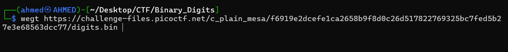
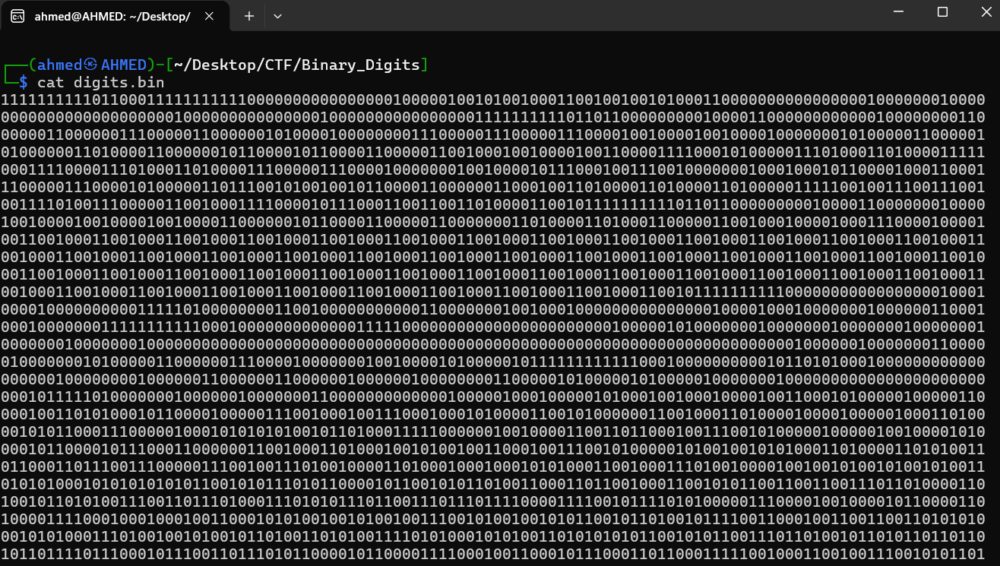
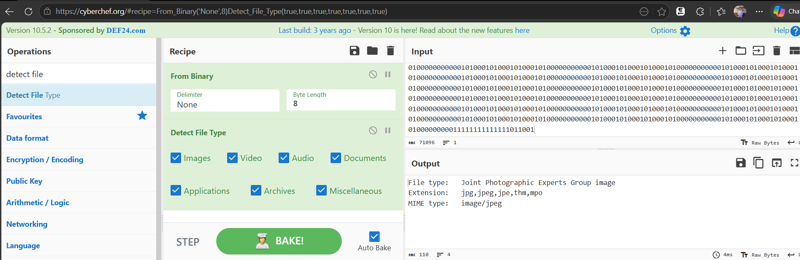
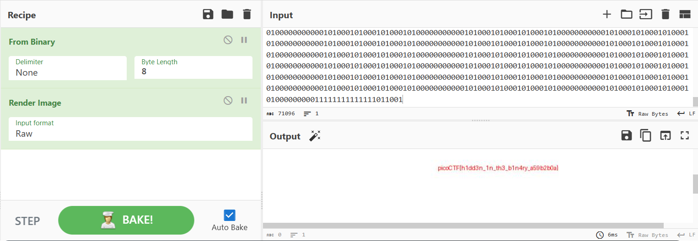

# Binary Digits Writeup
## lab link [Binary Digits](https://learn.cylabacademy.org/library?page=1&category=4)

## Scenario
```
This file doesn't look like much... just a bunch of 1s and 0s. But maybe it's not just random noise.
Can you recover anything meaningful from this?
```

First, I copied the file link to download it on the Linux OS.


use `wget` to download lab file 



Then, I used the cat command to print the file content, and I found that it was binary encoded.



after that, I used [CyberChef](https://cyberchef.org/) to decode content

use `from binary` then `detected file type`
I found it's `jpeg` file 


then I used `Render image` to see the original image 



*the flag may be different from account to another.*
Answer: `picoCTF{h1dd3n_1n_th3_b1n4ry_a59b2b0a}`


# The end. I hope this has been helpful to you.
