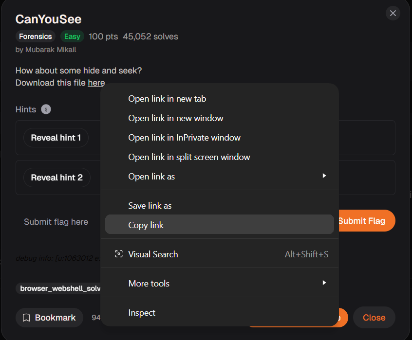
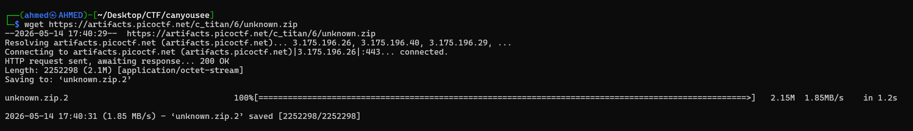
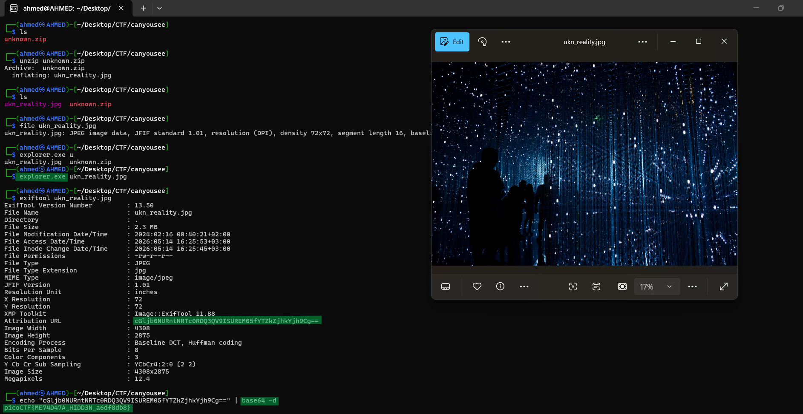

# CanYouSee Writeup
## lab link [CanYouSee](https://learn.cylabacademy.org/library?page=1&category=4)

## Scenario
```
How about some hide and seek?

```

First, I copied the file link to download it on the Linux OS.



use `wget` to download lab file 



First, I extracted the archive using the `unzip` command, which produced a `.jpg` file. 
I opened the image with `explorer.exe`, but it appeared to be a normal image with no visible indication of the flag. 
Then, I inspected the metadata using `exiftool` and found a Base64-encoded string. 
After decoding it with `base64 -d`, I successfully extracted the flag.




*the flag may be different from account to another.*

Answer: `picoCTF{ME74D47A_HIDD3N_a6df8db8}`


# The end. I hope this has been helpful to you.

