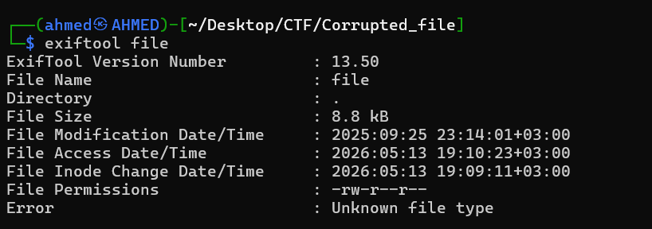
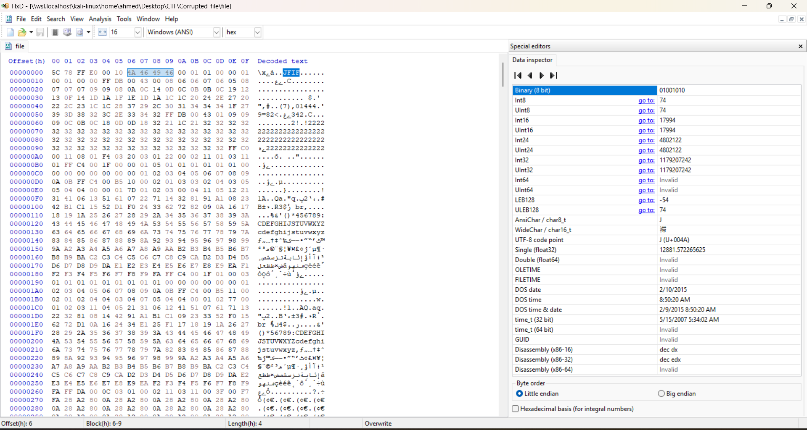
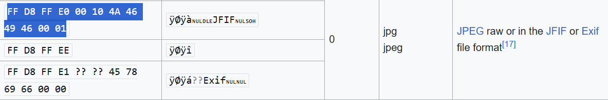
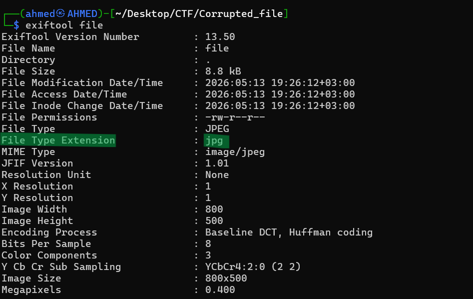
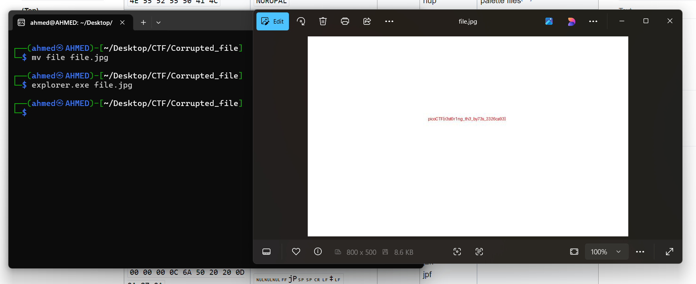

# Corrupted file Writeup
## lab link [Corrupted file](https://learn.cylabacademy.org/library?page=1&category=4)

## Scenario
```
This file seems broken... or is it? Maybe a couple of bytes could make all the difference.
Can you figure out how to bring it back to life?
```

First, I downloaded the lab file. Then, I attempted to display its contents, but I did not find any useful information.

Then, I tried to identify the file type because it had no extension. 
I used `exiftool`, but I still could not find anything useful.



Then, I decided to open the file using `HxD` to identify the file type manually.
I found the JFIF magic bytes, which indicated that the file was a corrupted JPG image.



I used this website [wiki](https://en.wikipedia.org/wiki/List_of_file_signatures) to identify the original magic bytes for this file type.
by searching for `JFIF` I found that



So, I decided to modify it in my file and save it

Then, I ran `exiftool` again, and it successfully identified the file type.



After that, change file extension and open it using `explorer.exe`.

*you can do these all steps using windows*



*the flag might be different from account to another*

Answer: `picoCTF{r3st0r1ng_th3_by73s_2326ca93}`


# The end. I hope this has been helpful to you.

