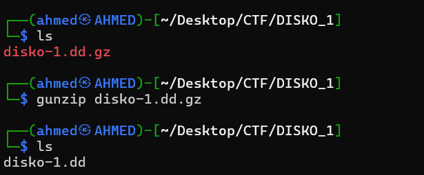
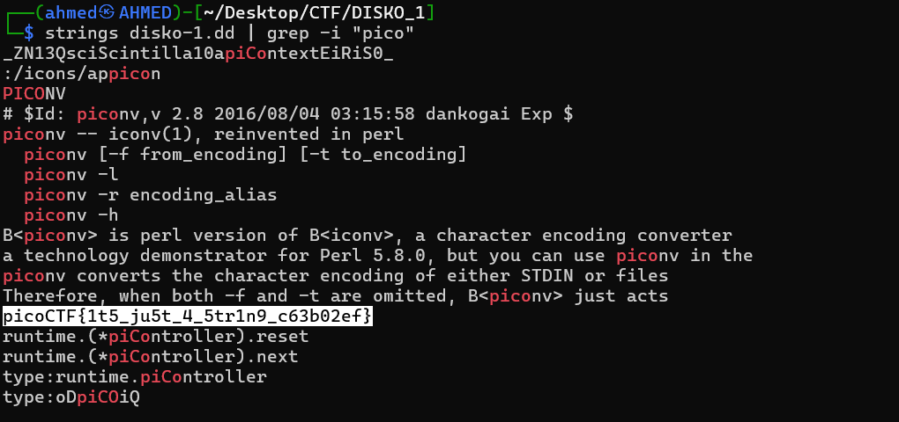

# DISKO 1 Writeup
## lab link [DISKO 1](https://learn.cylabacademy.org/library?page=1&category=4)

## Scenario
```
Can you find the flag in this disk image?
```

First, I copied the file link to download it on the Linux OS.


use `wget` to download lab file 


First, I used `gunzip` to decompress the file. Then, I found that the extracted file was a `.dd` disk image.



I used `strings` to extract readable strings from the disk image, then used `grep` to search for the keyword `pico`.



*the flag might be different from account to another*
Answer: `picoCTF{1t5_ju5t_4_5tr1n9_c63b02ef}`


# The end. I hope this has been helpful to you.
