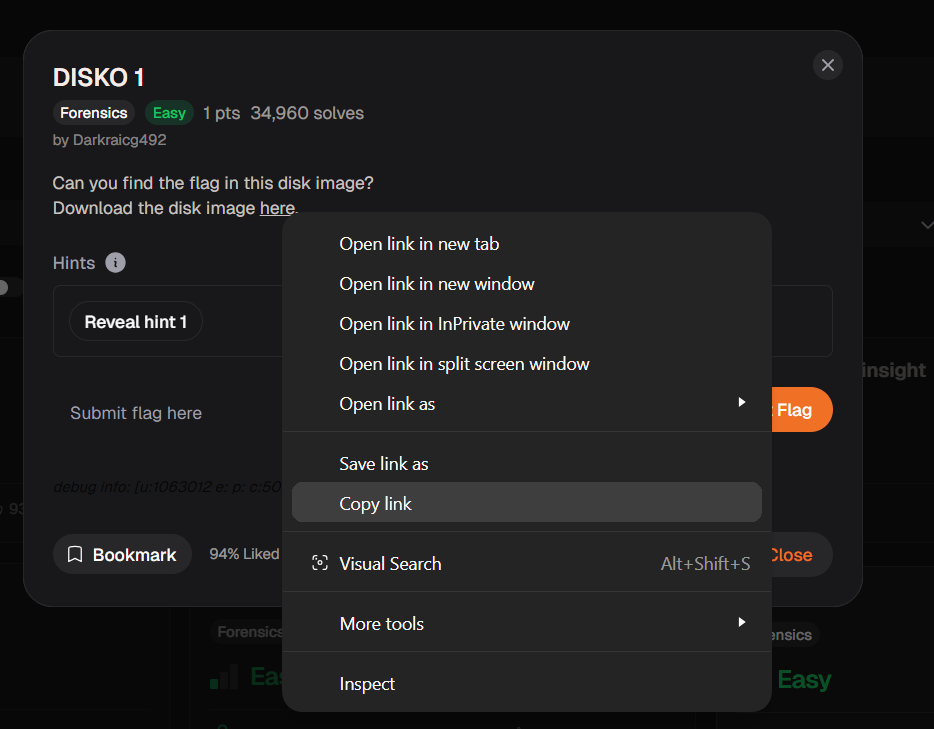
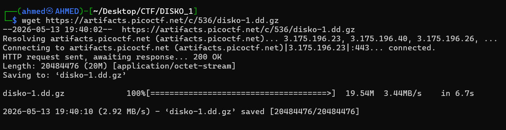

# DISKO 1 Writeup
## lab link [DISKO 1](https://learn.cylabacademy.org/library?page=1&category=4)

## Scenario
```
Can you find the flag in this disk image?
```

First, I copied the file link to download it on the Linux OS.



use `wget` to download lab file 




# The end. I hope this has been helpful to you.
