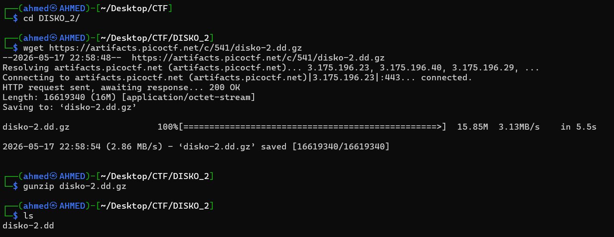
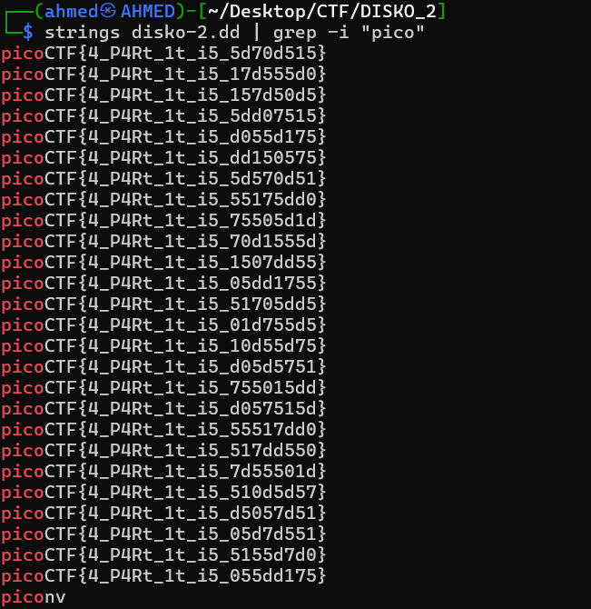
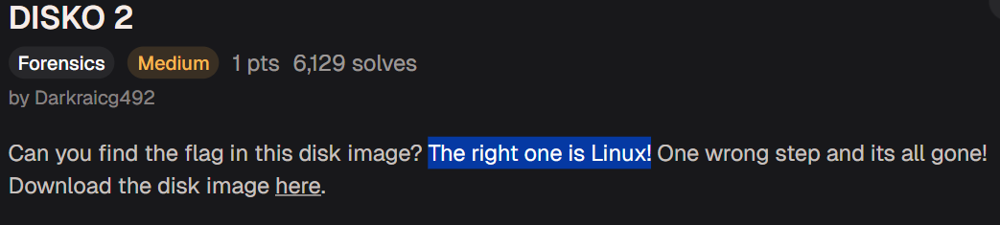
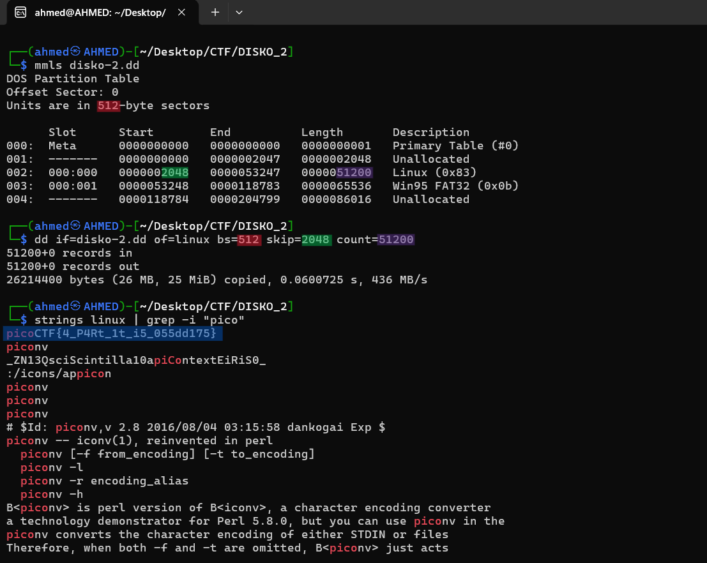

# DISKO 1 Writeup
## lab link [DISKO 1](https://learn.cylabacademy.org/library?page=2&category=4)

## Scenario
```
Can you find the flag in this disk image? The right one is Linux! One wrong step and its all gone!

```

First, I used `wget` to download the image file, then decompressed it with `gunzip`.



First, I used `strings` to extract readable strings from the disk image, then used `grep` to search for `pico`. 
However, the output contained many flag-like strings, so I needed to investigate further to identify the correct one.



After that, I reviewed the challenge scenario again and found the following hint.




After that, I used `mmls` to list the partitions inside the disk image. Since the full image contained many flag-like strings, 
I used `dd` to isolate the Linux partition and then ran `strings` on that partition only. 
Finally, I used `grep` to search for `pico` and found the correct flag.




*the flag might be different from account to another*

Answer: `picoCTF{4_P4Rt_1t_i5_055dd175}`

# The end. I hope this has been helpful to you.
