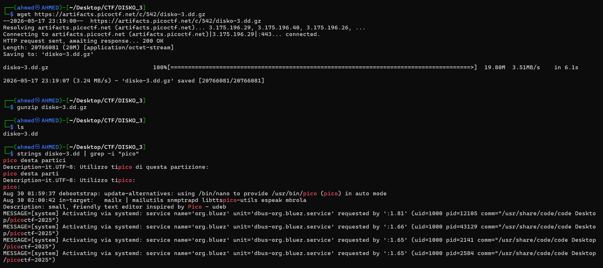
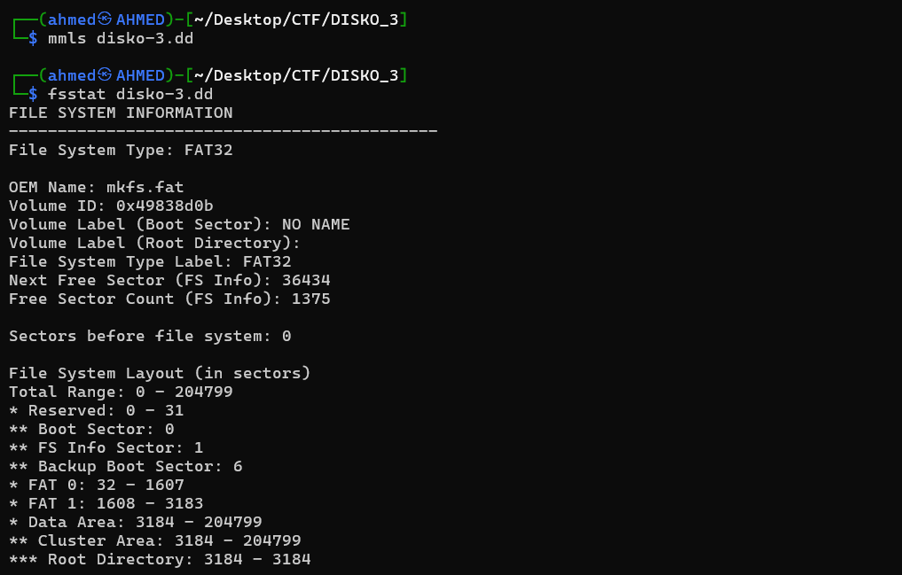
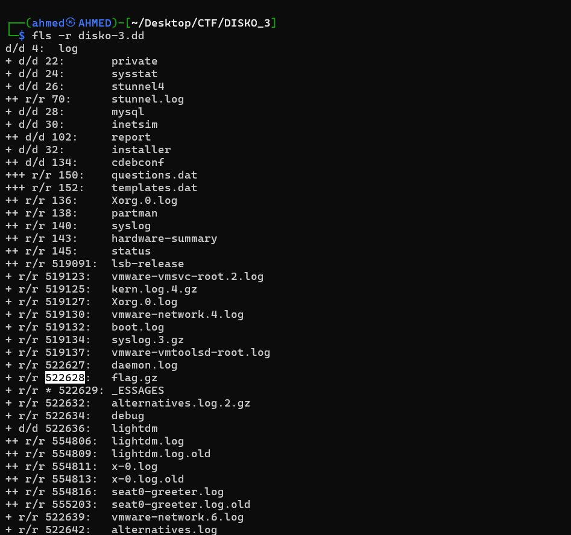
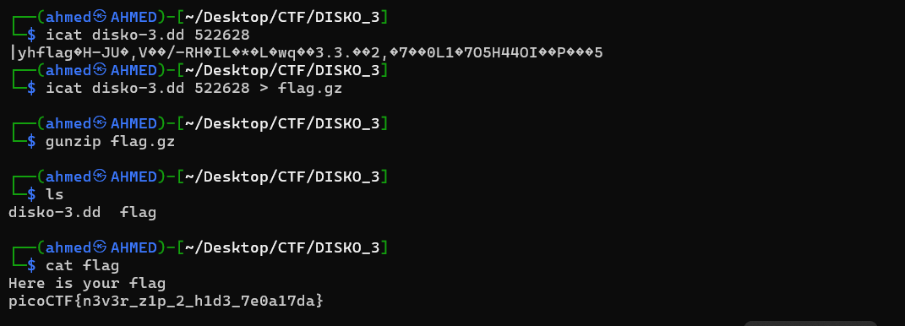

# DISKO 3 Writeup
## lab link [DISKO 3](https://learn.cylabacademy.org/library?page=2&category=4)

## Scenario
```
Can you find the flag in this disk image? This time, its not as plain as you think it is!

```

First, I used `wget` to download the image file, then decompressed it with `gunzip`.
Then, I ran `strings` on the image file and filtered the output with `grep` to search for `pico`, but no flag-related strings were found.




I first used `mmls` to check the partition layout, but it did not show any partitions. 
Then, I used `fsstat` and found that the image contained a FAT32 file system starting at sector 0. 
Since there was no partition offset, I used Sleuth Kit tools directly on the image without the `-o` option.




Then, I used `fls -r` to recursively list all files and directories in the image. During the investigation, I found a compressed file named `flag.gz`.



After finding the compressed file `flag.gz`, I used `icat` with its inode number to extract its contents from the disk image. 
When I printed the file directly, the output appeared unreadable because it was compressed.

So, I redirected the output of `icat` into a file named `flag.gz`, then decompressed it using `gunzip`. 
This produced a file named `flag`. Finally, I used `cat` to read the file and recovered the flag.




*the flag might be different from account to another*

Answer: `picoCTF{n3v3r_z1p_2_h1d3_7e0a17da}`

# The end. I hope this has been helpful to you.
