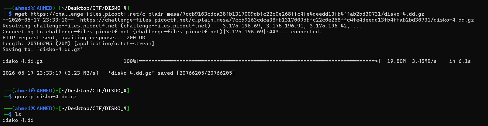
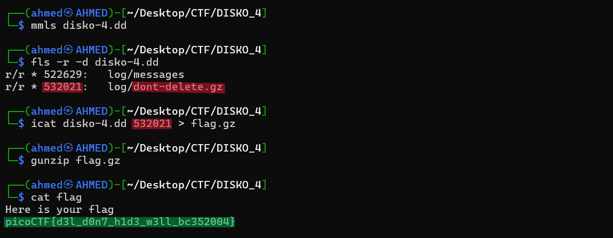

# DISKO 4 Writeup
## lab link [DISKO 4](https://learn.cylabacademy.org/library?page=2&category=4)

## Scenario
```
Can you find the flag in this disk image? This time I deleted the file! Let see you get it now!

```

First, I used `wget` to download the image file, then decompressed it with `gunzip`.



Based on the challenge scenario, the file that contained the flag had been deleted. 
Therefore, using `strings` was not useful, and I needed to inspect deleted files directly from the file system.

First, I used `mmls` to check the partition layout, but it did not show any partition table. 
Therefore, I used `fls` directly on the image without the `-o` option. 
I added `-r` to recursively list files and `-d` to display deleted files only.

Then, I found a deleted compressed file named `dont-delete.gz`. 
I used `icat` with its inode number to recover the file and redirected the output to `flag.gz`. 
After decompressing it with `gunzip`, I used `cat` to view the recovered contents.




*the flag might be different from account to another*

Answer: `picoCTF{d3l_d0n7_h1d3_w3ll_bc352004}`

# The end. I hope this has been helpful to you.
