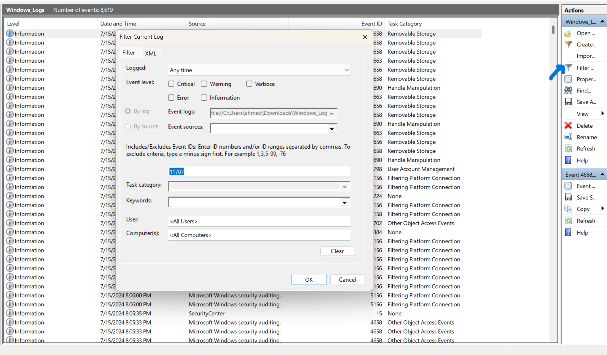
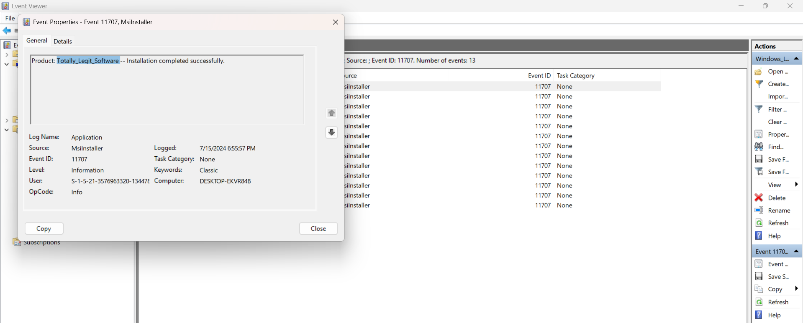
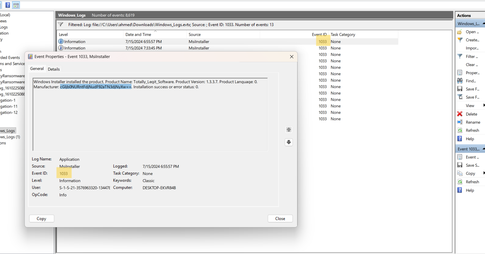
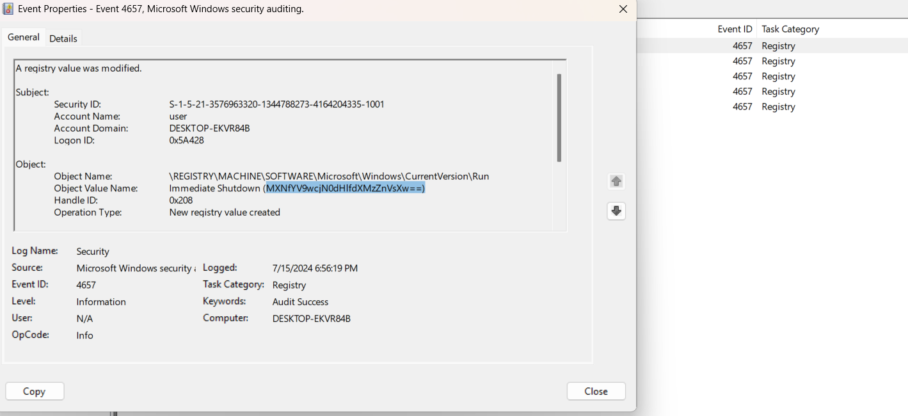
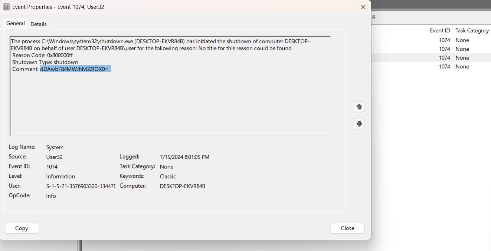
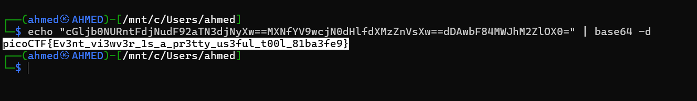

# Event-Viewing Writeup
## lab link [Event-Viewing](https://learn.cylabacademy.org/library?page=3&category=4)

## Scenario
```
One of the employees at your company has their computer infected by malware! Turns out every time they try to switch on the computer, it shuts down right after they log in. The story given by the employee is as follows:

They installed software using an installer they downloaded online
They ran the installed software but it seemed to do nothing
Now every time they bootup and login to their computer, a black command prompt screen quickly opens and closes and their computer shuts down instantly.
See if you can find evidence for the each of these events and retrieve the flag (split into 3 pieces) from the correct logs!
```

First, I downloaded the event log file and opened it using Windows `Event Viewer`.

Based on the scenario, I first filtered the event logs by Event ID `11707`, which indicates a `successful software installation`.
This revealed a suspicious installer named `Totally_Legit_Software`, but it did not contain the flag.






After that, I filtered by Event ID `1033`, which is associated with `Windows Installer events`. 
I searched for the same installer name and found a Base64-encoded string related to it.



Based on the second part of the scenario, the software appeared to do nothing after execution. 
Therefore, I suspected that it might have modified a registry value, so I filtered the logs by Event ID `4657`, which indicates a `registry value modification`.




Based on the last part of the scenario, the process appeared to launch `cmd` and execute a command that immediately shut down the system.
Therefore, I filtered the logs by Event ID `1074`, which indicates that `a shutdown was initiated by a process or user`.



Finally, I combined all three encoded parts and decoded the result using `base64 -d`, which revealed the flag.




*the flag might be different from account to another*

Answer: `picoCTF{Ev3nt_vi3wv3r_1s_a_pr3tty_us3ful_t00l_81ba3fe9}`

# The end. I hope this has been helpful to you.
