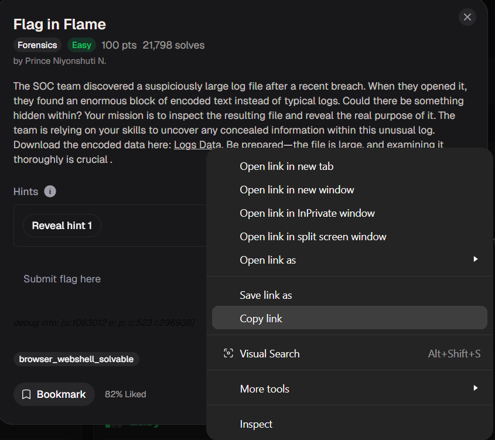
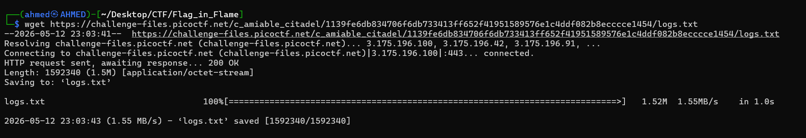
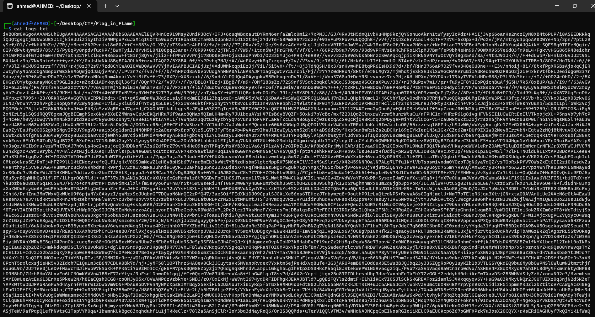
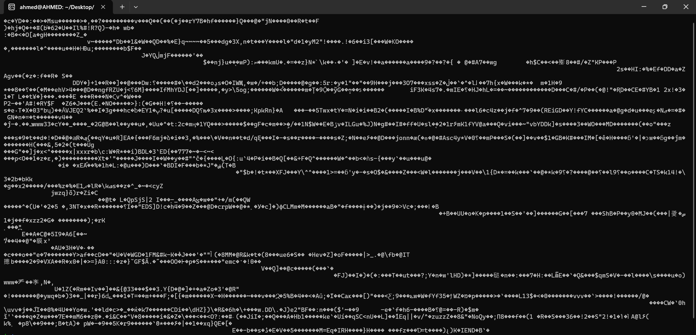
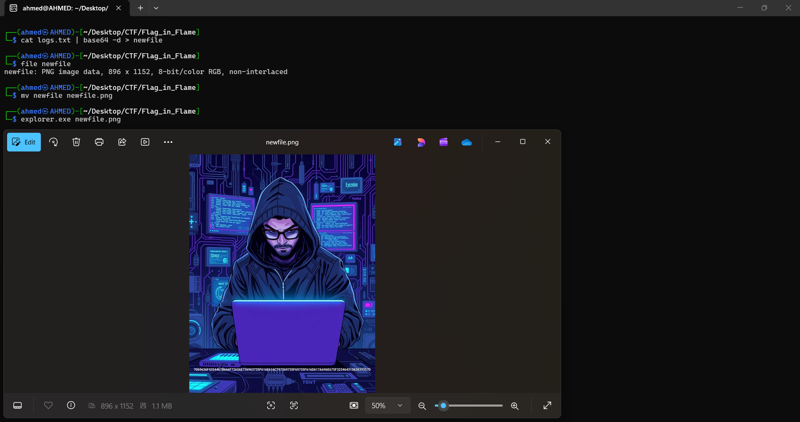
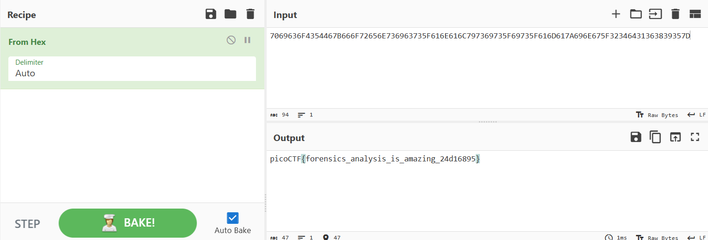
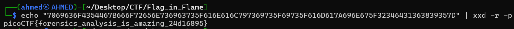

# Flag in Flame Writeup
## lab link Flag in Flame](https://learn.cylabacademy.org/library?page=1&category=4)

## Scenario
```
The SOC team discovered a suspiciously large log file after a recent breach. When they opened it,
they found an enormous block of encoded text instead of typical logs. Could there be something hidden within?
Your mission is to inspect the resulting file and reveal the real purpose of it.
The team is relying on your skills to uncover any concealed information within this unusual log.
```

First, I copied the file link to download it on the Linux OS.



use `wget` to download lab file 



First of all, I tried to see file content but there was huge amount of encoded data



after that, I tried to use `exiftool` to parse metadat but couldn't find anything

then, I decided to decode the content using this command
`cat logs.txt | base64 -d`


The output looked like raw file data, but I still did not know the file type. 
So, I decided to save the output and then use `file` or `exiftool` to detect the file type.

`cat logs.txt | base64 -d > newfile`



It turned out that it was a `PNG` file, so I renamed the file to `newfile.png`. 
Then, I used `explorer.exe` to open the file and found that there was hex written on the image.

extract the hex then use [cyberchef](https://cyberchef.org/) to convert to ASCII


Or you can use the command line with `xxd -r -p` to convert the hex string back into readable text.


the flag might be different from account to another
Answer: `picoCTF{forensics_analysis_is_amazing_24d16895}`


# The end. I hope this has been helpful to you.
