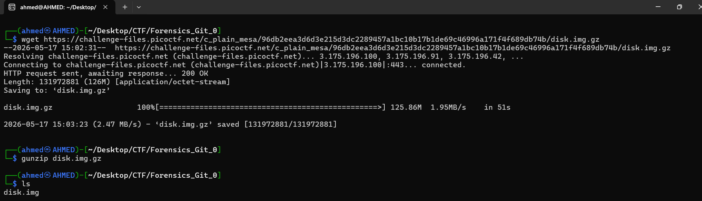
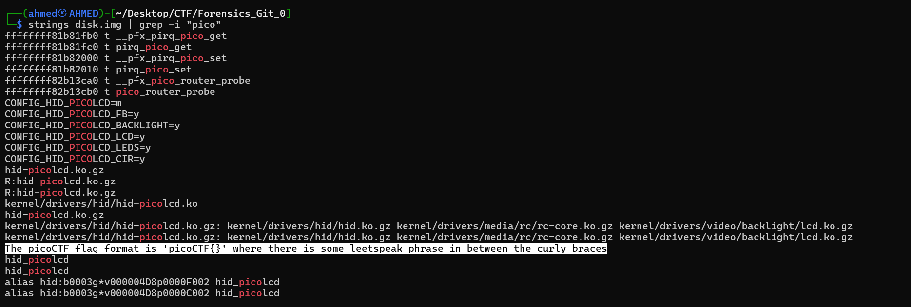
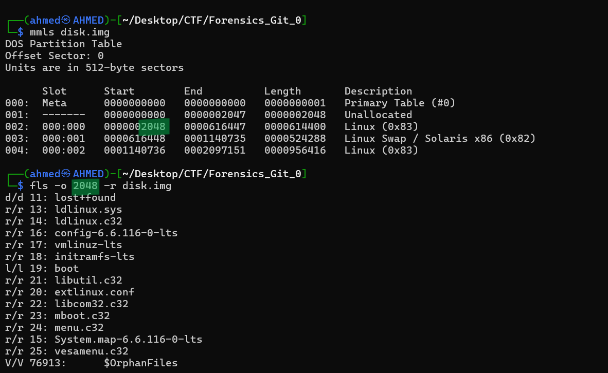
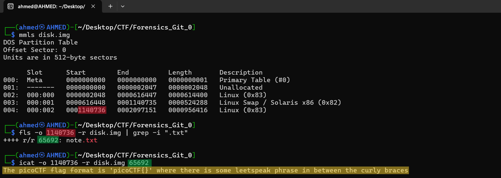
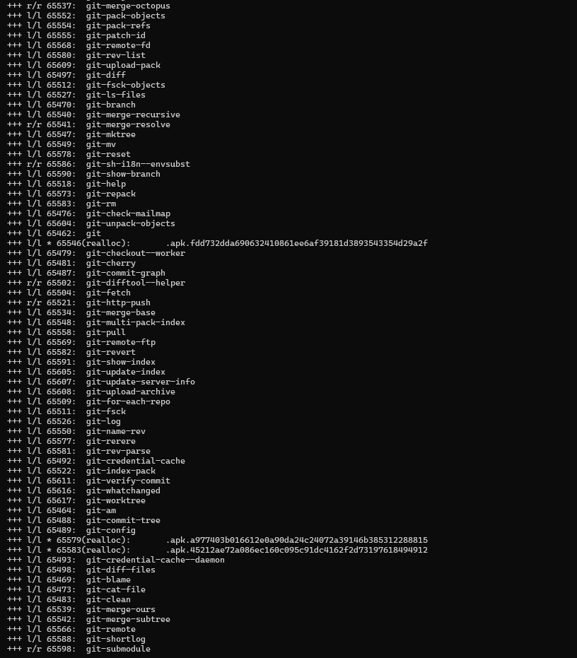
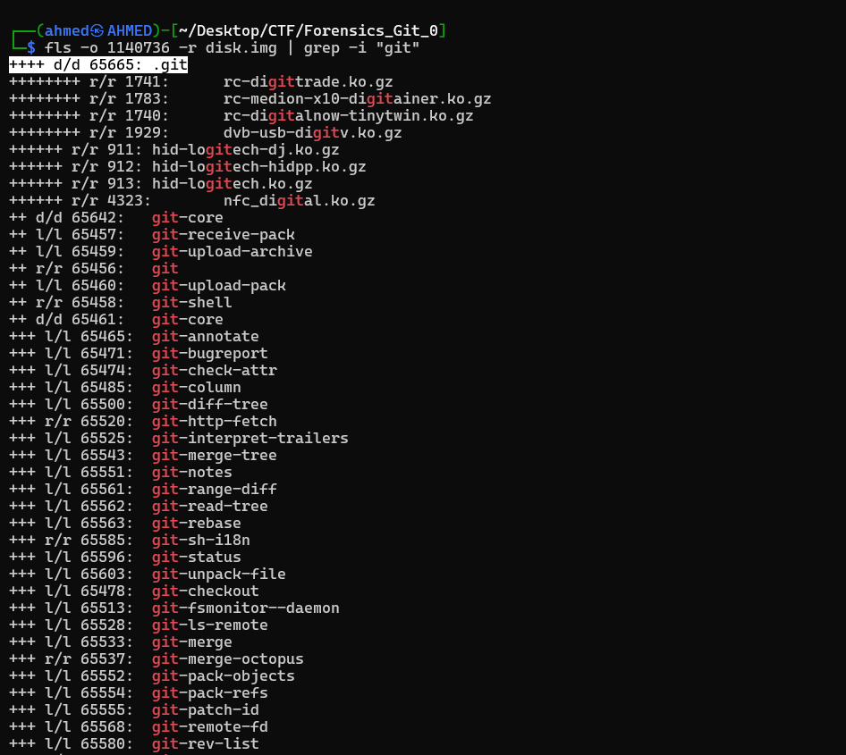
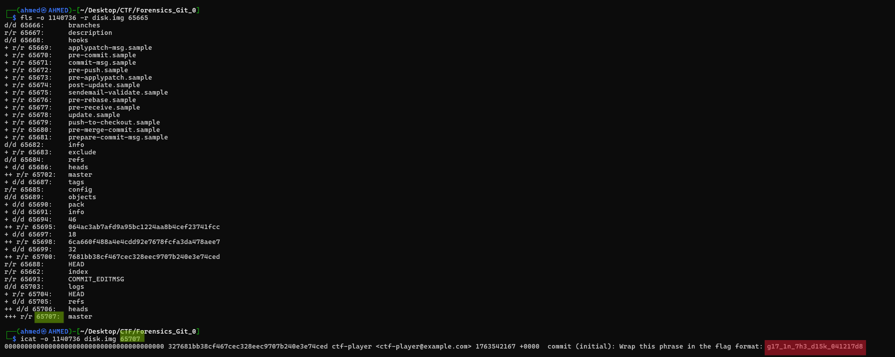

# Forensics Git 0 Writeup
## lab link [Forensics Git 0](https://learn.cylabacademy.org/library?page=2&category=4)

## Scenario
```
Can you find the flag in this disk image?

```

First, I used `wget` to download the image file, then decompressed it with `gunzip`.



Firstly, I used `strings` to extract readable strings and used `grep` to search for `pico`, but no flag was found.




The `mmls` output revealed two Linux file system partitions starting at sectors `2048` and `1140736`, along with a Linux swap partition starting at sector `616448`. 
Since `fls` requires the starting sector as an offset, I used these start values to inspect the file and folders inside the disk image.

After inspecting the partition starting at sector `2048`, I did not find any useful artifacts.



Then, I inspected the other partition using `fls` to list the files and directories inside the disk image. 
After that, I used `grep` to search for `.txt` files that might contain the flag.
I found a file named `note.txt` and used `icat` with its inode number to extract and view its contents. Inside the file, I found this part of the flag.



then, I listed all files and folders using `fls` again and find these all files related to `git` 



so, I grep using git and  I found this hidden folder 



I used `fls` to list the files inside the directory and found a file named `master`. 
Since `master` usually represents the main branch in a Git repository, I extracted and inspected its contents using `icat`.



I found this part of flag and wrraped it using `picoCTF{}`

*the flag might be different from account to another*

Answer: `picoCTF{g17_1n_7h3_d15k_041217d8}`

# The end. I hope this has been helpful to you.

