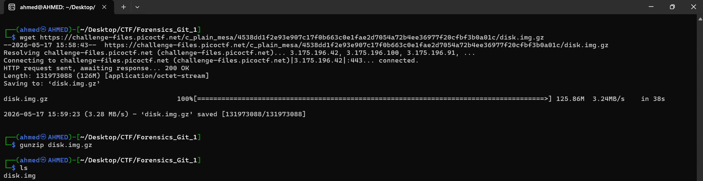
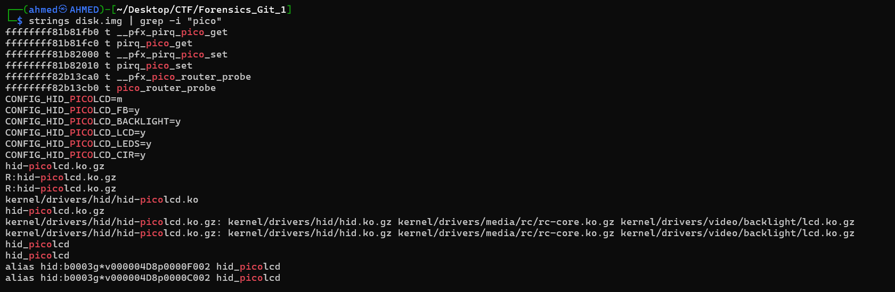
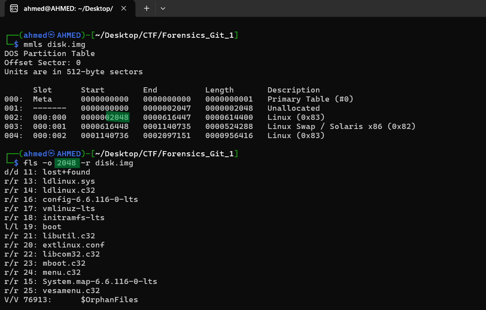
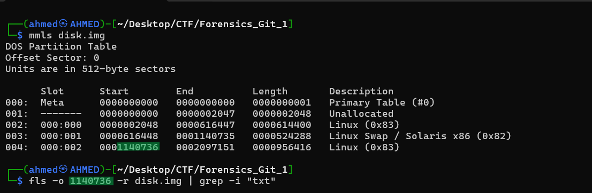
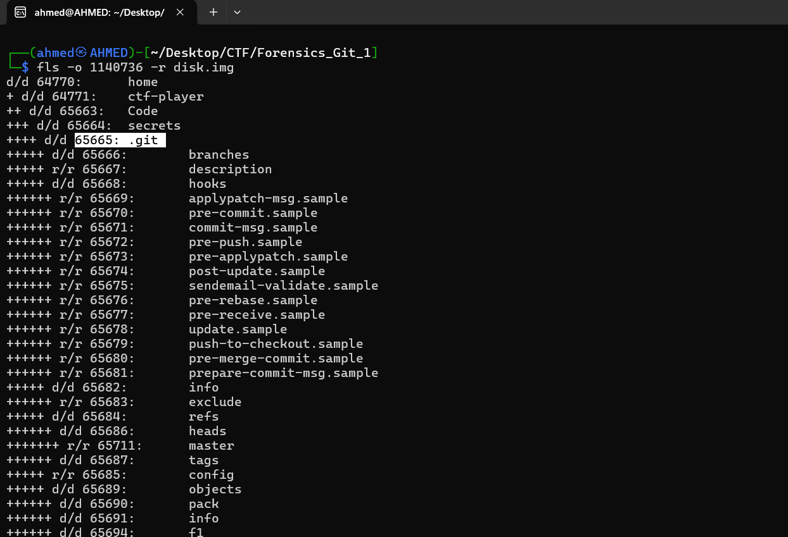
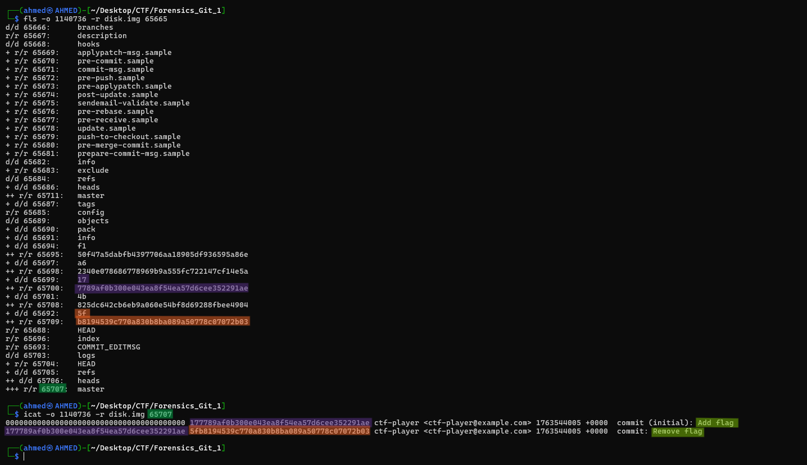
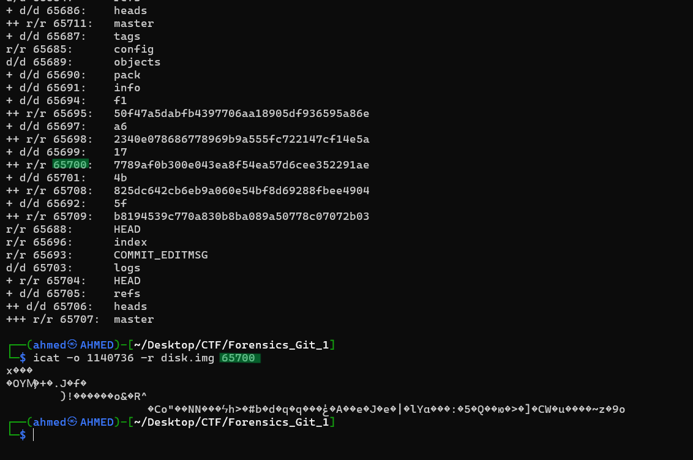
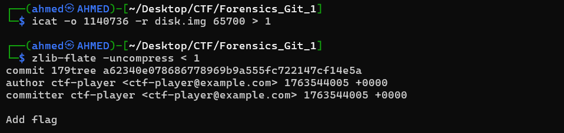
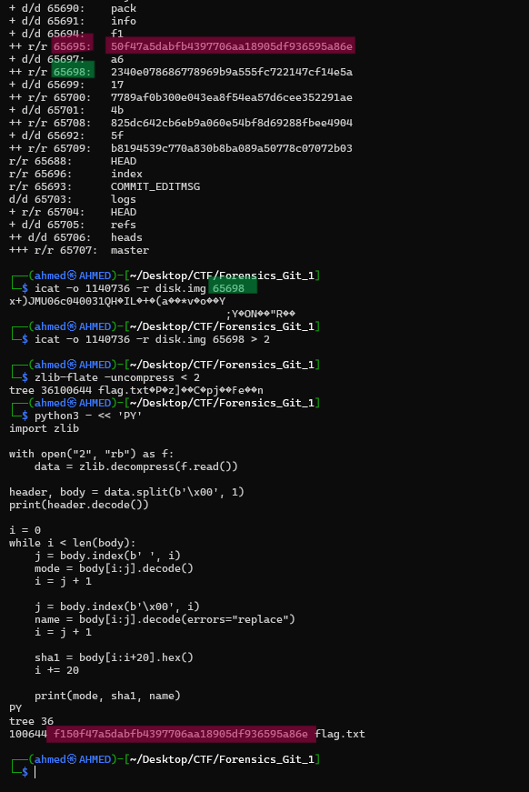
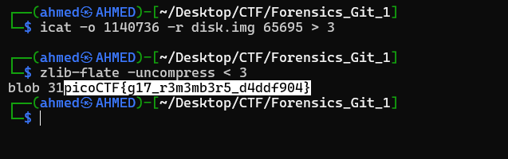

# Forensics Git 1 Writeup
## lab link [Forensics Git 1](https://learn.cylabacademy.org/library?page=2&category=4)

## Scenario
```
Can you find the flag in this disk image?

```

First, I used `wget` to download the image file, then decompressed it with `gunzip`.



Firstly, I used `strings` to extract readable strings and used `grep` to search for `pico`, but no flag was found.



The `mmls` output revealed two Linux file system partitions starting at sectors `2048` and `1140736`, along with a Linux swap partition starting at sector `616448`. 
Since `fls` requires the starting sector as an offset, I used these start values to inspect the file and folders inside the disk image.

After inspecting the partition starting at sector `2048`, I did not find any useful artifacts.



Then, I inspected the other partition using `fls` to list the files and directories inside the disk image. 
After that, I used `grep` to search for `.txt` files that might contain the flag but found nothing.



then, I listed all files and folders using `fls` again and find these all files related to `git` and found this hidden git folder



I used `fls` to list the files inside the directory and found a file named `master`. 
Since `master` usually represents the main branch in a Git repository, I extracted and inspected its contents using `icat`.



After extracting the Git reflog using `icat`, I found an initial commit labeled `Add flag` followed by another commit labeled `Remove flag`. This showed that the flag had been added in an earlier commit and later removed, so I decided to investigate the initial commit to recover it.


After extracting the content, it appeared unreadable because Git stores its objects in a zlib-compressed format.



Therefore, I saved the extracted Git object to a file and decompressed it using the `zlib-flate -uncompress` command and found this content.



Therefore, I used `icat` again with the inode number related to this hash file to extract and inspect the tree object contents.

I extracted the Git tree object using `icat`, but the output was unreadable because Git objects are zlib-compressed. After decompressing it with `zlib-flate`, I found a reference to `flag.txt`, but the blob hash appeared as binary data.

To read it correctly, I used a Python script to parse the tree object. The script converted the binary SHA-1 value into a readable hexadecimal hash. The result showed that `flag.txt` pointed to the blob hash `f150f47a5dabfb4397706aa18905df936595a86e`, which I then used to locate the flag content.

- python script
```
python3 - << 'PY'
import zlib

with open("2", "rb") as f:
    data = zlib.decompress(f.read())

header, body = data.split(b'\x00', 1)
print(header.decode())

i = 0
while i < len(body):
    j = body.index(b' ', i)
    mode = body[i:j].decode()
    i = j + 1

    j = body.index(b'\x00', i)
    name = body[i:j].decode(errors="replace")
    i = j + 1

    sha1 = body[i:i+20].hex()
    i += 20

    print(mode, sha1, name)
PY
```


I repeated the same process for the blob object referenced by `flag.txt`. First, I located the object inside `.git/objects` using its SHA-1 hash, 
then extracted it from the disk image using `icat`. Since the output was also zlib-compressed, 
I saved it to a file and decompressed it using `zlib-flate -uncompress` to reveal the actual contents of `flag.txt`.




*the flag might be different from account to another*

Answer: `picoCTF{g17_r3m3mb3r5_d4ddf904}`

# The end. I hope this has been helpful to you.
