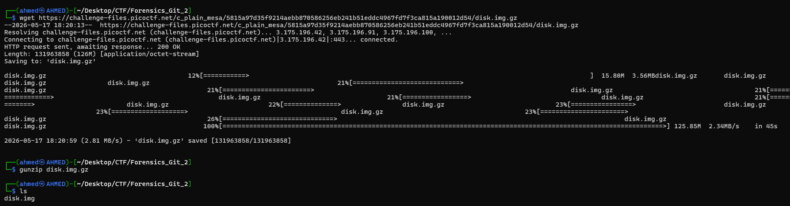
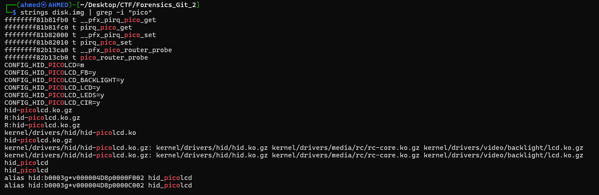
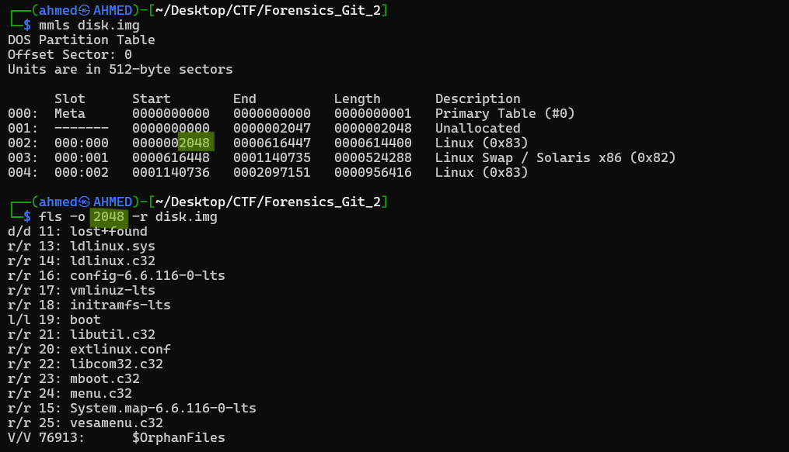
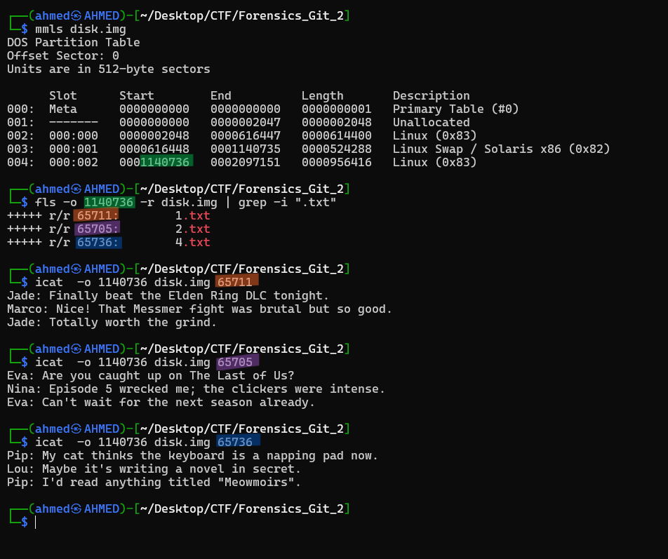
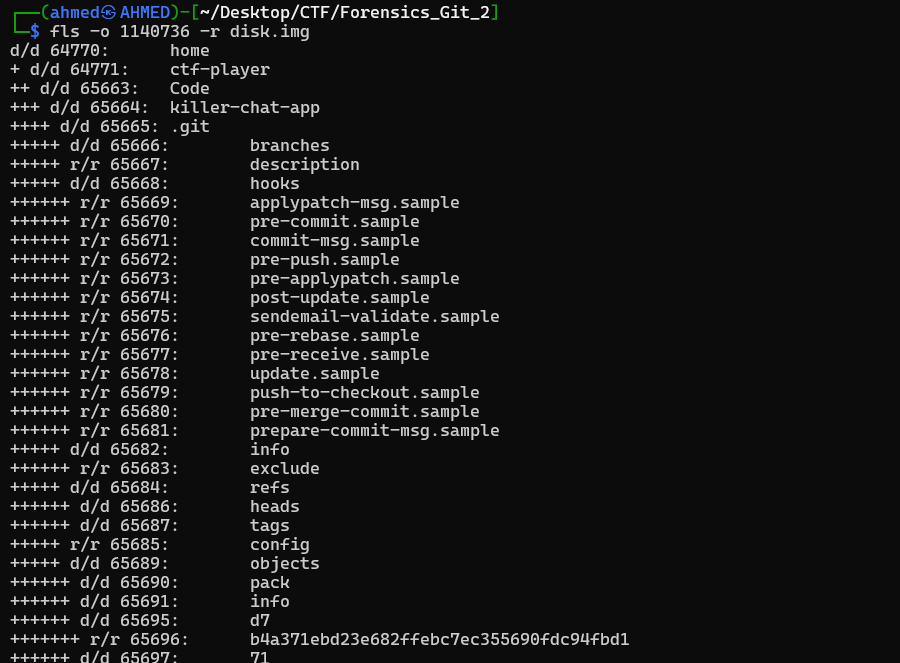
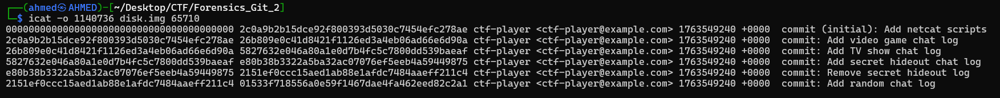
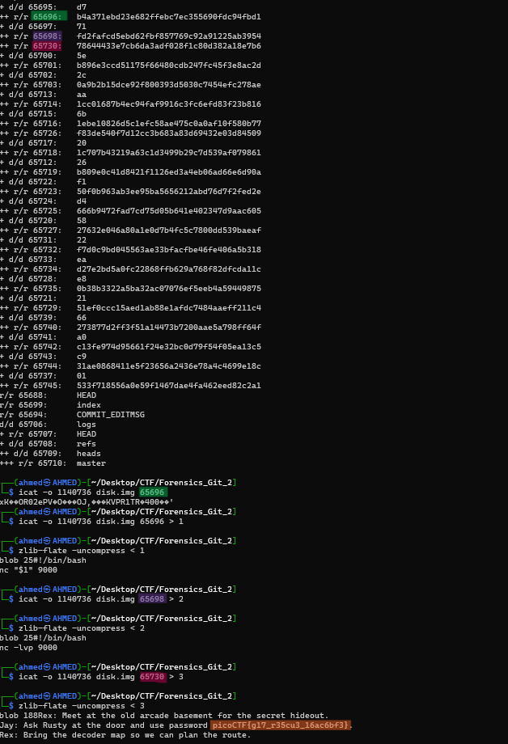

# Forensics Git 2 Writeup
## lab link [Forensics Git 2](https://learn.cylabacademy.org/library?page=2&category=4)

## Scenario
```
The agents interrupted the perpetrator's disk deletion routine. Can you recover this git repo?

```

First, I used `wget` to download the image file, then decompressed it with `gunzip`.



Firstly, I used `strings` to extract readable strings and used `grep` to search for `pico`, but no flag was found.



The `mmls` output revealed two Linux file system partitions starting at sectors `2048` and `1140736`, along with a Linux swap partition starting at sector `616448`. 
Since `fls` requires the starting sector as an offset, I used these start values to inspect the file and folders inside the disk image.

After inspecting the partition starting at sector `2048`, I did not find any useful artifacts.




Then, I inspected the other partition using `fls` to list the files and directories inside the disk image. 
I recursively listed the files in the target partition using `fls` and searched for `.txt` files. I found three text files: `1.txt`, `2.txt`, and `4.txt`. 
After extracting their contents with `icat`, I confirmed that they only contained ordinary chat messages and did not reveal the flag.



I listed all files and folders in second partition againg using `fls` and found this .git hidden folder so, idecided to invistigate it
 


after listed all files and folders inside it 
` fls -o 1140736 -r disk.img 65665` 
I found this master branch file so, I decided to get its contenet using `icat`



I decided to see content of all these files 
After extracting the content, it appeared unreadable because Git stores its objects in a zlib-compressed format.
Therefore, I saved the extracted Git object to a file and decompressed it using the `zlib-flate -uncompress` command and found this content.

and I found flag in `7178644433e7cb6da3adf028f1c80d382a18e7b6`




*the flag might be different from account to another*

Answer: `picoCTF{g17_r35cu3_16ac6bf3}`

# The end. I hope this has been helpful to you.
