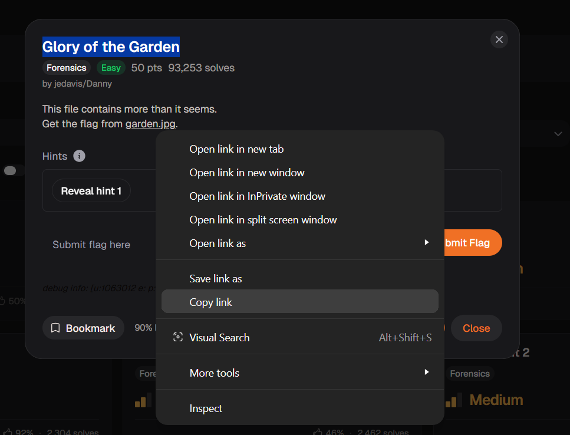
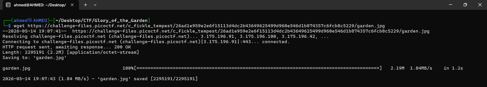
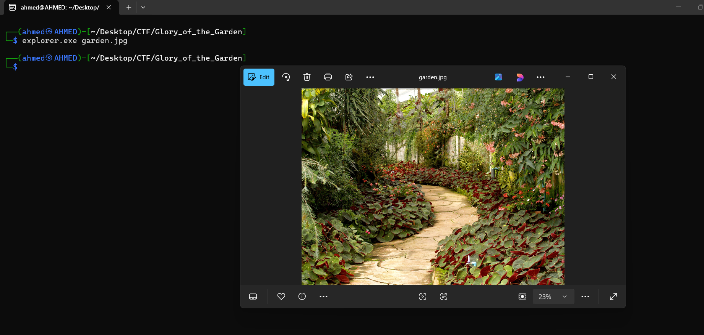
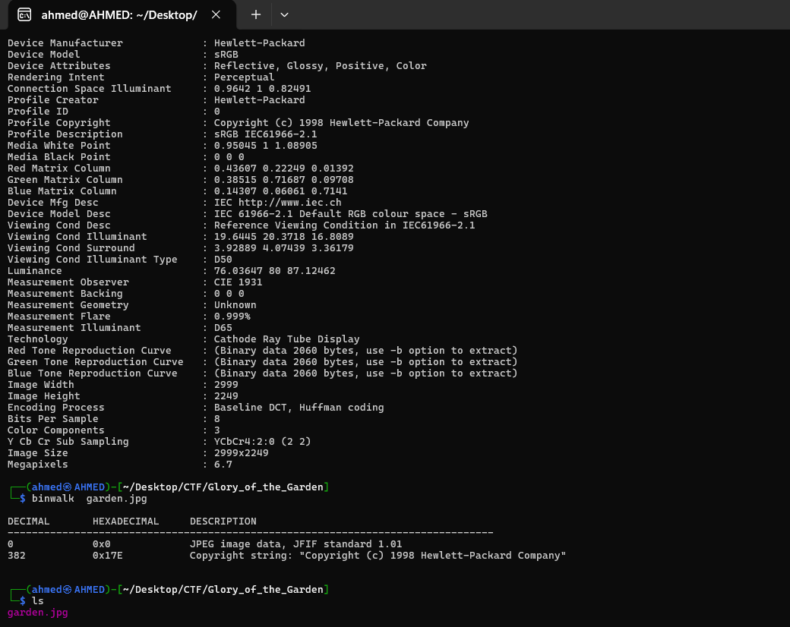
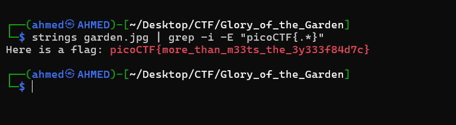

# Glory of the Garden Writeup
## lab link [Glory of the Garden](https://learn.cylabacademy.org/library?page=1&category=4)

## Scenario
```
This file contains more than it seems.

```

First, I copied the file link to download it on the Linux OS.



use `wget` to download lab file 



After opening the image, it appeared to be a normal picture of a garden with no visible indication of flags.




I used `exiftool` to inspect the file metadata, but it did not reveal any useful information. 
Then, I used `binwalk` to check for embedded files, but no hidden files were found.



Then, I used `strings` to search for readable text inside the image binary. Fortunately, I found the flag.




*the flag may be different from account to another.*

Answer: `picoCTF{more_than_m33ts_the_3y333f84d7c}`


# The end. I hope this has been helpful to you.
