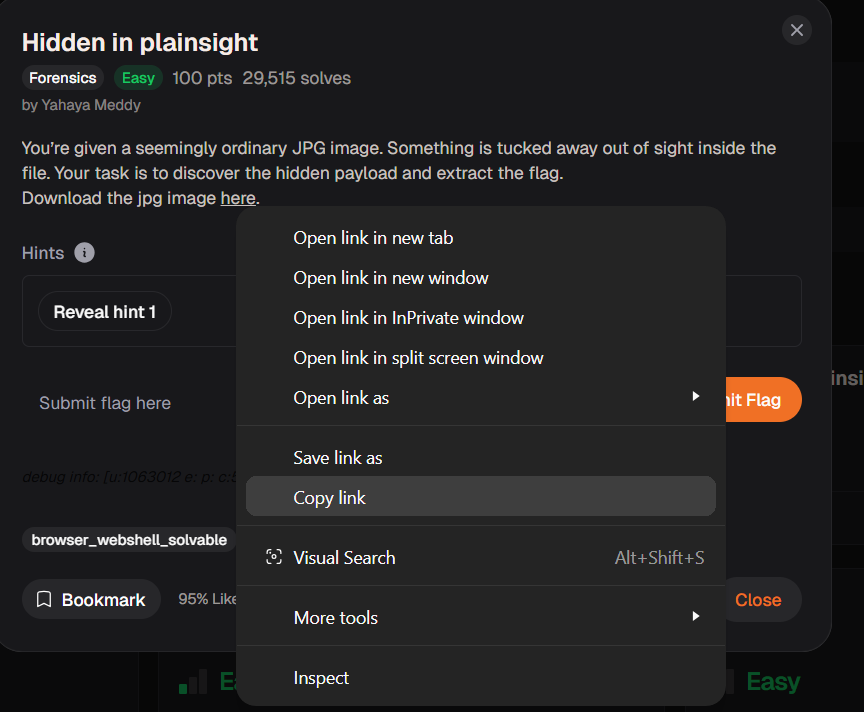
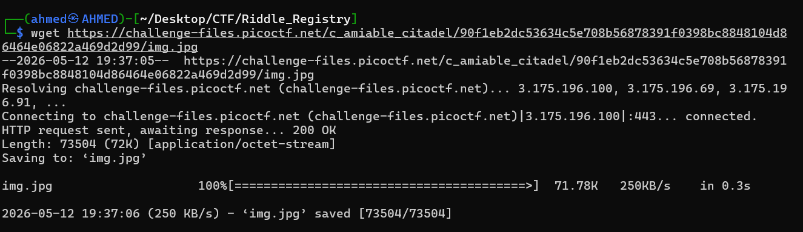
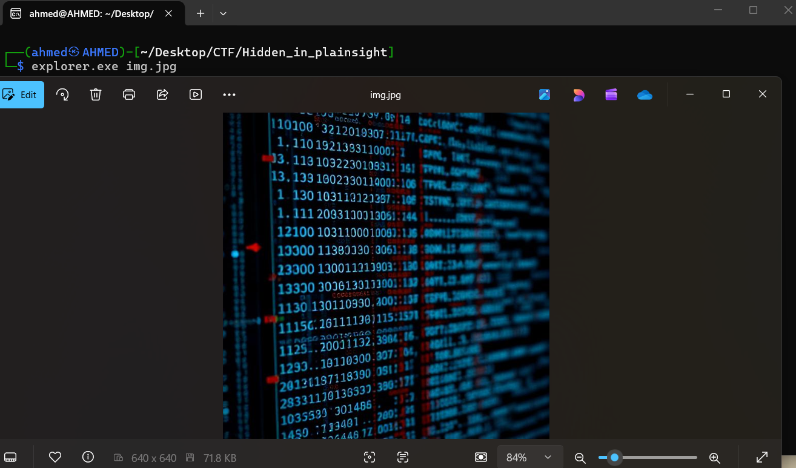

# Hidden in plainsight Writeup
## lab link [Hidden in plainsight](https://learn.cylabacademy.org/library?page=1&category=4)

## Scenario
```
You’re given a seemingly ordinary JPG image. Something is tucked away out of sight inside the file.
Your task is to discover the hidden payload and extract the flag.
```

First, I copied the file link to download it on the Linux OS.



use `wget` to download lab file 



I used explorer.exe to open the JPG file and view its contents, but I found nothing useful.




# The end. I hope this has been helpful to you.
