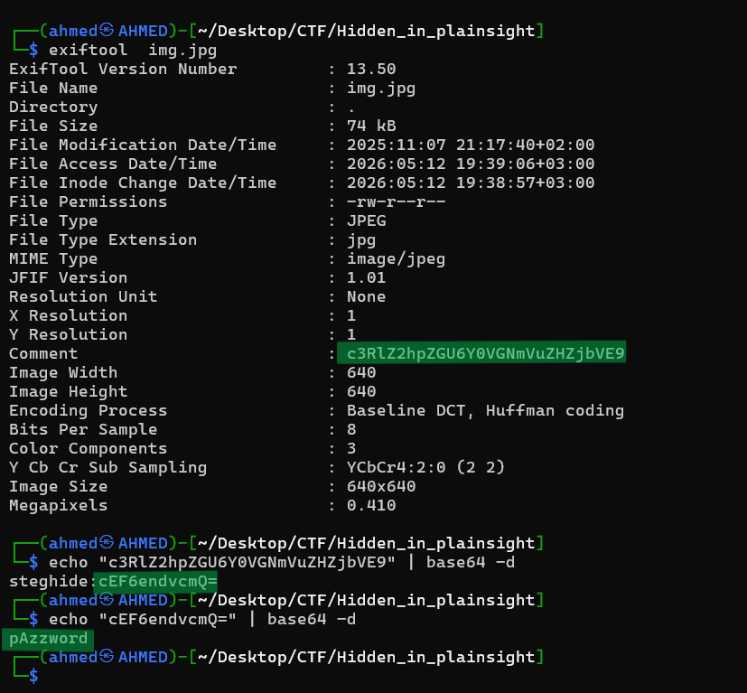
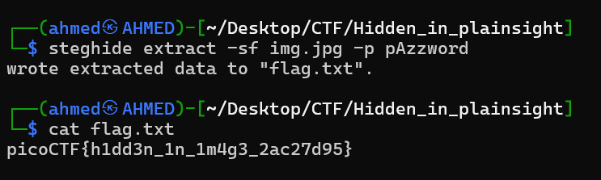

# Hidden in plainsight Writeup
## lab link [Hidden in plainsight](https://learn.cylabacademy.org/library?page=1&category=4)

## Scenario
```
You’re given a seemingly ordinary JPG image. Something is tucked away out of sight inside the file.
Your task is to discover the hidden payload and extract the flag.
```

First, I copied the file link to download it on the Linux OS.


use `wget` to download lab file 


I used explorer.exe to open the JPG file and view its contents, but I found nothing useful.


then,I used `exiftool` to parse file metadata and I found this base64 decoded text

I decoded the text using `|base64 -d` you can also use [Cyberchef](https://cyberchef.org/)
then I found another base64 and decoded it 



It seemed that there was hidden data embedded in the file using `steghide`.

so, you need to use steghide to extract embeded data 
`steghide extract -sf img.jpg -p pAzzword`



Answer: `picoCTF{h1dd3n_1n_1m4g3_2ac27d95}`


# The end. I hope this has been helpful to you.
