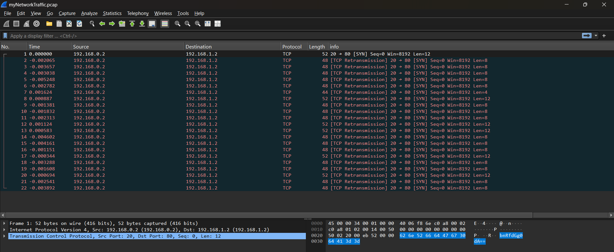
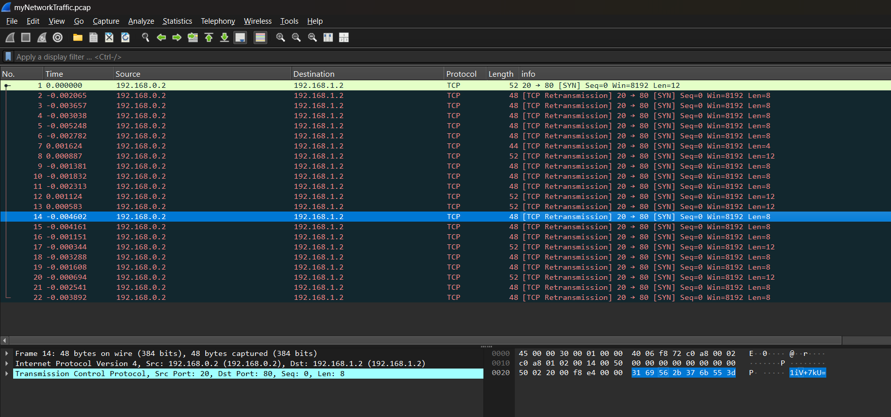

# Ph4nt0m 1ntrud3r Writeup
## lab link [Ph4nt0m 1ntrud3r](https://learn.cylabacademy.org/library?page=1&category=4)

## Scenario
```
A digital ghost has breached my defenses, and my sensitive data has been stolen! 😱💻 Your mission is to uncover how this phantom intruder infiltrated my system and retrieve the hidden flag.

To solve this challenge, you'll need to analyze the provided PCAP file and track down the attack method. The attacker has cleverly concealed his moves in well timely manner. Dive into the network traffic, apply the right filters and show off your forensic prowess and unmask the digital intruder!
```

First, I copied the file link to download it on the Linux OS.



use `wget` to download lab file 




*the flag might be different from account to another*
Answer: ``


# The end. I hope this has been helpful to you.
