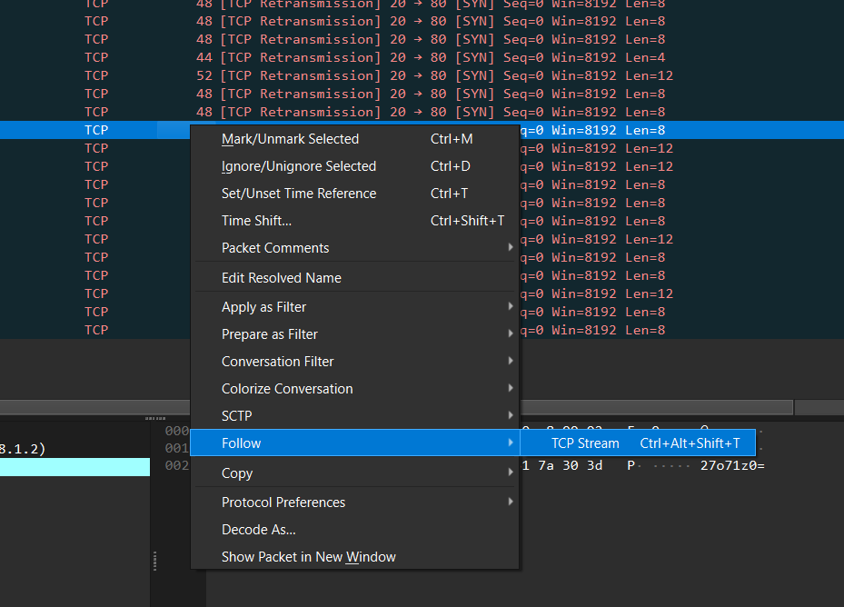
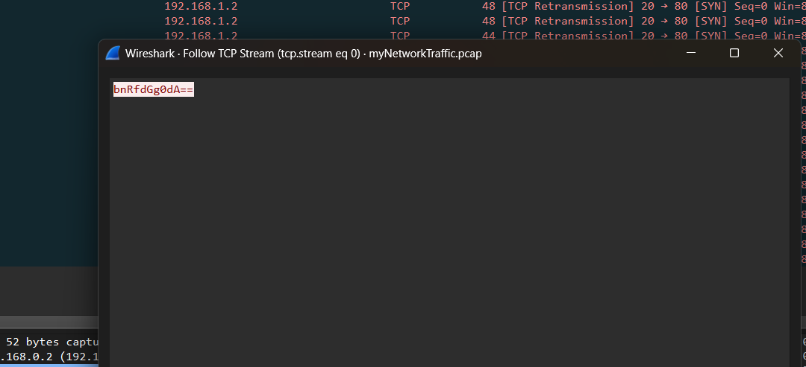
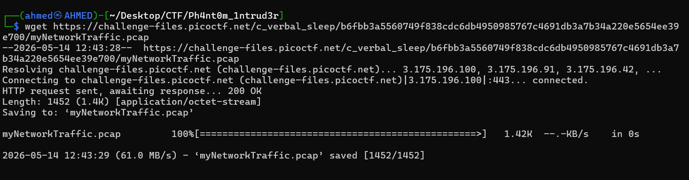
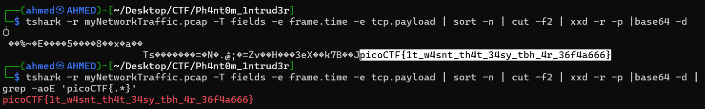

# Ph4nt0m 1ntrud3r Writeup
## lab link [Ph4nt0m 1ntrud3r](https://learn.cylabacademy.org/library?page=1&category=4)

## Scenario
```
A digital ghost has breached my defenses, and my sensitive data has been stolen! 😱💻 Your mission is to uncover how this phantom intruder infiltrated my system and retrieve the hidden flag.

To solve this challenge, you'll need to analyze the provided PCAP file and track down the attack method. The attacker has cleverly concealed his moves in well timely manner. Dive into the network traffic, apply the right filters and show off your forensic prowess and unmask the digital intruder!
```


First, I downloaded the PCAP file and opened it in Wireshark. While analyzing the first packet, 
I found Base64-encoded data. After investigating further, I discovered that each packet contained decoded data.


Then, I opened each packet, selected Follow >>> TCP Stream, copied the Base64-encoded data to decoded it.





Extracting the Base64-encoded data from each packet manually would be inefficient and time-consuming. 
Therefore, I switched back to Linux and used `tshark` to automate the extraction process.



use this command to get the flag 
`tshark -r myNetworkTraffic.pcap -T fields -e frame.time -e tcp.payload | sort -n | cut -f2 | xxd -r -p |base64 -d`

I used this command to automate the extraction process from the PCAP file. 
The command extracts the packet timestamp and TCP payload using `tshark`, sorts the packets, isolates the TCP payload field, converts the hexadecimal payload into raw data using `xxd`, and then decodes the Base64-encoded content to reveal the hidden data.




*the flag might be different from account to another*

Answer: `picoCTF{1t_w4snt_th4t_34sy_tbh_4r_36f4a666}`


# The end. I hope this has been helpful to you.
