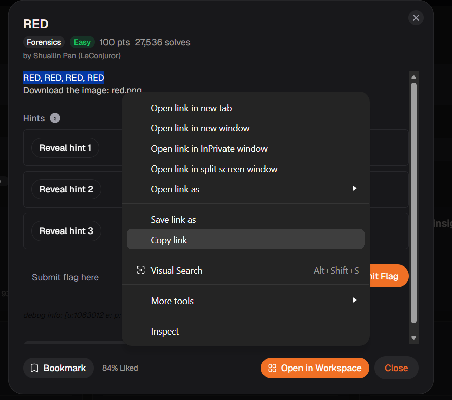
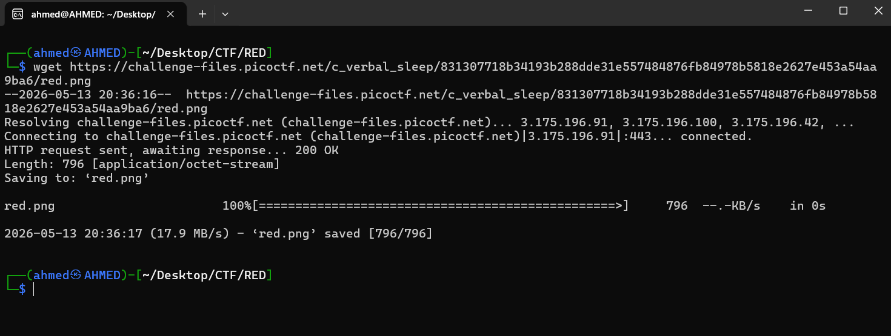
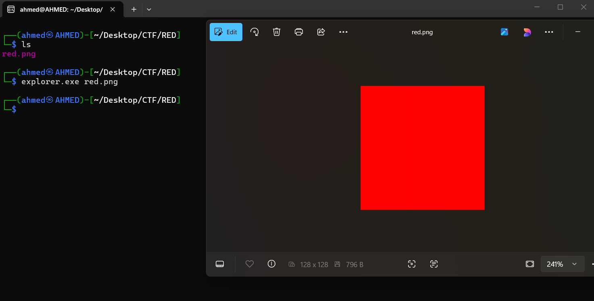
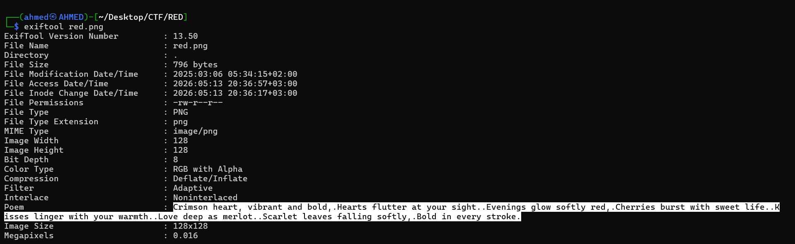
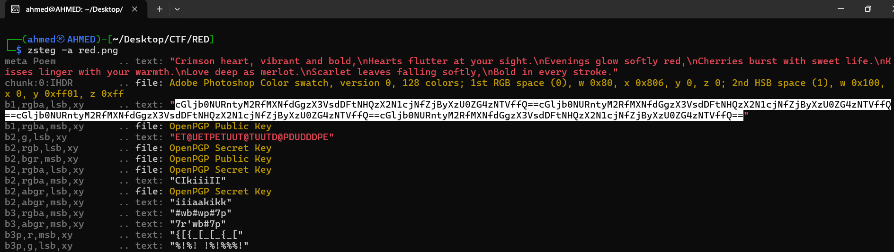
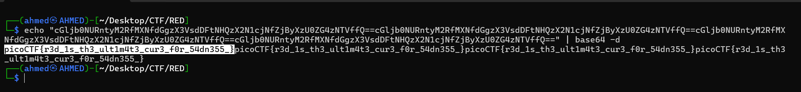

# RED Writeup
## lab link [RED](https://learn.cylabacademy.org/library?page=1&category=4)

## Scenario
```
RED, RED, RED, RED
```
First, I copied the file link to download it on the Linux OS.



use `wget` to download lab file 



First, since the file was a PNG image, I opened it using `explorer.exe`, but it only displayed a red-colored image.



Then, I inspected the file metadata using `exiftool` to look for useful information, but the only relevant content I found was a poem.



After that, I decided to investigate further and check whether the file contained any hidden data that could be extracted.

I started with `zsteg` instead of `steghide` because `steghide` often requires a passphrase, which I did not have. 
In addition, `zsteg` is more suitable for analyzing PNG files for hidden data.



I found a repeated Base64-encoded string. After decoding it, I successfully extracted the flag.



*The flag might be different from account to another*

Answer: `picoCTF{r3d_1s_th3_ult1m4t3_cur3_f0r_54dn355_}`


# The end. I hope this has been helpful to you.
