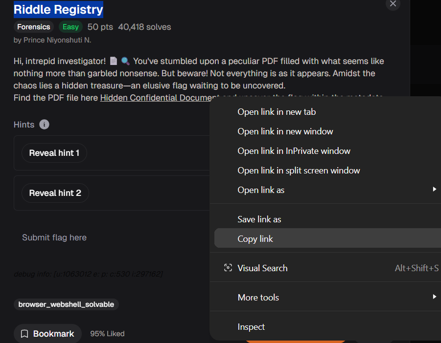
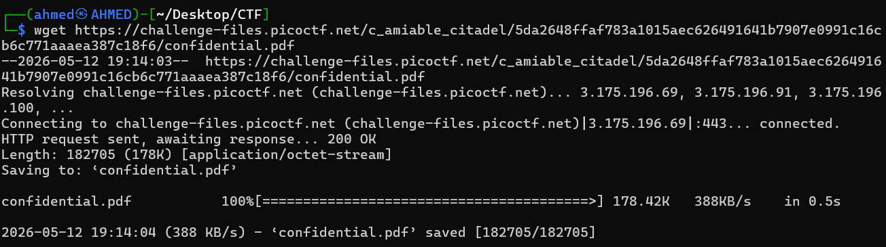
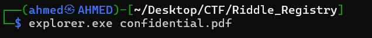
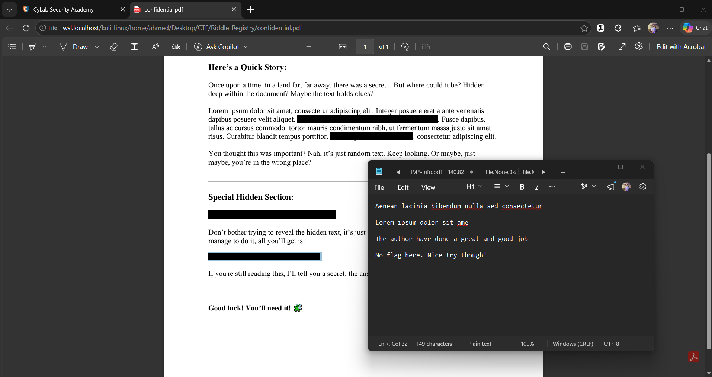
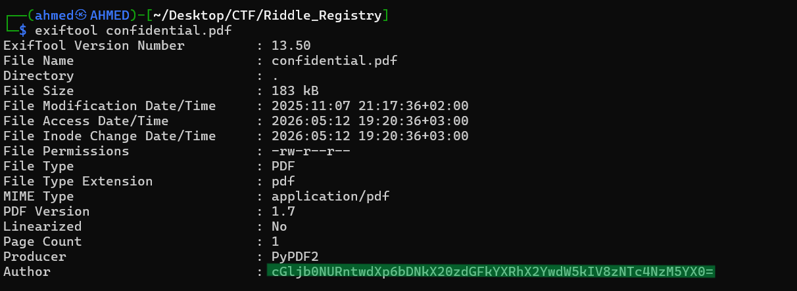
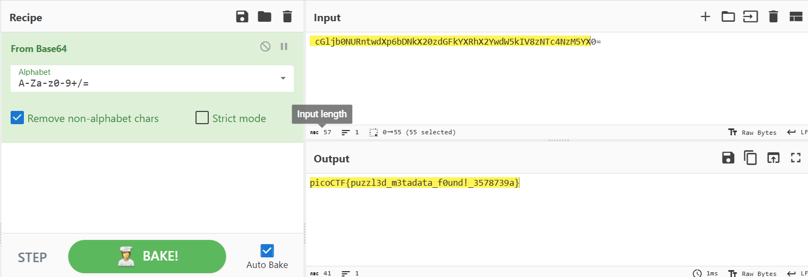

# Riddle Registry Writeup
## lab link [Riddle Registry](https://learn.cylabacademy.org/library?page=1&category=4)

## Scenario
```
Hi, intrepid investigator! 📄🔍 You've stumbled upon a peculiar PDF filled with what seems like nothing more than garbled nonsense.
But beware! Not everything is as it appears. Amidst the chaos lies a hidden treasure—an elusive flag waiting to be uncovered.
```
First, I copied the file link to download it into linux machine


then, download it using `wget`


I used explorer.exe to open the PDF file and view its content.



I found that some of the file content was covered with black lines. However, I was able to copy the covered content and paste it into a .txt file, but I still could not find the flag.



then, I decided to use `exiftool` to show file metadata and I found the Author name is base64 encoded



I used [Cyber Chef](https://cyberchef.org/) to decode it



*the flag might be different from account to another*

Answer: `picoCTF{puzzl3d_m3tadata_f0und!_3578739a}`


# The end. I hope this has been helpful to you.

