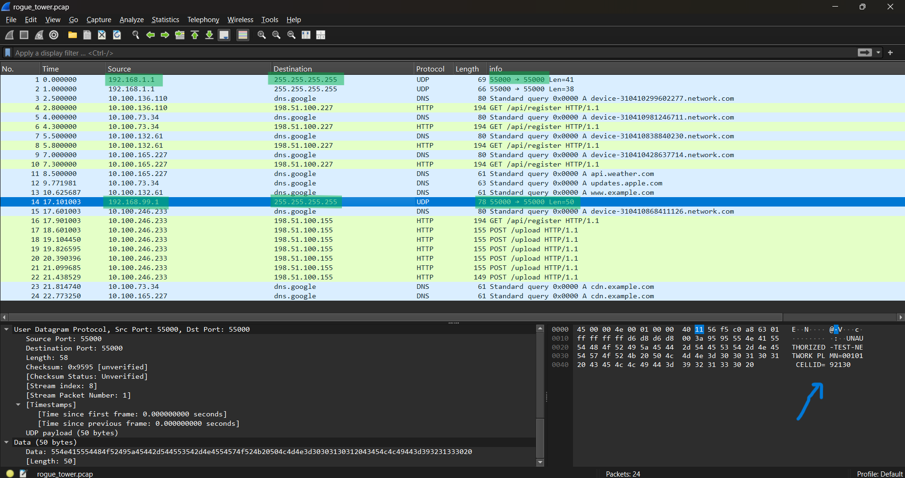
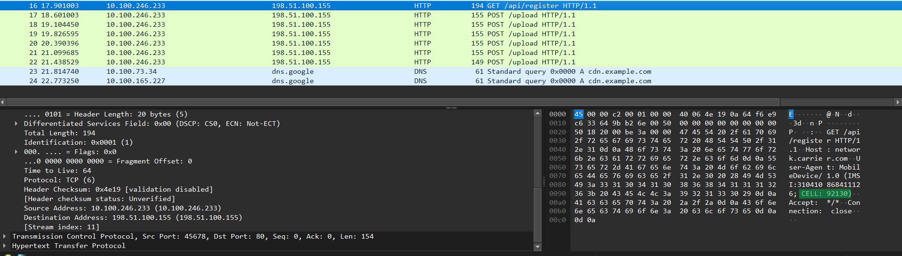
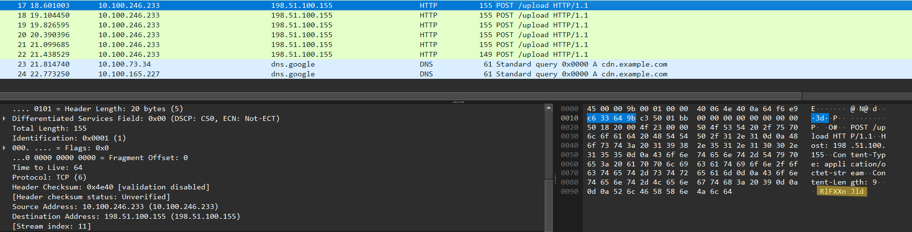
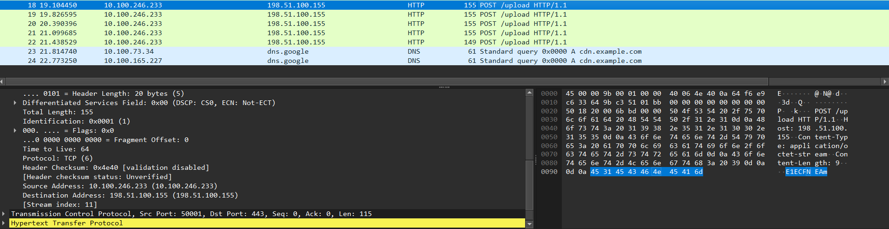
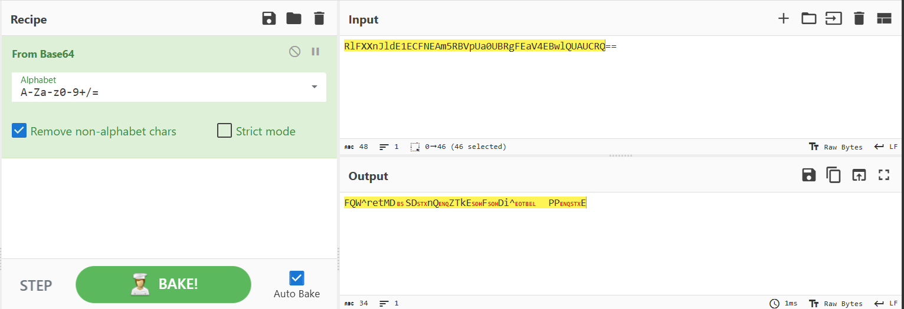
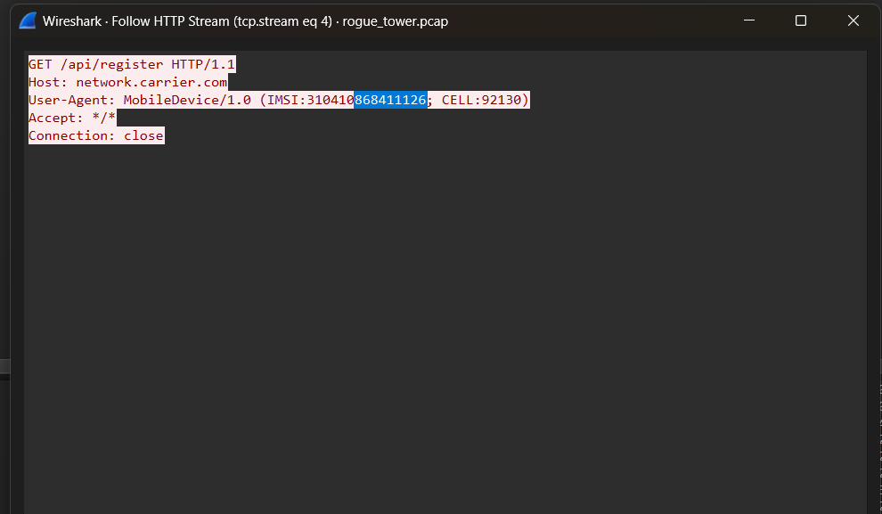
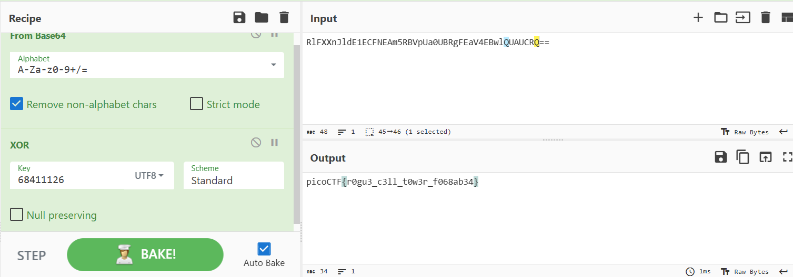

# Rogue Tower 1 Writeup
## lab link [Rogue Tower](https://learn.cylabacademy.org/library?page=2&category=4)

## Scenario
```
A suspicious cell tower has been detected in the network. Analyze the captured network traffic to identify the rogue tower, find the compromised device, and recover the exfiltrated flag.
```

Download pcap file and open it with wireshark

During the traffic analysis, I noticed that the original router first sent a broadcast message. 
A short time later, a rogue tower sent another broadcast message, and the response contained the message shown in the screenshot below.



After that, I observed a GET request that used the same cell tower ID. 
This was followed by multiple POST requests, each of which contained a fragment of the Base64-encoded data.








After collecting all Base64 fragments from the POST requests, I decoded them using CyberChef. 
The decoded output was not readable, which indicated that it was likely encrypted using XOR.


I used the last eight digits of the IMSI value as a possible XOR key to decrypt the decoded data.






*the flag might be different from account to another*

Answer: `picoCTF{r0gu3_c3ll_t0w3r_f068ab34}`


# The end. I hope this has been helpful to you.
