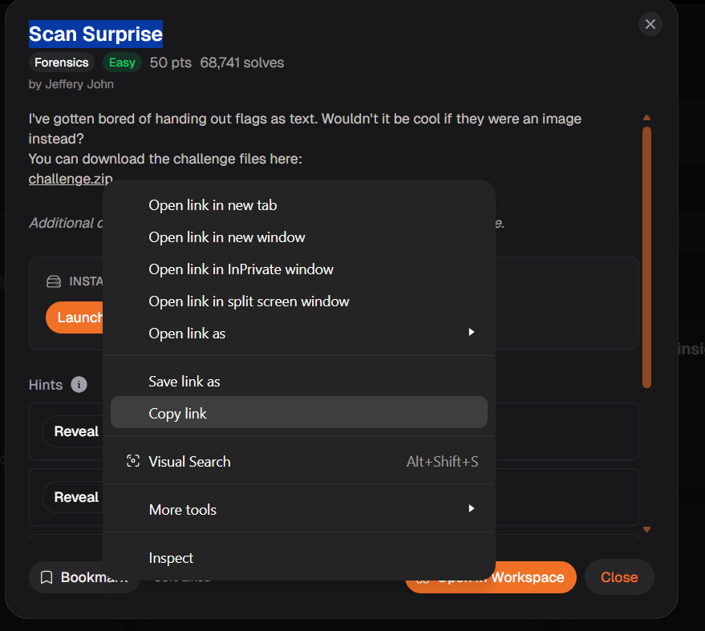
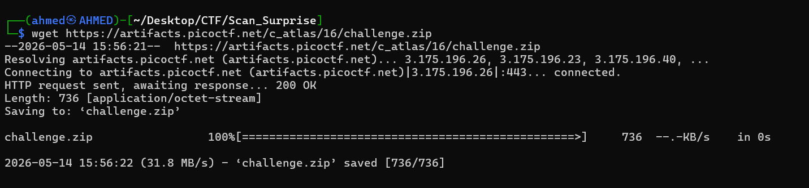
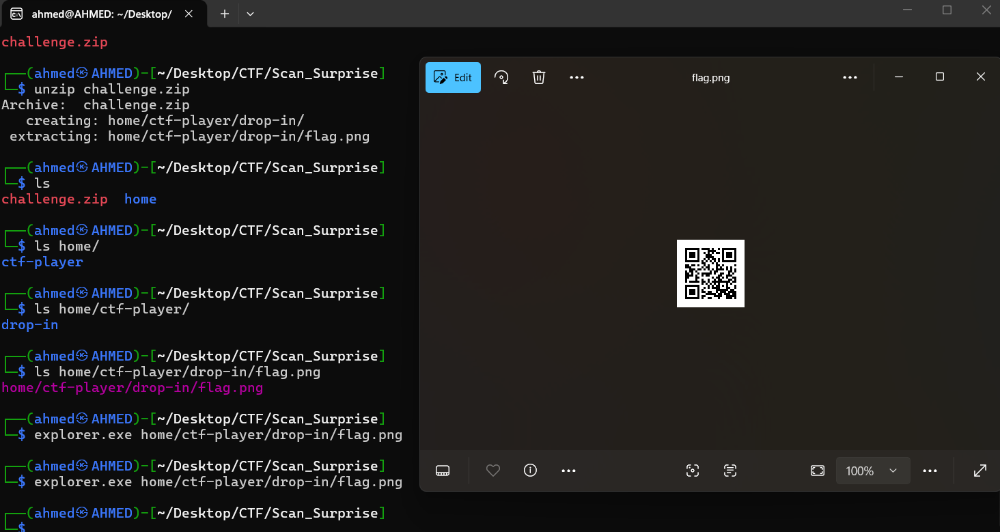
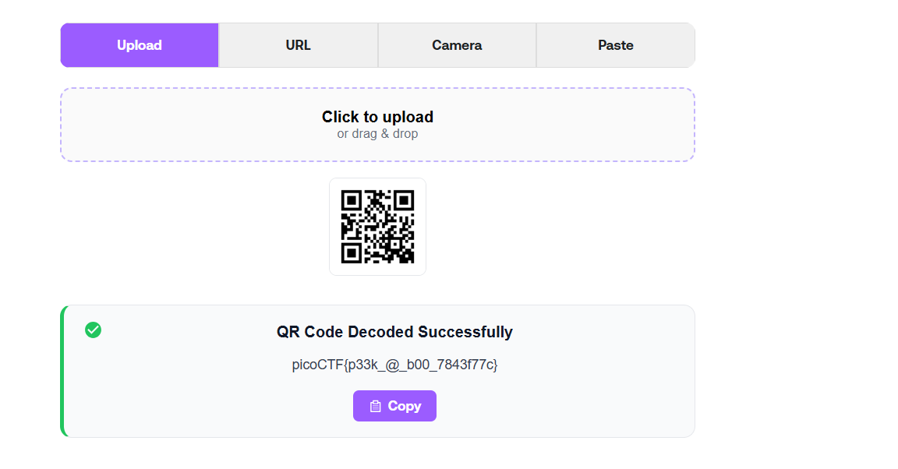

# Scan Surprise Writeup
## lab link [Scan Surprise](https://learn.cylabacademy.org/library?page=1&category=4)

## Scenario
```
I've gotten bored of handing out flags as text.
Wouldn't it be cool if they were an image instead?
```
First, I copied the file link to download it on the Linux OS.



use `wget` to download lab file 



I extracted the archive using the `unzip` command and inspected the extracted files and directories. 
After finding a `.png` file, I opened it with `explorer.exe` to view its contents.



I discovered that the PNG file contained a QR code.

so, I used this site to deocde it [QR code decoder](https://www.qr-codes.com/decoder) 



*the flag may be different from account to another.*

Answer: `picoCTF{p33k_@_b00_7843f77c}`


# The end. I hope this has been helpful to you.
