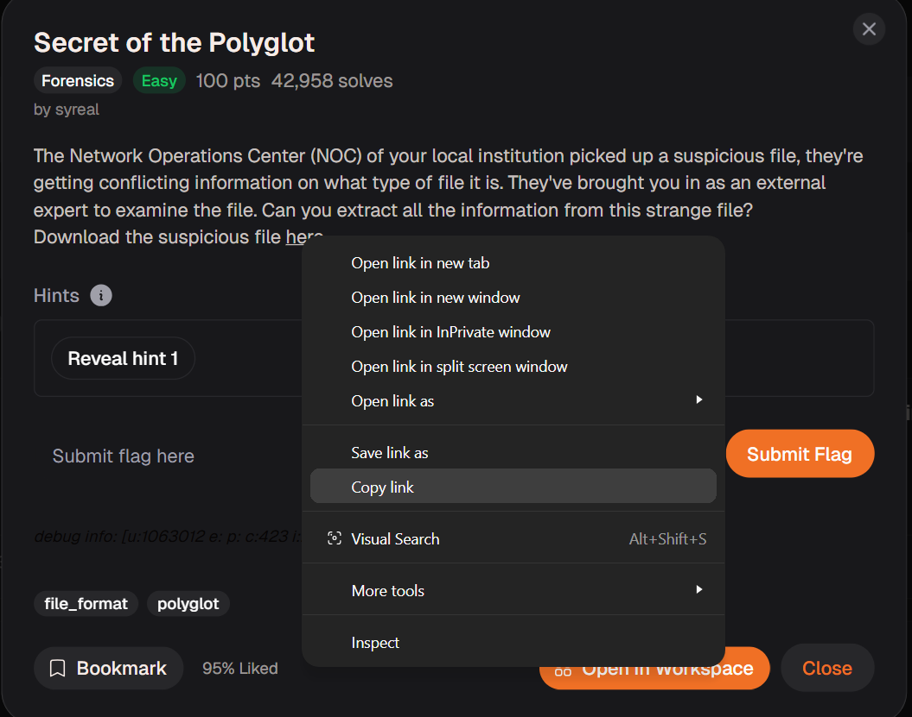
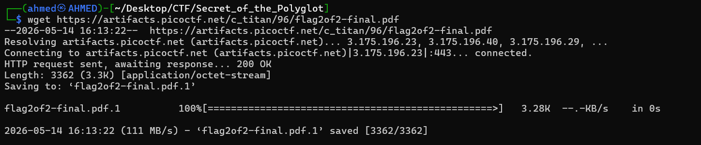
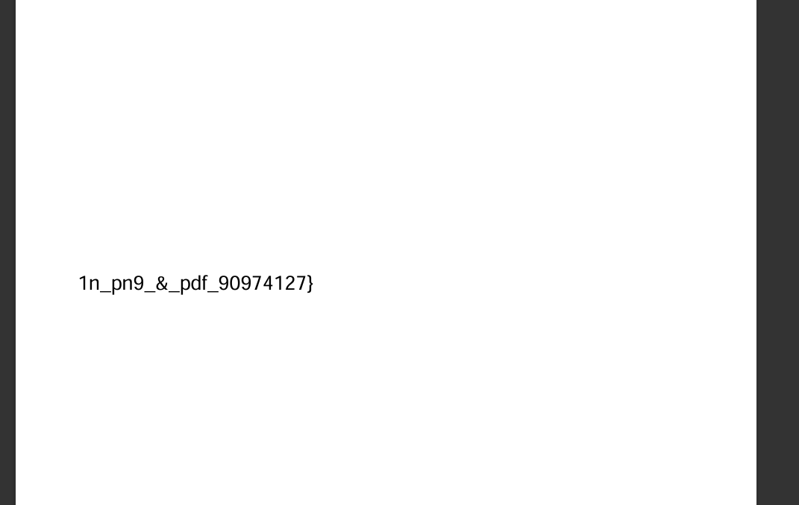
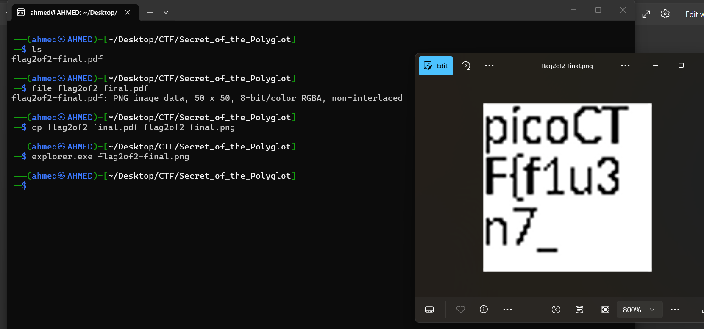

# Secret of the Polyglot Writeup
## lab link [Secret of the Polyglot](https://learn.cylabacademy.org/library?page=1&category=4)

## Scenario
```
The Network Operations Center (NOC) of your local institution picked up a suspicious file,
they're getting conflicting information on what type of file it is.
They've brought you in as an external expert to examine the file.
Can you extract all the information from this strange file?
```

First, I copied the file link to download it on the Linux OS.



use `wget` to download lab file 



Firstly, I opened the pdf file using explorer.exe and I found this part of flag 



Then, I used the `file` command to inspect the file information and confirm its correct file type.

After confirming that it was a PNG file, I renamed it with the correct `.png` extension. 
After opening the image, I found the first part of the flag.




*the flag may be different from account to another.*

Answer: `picoCTF{f1u3n7_1n_pn9_&_pdf_90974127}`


# The end. I hope this has been helpful to you.
