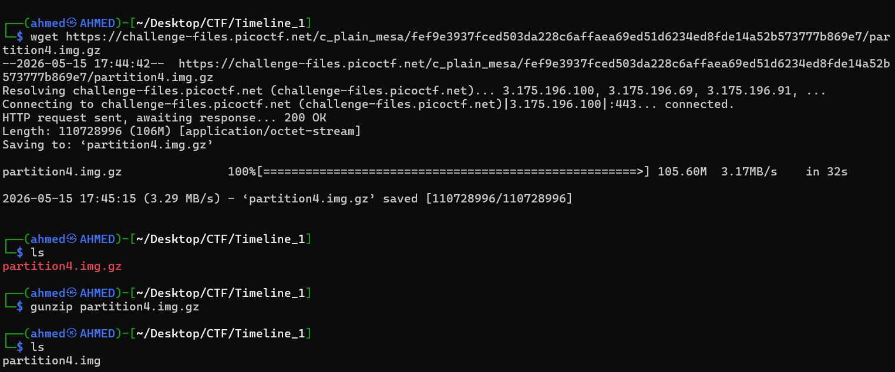
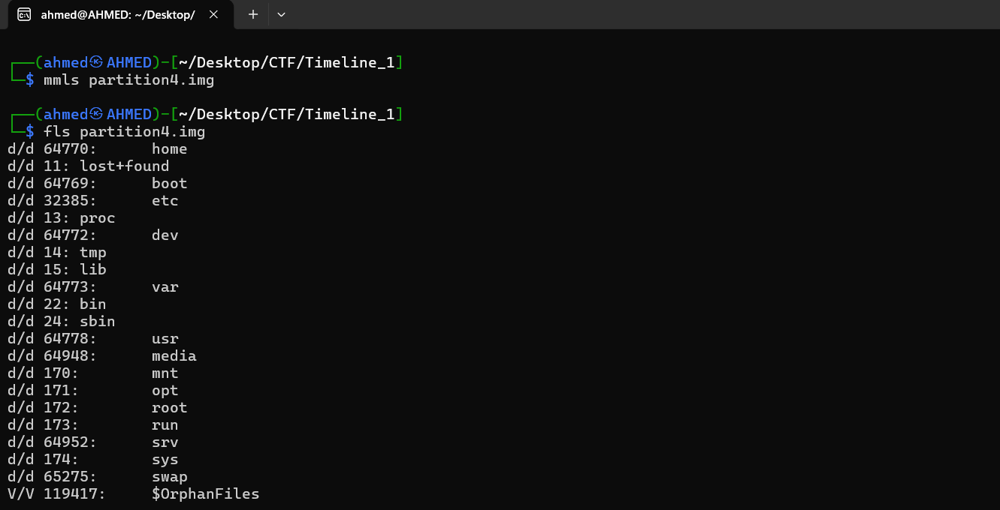
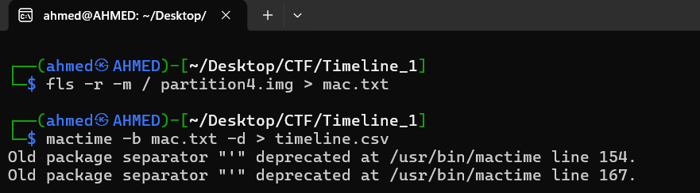
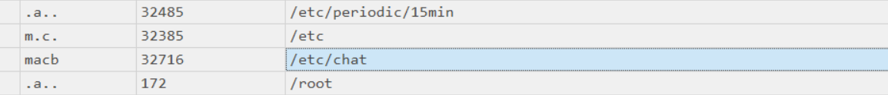
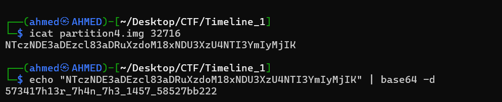

# Timeline 1 Writeup
## lab link [Timeline 1](https://learn.cylabacademy.org/library?page=1&category=4)

## Scenario
```
Can you find the flag in this disk image? Wrap what you find in the picoCTF flag format.

```

First, I used `wget` to download the image file, then decompressed it with `gunzip`.



First, I used `mmls` to examine the partition layout, but it did not reveal any useful information. 
Then, I used `fls` to list the directories inside the image file.



After that, I created a MAC timeline to analyze the file system activity chronologically.



I used `Timeline Explorer` from Eric Zimmerman's tools to analyze the `.csv` timeline file. 
During the analysis, I found a suspicious entry associated with this inode.



Therefore, I used `icat` with the inode number to extract and view the file contents.
The extracted output was Base64-encoded. I decoded it using `base64 -d`, then wrapped the decoded result in the `picoCTF{}` flag format.



*the flag might be different from account to another*

Answer: `picoCTF{573417h13r_7h4n_7h3_1457_58527bb222} `


# The end. I hope this has been helpful to you.
