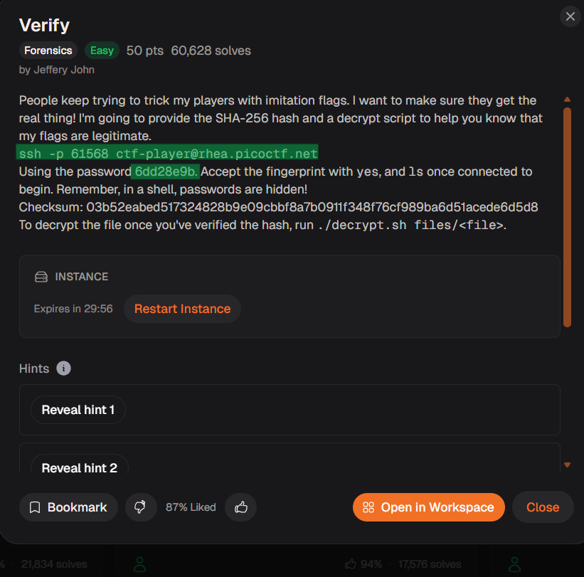
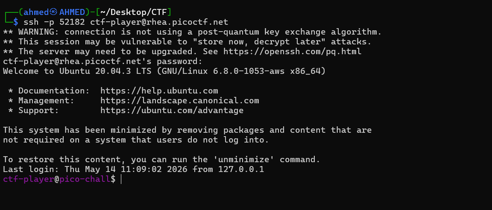
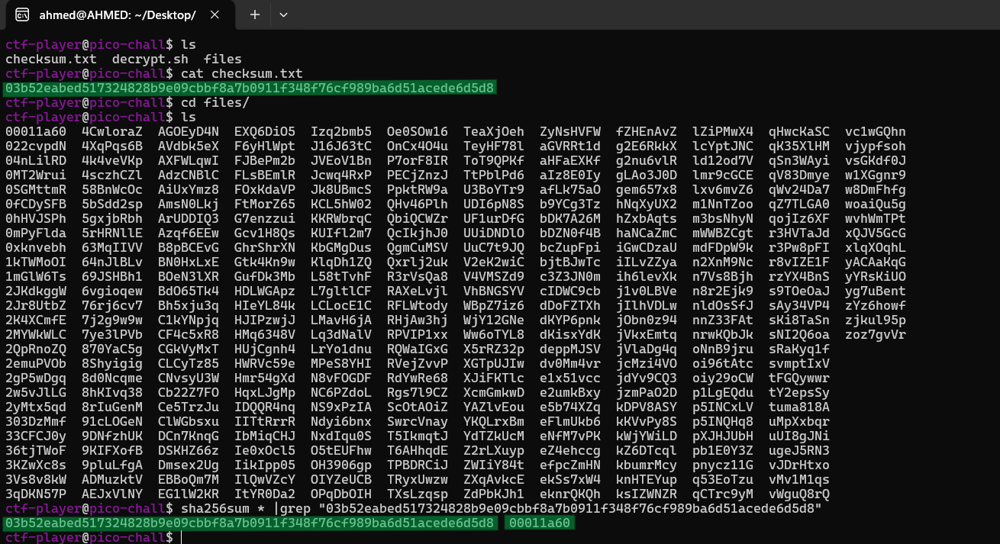
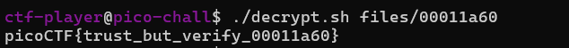

# Verify Writeup
## lab link [Verify](https://learn.cylabacademy.org/library?page=1&category=4)

## Scenario
```
People keep trying to trick my players with imitation flags. I want to make sure they get the real thing! I'm going to provide the SHA-256 hash and a decrypt script to help you know that my flags are legitimate.
```

First, I established an SSH connection to the machine using the provided credentials.





Then, I calculated the SHA-256 hashes of all files in the `files` directory and compared them with the given checksum using `grep`.



After confirming that the file matched the given checksum, I ran `./decrypt.sh files/<file>` to decrypt it.



*the flag might be different from account to another*

Answer: `picoCTF{trust_but_verify_00011a60}`


# The end. I hope this has been helpful to you.


