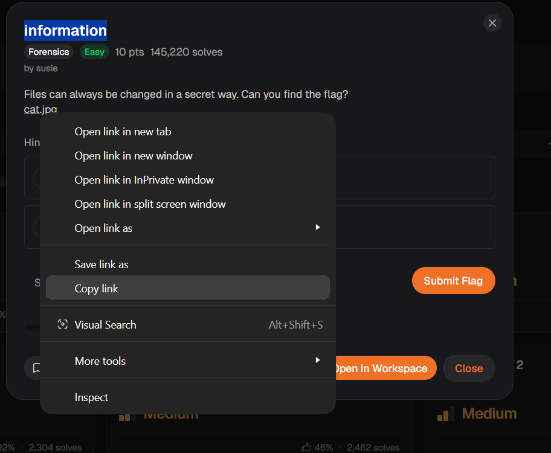
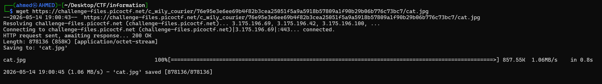
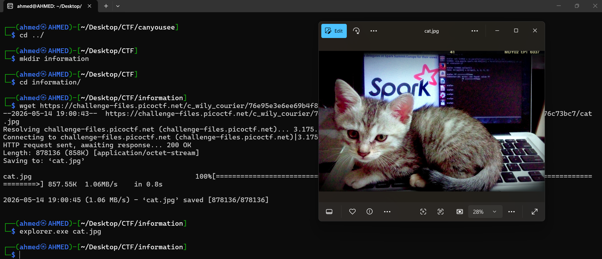
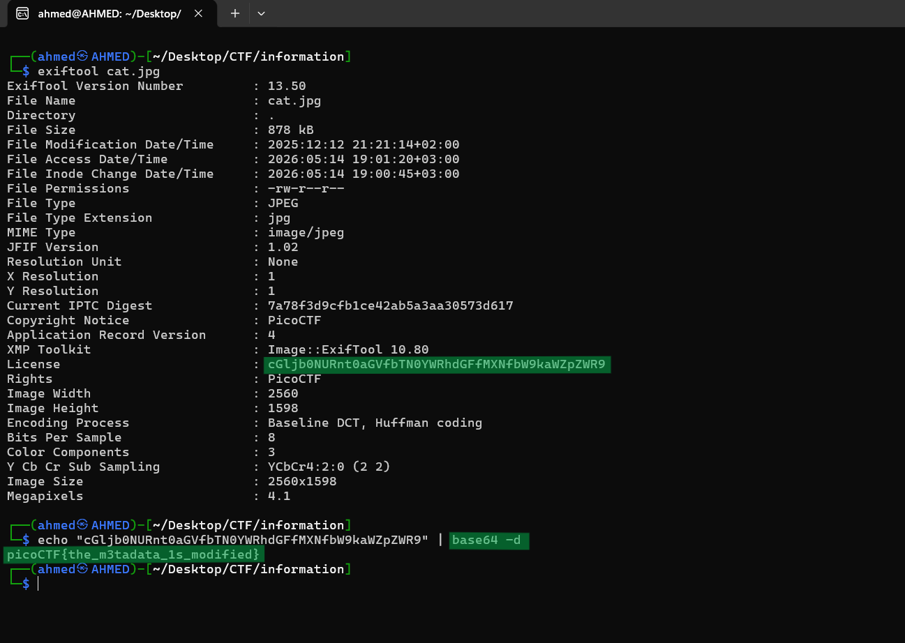

# information Writeup
## lab link [information](https://learn.cylabacademy.org/library?page=1&category=4)

## Scenario
```
Files can always be changed in a secret way. Can you find the flag?

```

First, I copied the file link to download it on the Linux OS.



use `wget` to download lab file 



After opening the image, it appeared to be a normal picture of a cat with no visible indication of hidden data.



Then, I used `exiftool` to inspect the image metadata and look for hidden information. 
I found a Base64-encoded string in the metadata, decoded it using `base64 -d`, and successfully extracted the flag.




*the flag may be different from account to another.*

Answer: `picoCTF{the_m3tadata_1s_modified}`


# The end. I hope this has been helpful to you.

