# DumpMe Lab writeup
lab link [DumpMe](https://cyberdefenders.org/blueteam-ctf-challenges/dumpme/)

## Scenario
```
A SOC analyst took a memory dump from a machine infected with a meterpreter malware.
As a Digital Forensicators, your job is to analyze the dump,
extract the available indicators of compromise (IOCs) and answer the provided questions.

```

## Tools
  - Volatility-2
  - Volatility-3
  - strings


first you need to extract lab file using any uncompression tool like winrar using password `cyberdefenders.org`

### Q1: What is the SHA1 hash of Triage-Memory.mem (memory dump)?

on CMD you can use this command `certutil -hashfile Triage-Memory.mem sha1`

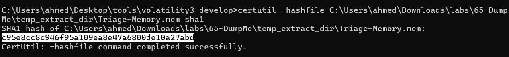

Answer: `c95e8cc8c946f95a109ea8e47a6800de10a27abd`


### Q2: What volatility profile is the most appropriate for this machine? (ex: Win10x86_14393)

for this we need to use `volatility 2`

using this plugin `volatility_2.exe -f Triage-Memory.mem imageinfo`

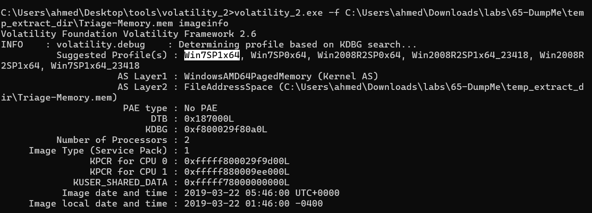

it was suggest more than one profile, usually the first one is correct

Answer: `Win7SP1x64`


### Q3: What was the process ID of notepad.exe?

in vol-2 you need to append profile in the command 
`volatility_2.exe -f Triage-Memory.mem --profile=Win7SP1x64 pslist | findstr "notepad.exe"`

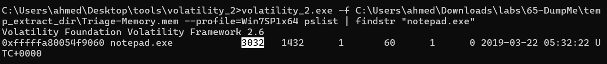


### Q4: Name the child process of wscript.exe.

using the same command above without `findstr` 

`volatility_2.exe -f Triage-Memory.mem --profile=Win7SP1x64 pslist`

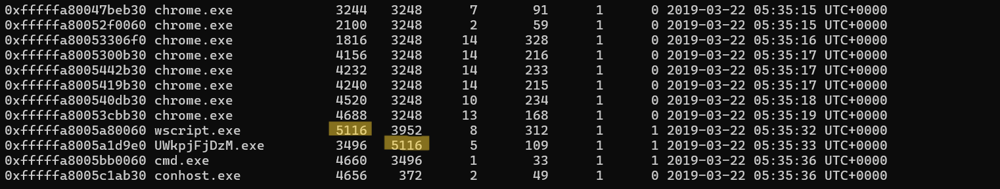


Answer: `UWkpjFjDzM.exe `


### Q5: What was the IP address of the machine at the time the RAM dump was created?

using `netscan` command to show all connection 

`volatility_2.exe -f Triage-Memory.mem --profile=Win7SP1x64 netscan`

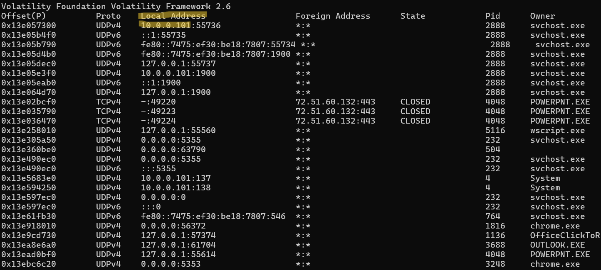

as we can see the local ip is the solution 

Answer: `10.0.0.101`


### Q6: Based on the answer regarding the infected PID, can you determine the IP of the attacker?

using the same command above and grep on malicious process 
we can see that 

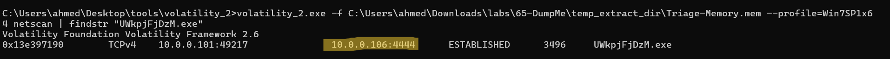

connection from local ip to foreign ip on port:4444 which usually related to backdoor, reverse shell
or even malicious tools like metasploit 


Answer: `10.0.0.106`


### Q7: How many processes are associated with VCRUNTIME140.dll?

I tried with volatility-2 using this command `volatility_2.exe -f Triage-Memory.mem --profile=Win7SP1x64 dlllist | findstr /i "VCRUNTIME140.dll"`
 and found just 1 process but answer 1 was wrong

 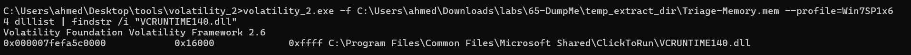

so, I used volatility-3 and found 5 process
`python vol.py -f Triage-Memory.mem windows.dlllist | findstr /i "VCRUNTIME140.dll"`

 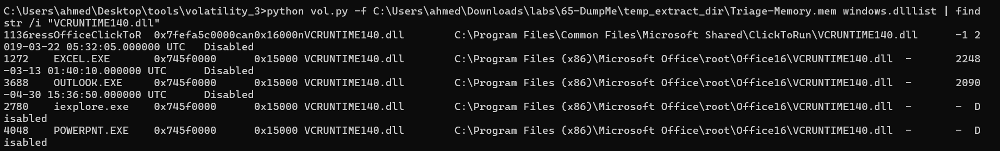

Answer: `5`


### Q8: After dumping the infected process, what is its md5 hash?
as we already know from the Q4 
the PID of the malicious process is  `3496`

so, we can use this command to dump the pocess
`volatility_2.exe -f Triage-Memory.mem --profile=Win7SP1x64 procdump -p 3496 -D "extracted"`

 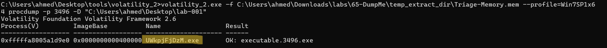

then calc the hash using any hash calculator or even command line 

windows defender may be delete the file, so you need to disable windows defender then dump file or dump it in VM

use this command `certutil -hashfile UWkpjFjDzM.exe  md5`

 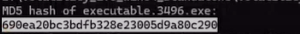

Answer: `690ea20bc3bdfb328e23005d9a80c290`


### Q9: What is the LM hash of Bob's account?

the plugin is used to dump `LM/NTLM` hashes is `hashdump`
command: `volatility_2.exe -f Triage-Memory.mem --profile=Win7SP1x64 hashdump`

 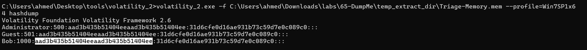

Answer: `aad3b435b51404eeaad3b435b51404ee`


### Q10: What memory protection constants does the VAD node at 0xfffffa800577ba10 have?

Because the command prompt (CMD) does not contain a command to display a specific line and the lines that follows it.

I fisrt use this command to know which line contains the vlaue I want 

`volatility_2.exe -f Triage-Memory.mem --profile=Win7SP1x64 vadinfo | findstr /n "0xfffffa800577ba10"`

then used this command to number all lines and search for  specific value using it's number 
which I know from the past command and print also the lines follows it.

`volatility_2.exe -f Triage-Memory.mem --profile=Win7SP1x64 vadinfo | findstr /n "^" | findstr "11132 11133 11134 11135"`

 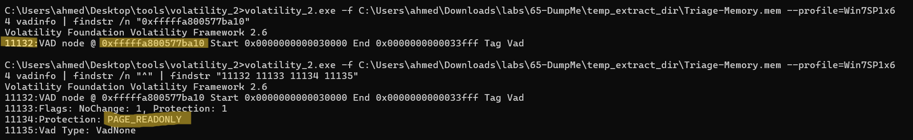

Answer: `PAGE_READONLY`


### Q11: What memory protection did the VAD starting at 0x00000000033c0000 and ending at 0x00000000033dffff have?

Using the same mindset as in the previous question 

`volatility_2.exe -f Triage-Memory.mem --profile=Win7SP1x64 vadinfo | findstr /n "0x00000000033c0000"`

then choose the output contains the start and end I want and print its number and the following numbers

`volatility_2.exe -f Triage-Memory.mem --profile=Win7SP1x64 vadinfo | findstr /n "^" | findstr "20742 20743 20744 20745"`

 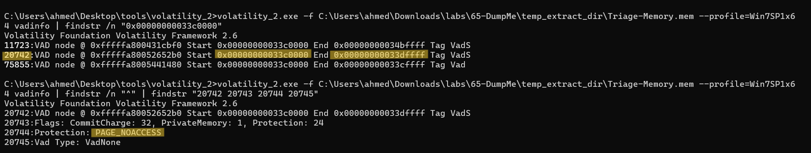


Answer: `PAGE_NOACCESS`


### Q12: There was a VBS script that ran on the machine. What is the name of the script? (submit without file extension)

in this question I tried to search for it in listed processes but finally I found it in cmdline

command: volatility_2.exe -f Triage-Memory.mem --profile=Win7SP1x64 cmdline | findstr /i "VBS"

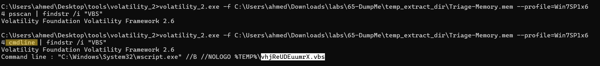

Answer: `vhjReUDEuumrX`


### Q13: An application was run at 2019-03-07 23:06:58 UTC. What is the name of the program? (Include extension)

I searched using `pslist, psscan` but found nothing, so I searched for 
the Evidence of execution in windows 

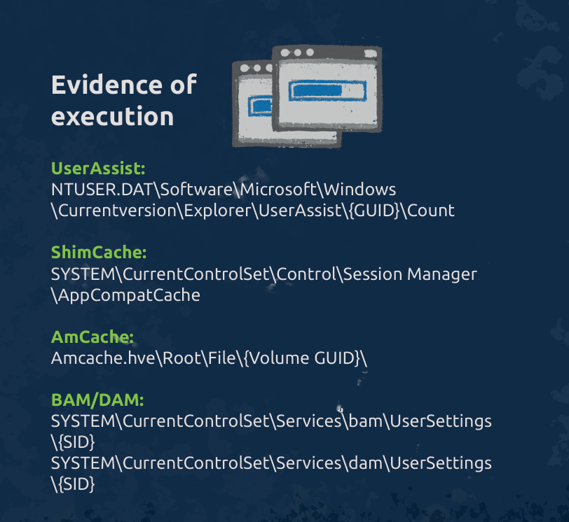

then I searched for any plugin related to these values

`volatility_2.exe -h | findstr /i "ShimCache UserAssist AmCache BAM DAM`

this plugin found the solution `shimcache`

command: `volatility_2.exe -f Triage-Memory.mem --profile=Win7SP1x64 shimcache | findstr /i "2019-03-07 23:06:58"`

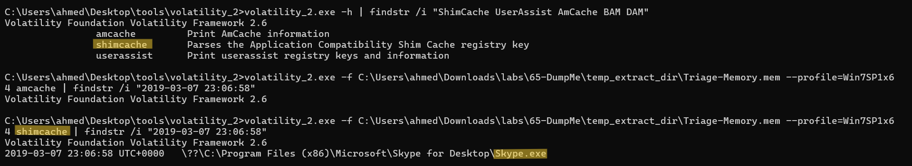


Answer: `Skype.exe`


### Q14: What was written in notepad.exe at the time when the memory dump was captured?

we need to dump all memory related to `notepad.exe` using `memdump`

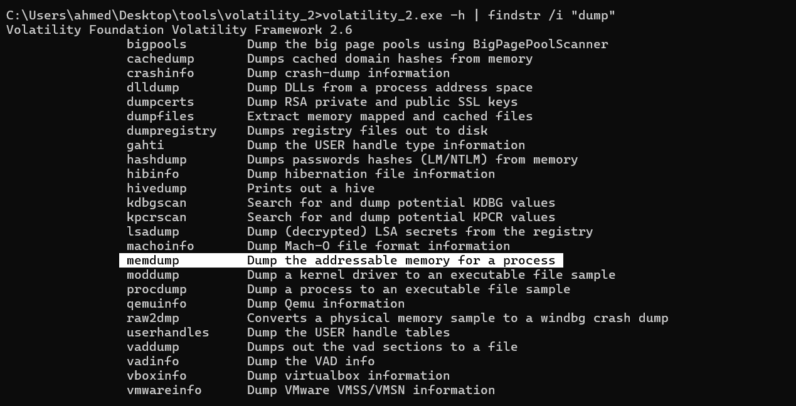

now we need to know pid of notepad.exe using `pslist`

pid: `3032`

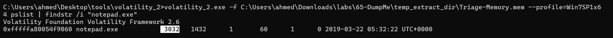

using `memdump` to dump notepad.exe memory 

`volatility_2.exe -f Triage-Memory.mem --profile=Win7SP1x64 memdump -p 3032 -D "out directory"`

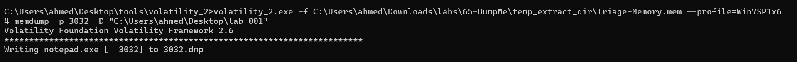

then using `Strings` to find the flag
I used -e l to read Unicode strings from memory, since Windows often stores text in this format

command: `strings -el  3032.dmp | findstr "flag<"`

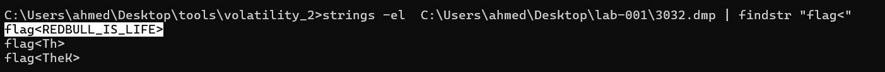


Answer: `flag<REDBULL_IS_LIFE>`


### Q15: What is the short name of the file at file record 59045?

for this I used `mftparser` plugin

`volatility_2.exe -f Triage-Memory.mem --profile=Win7SP1x64 mftparser | findstr /i "59045"`

but findstr didn't print the answer directely, so I used the same mindset as in Q10


to know the line where is located
`volatility_2.exe -f Triage-Memory.mem --profile=Win7SP1x64 mftparser | findstr /n "59045"`

to print all lines by numbers and search by the number of line above
`volatility_2.exe -f Triage-Memory.mem --profile=Win7SP1x64 mftparser | findstr /n "^" | findstr  "28142 28143 28144 28145 28146 28147 28148 28149 28150 28151 28152 28153 28154 28156 28157 28158 28159 28160 28161 28162 28163"`

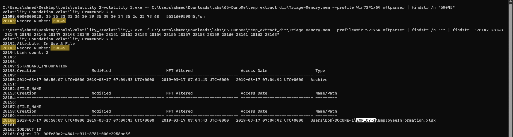


Answer: `EMPLOY~1.xls`


### Q16: This box was exploited and is running meterpreter. What was the infected PID?

return to the malicious process we found in the Q4 
by using pslist to display all process
`volatility_2.exe -f Triage-Memory.mem --profile=Win7SP1x64 pslist | findstr /i "UWkpjFjDzM.exe"`

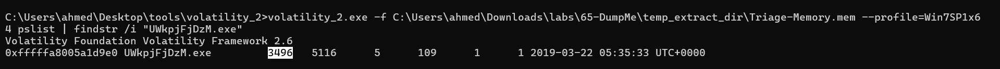


Answer: `3496`


# The end, I hope you found this useful. 


