# Hunter lab wrtieup 
## Category : Endpoint Forensics 
## Tools : 
- AccessData_FTK_Imager

## scenario 
The SOC team got an alert regarding some illegal port scanning activity coming from an employee's system. The employee was not authorized to do any port scanning or any offensive hacking activity within the network. The employee claimed that he had no idea about that, and it is probably a malware acting on his behalf. The IR team managed to respond immediately and take a full forensic image of the user's system to perform some investigations.

There is a theory that the user intentionally installed illegal applications to do port scanning and maybe other things. He was probably planning for something bigger, far beyond a port scanning!

It all began when the user asked for a salary raise that was rejected. After that, his behavior was abnormal and different. The suspect is believed to have weak technical skills, and there might be an outsider helping him!

Your objective as a soc analyst is to analyze the image and to either confirm or deny this theory.

### Firstly, open FTK_Imager then select image file, after that select the image itself 

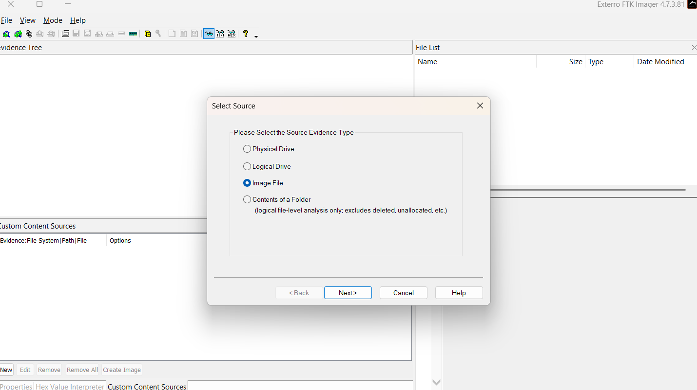 

#### Q1: What is the computer name of the suspect machine? 

computer name can found in this hive `SYSTEM\CurrentControlSet\Control\ComputerName\ComputerName`

so, we need to export software hive you will found it in this path `root\windows\system32\config` 

remeber, you need to extract all SYSTEM files like SYSTEM, SYSTEM.LOG 

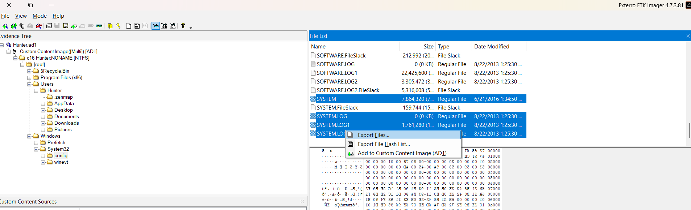

open the SYSTEM and SYSTEM.LOG file using `RegisteryExplorer` form EZtools 

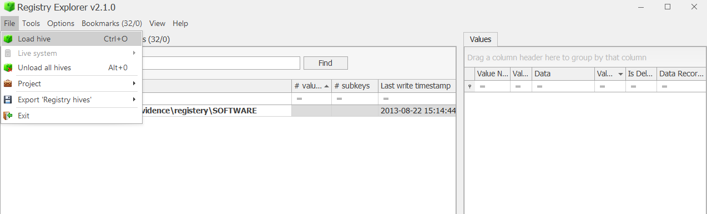
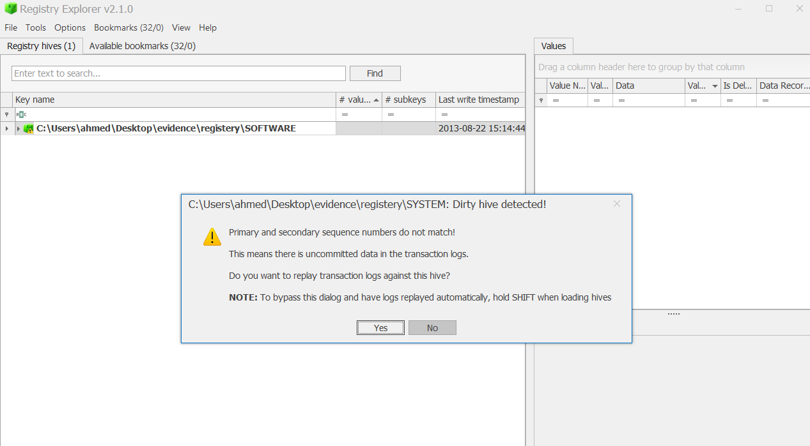
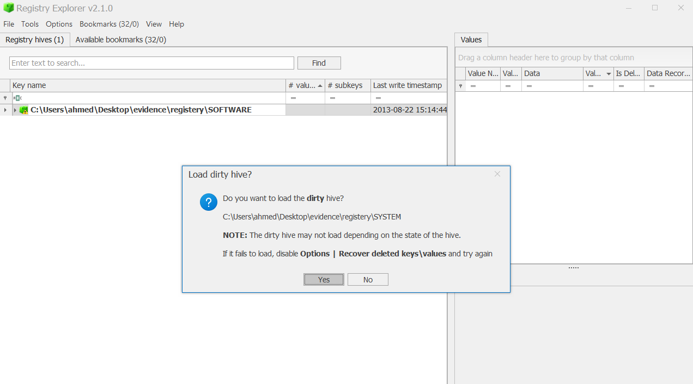

now we need to go to the path hive above 
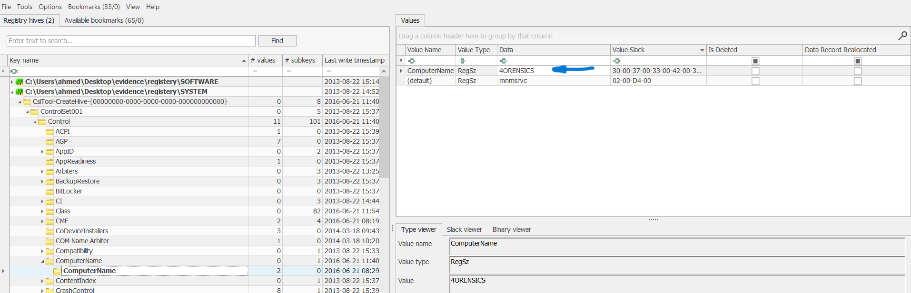

OR you can found it in available bookmarks in RegisteryExplorer

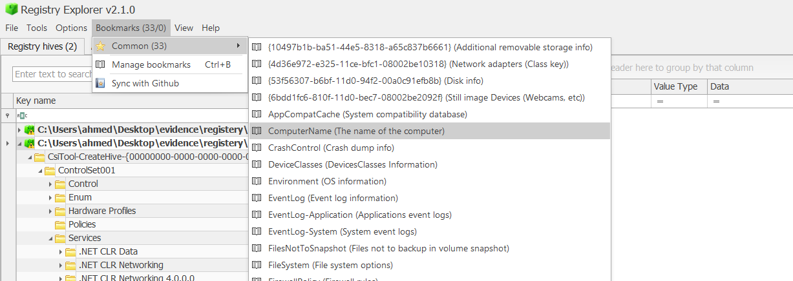

Answer: `4ORENSICS`

#### Q2: What is the computer IP?

network information can found in this hive path `SYSTEM\CurrentControlSet\Services\Tcpip\Parameters\Interfaces`

or directely from available bookmarks 

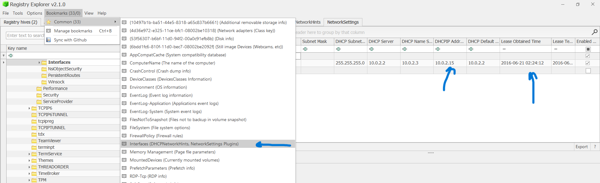

Answer: `10.0.2.15`

#### Q3: What was the DHCP LeaseObtainedTime?

from the image above you can see the answer 

Answer: `21/06/2016 02:24:12 UTC`

#### Q4: What is the computer SID?
 SID is security identifier you can found it in  `HKLM\SOFTWARE\Microsoft\Windows NT\CurrentVersion\ProfileList`
 export SOFTWARE hive from FTK_imager and open it in RegisteryExplorer

 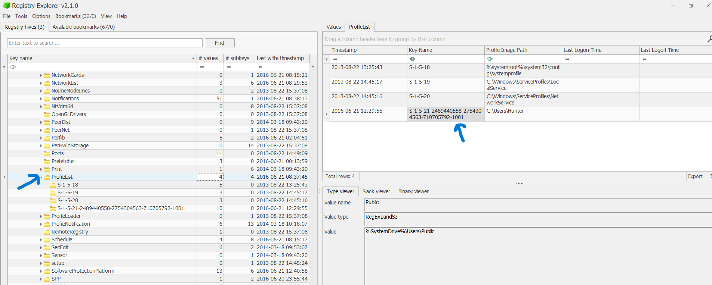

 Answer: `S-1-5-21-2489440558-2754304563-710705792`

 #### Q5:What is the Operating System(OS) version?

in the SOFTWARE hive and from bookmarks you can find `windows version information`

 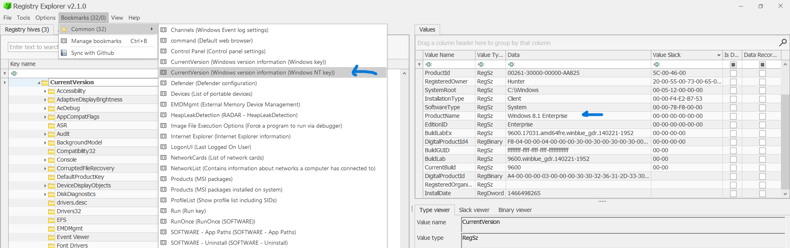

 Answer: `8.1`

 #### Q6: What was the computer timezone?

the hive path that contain time zone info is `SYSTEM\CurrentControlSet\Control\TimeZoneInformation`
or you can find it directely from bookmarks 

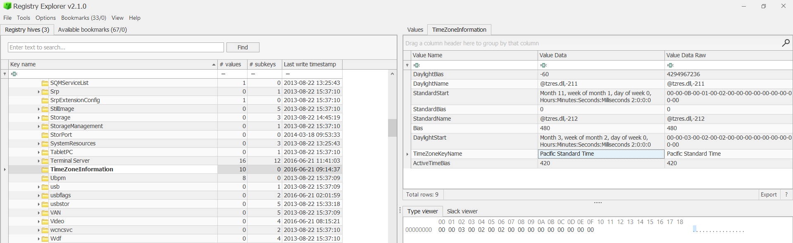

I used info in this photo and then asked ai tool  

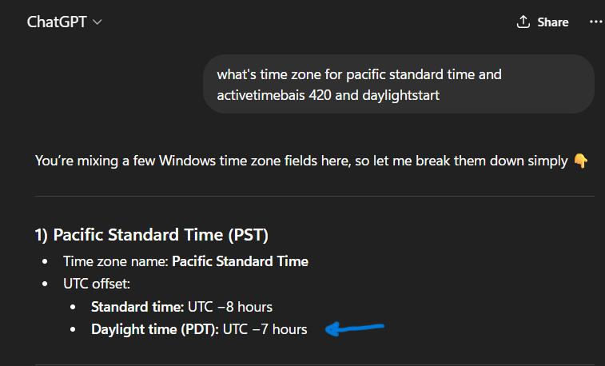

Answer: `UTC-07:00`

#### Q7: How many times did this user log on to the computer?

you can find info related to users from `SAM` hive export it from FTK_Imager as you did in SYSTEM hive,
then add it to registery explorer

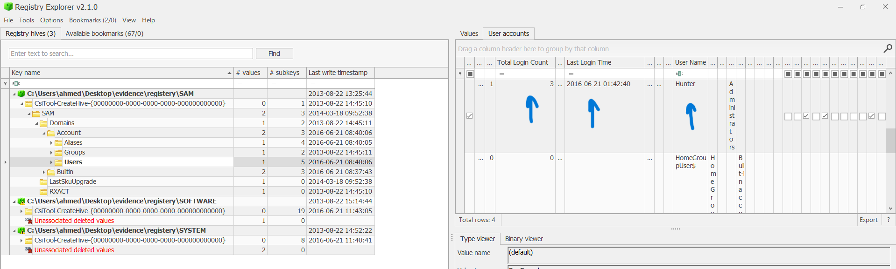 

Answer: `3`

#### Q8: When was the last login time for the discovered account? Format: one-space between date and time

the answer in the photo above 

Answer: `2016-06-21 01:42`

#### Q9: There was a “Network Scanner” running on this computer, what was it? And when was the last time the suspect used it? Format: program.exe,YYYY-MM-DD HH:MM:SS UTC 

by get deeper in image on FTK_imager i found this 

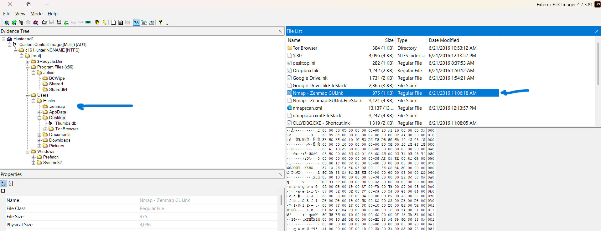 

as you already know zenmap is a network scanner tool 
now we need to know the last time it's used
the files provide it is `prefetchfiles` 
you can found this folder in this path `root\windows\prefetch`
we need now to export the whole folder 

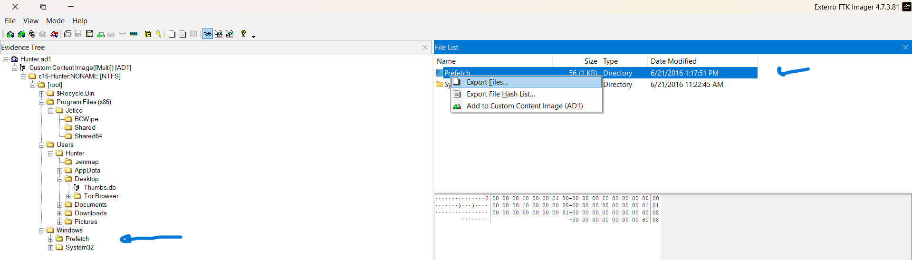 

after that we need to analyze this folder 
we can analyze it using `PECmd.exe` from EZtools 

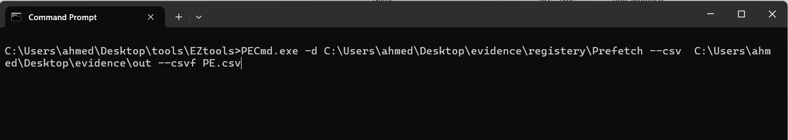 

open the CSV file using `timelineexplorer` from EZtools and search for zenmap 

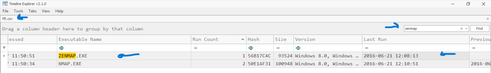 

Answer: `zenmap.exe,2016-06-21 12:08:13 UTC`

#### Q10: When did the port scan end? (Example: Sat Jan 23 hh:mm:ss 2016)

export this file to know info about last scan 

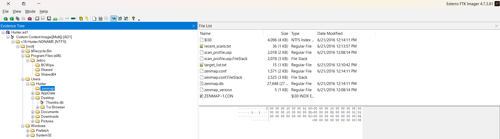 

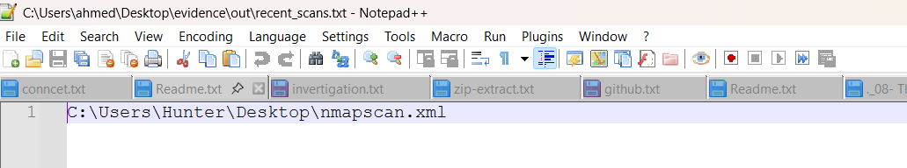 

go to this path and export this file 

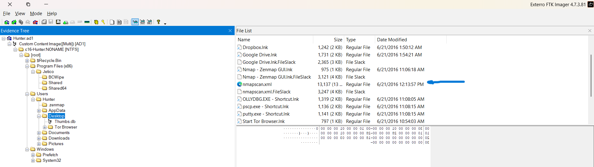 

I tried to open it with browser but it didin't open, so I opened it with vscode you can open it with any text editor 

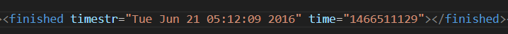 

Answer: `Tue Jun 21 05:12:09 2016`

#### Q11: How many ports were scanned?

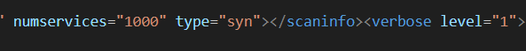 

Answer: `1000`

#### Q12: What ports were found "open"?(comma-separated, ascending)

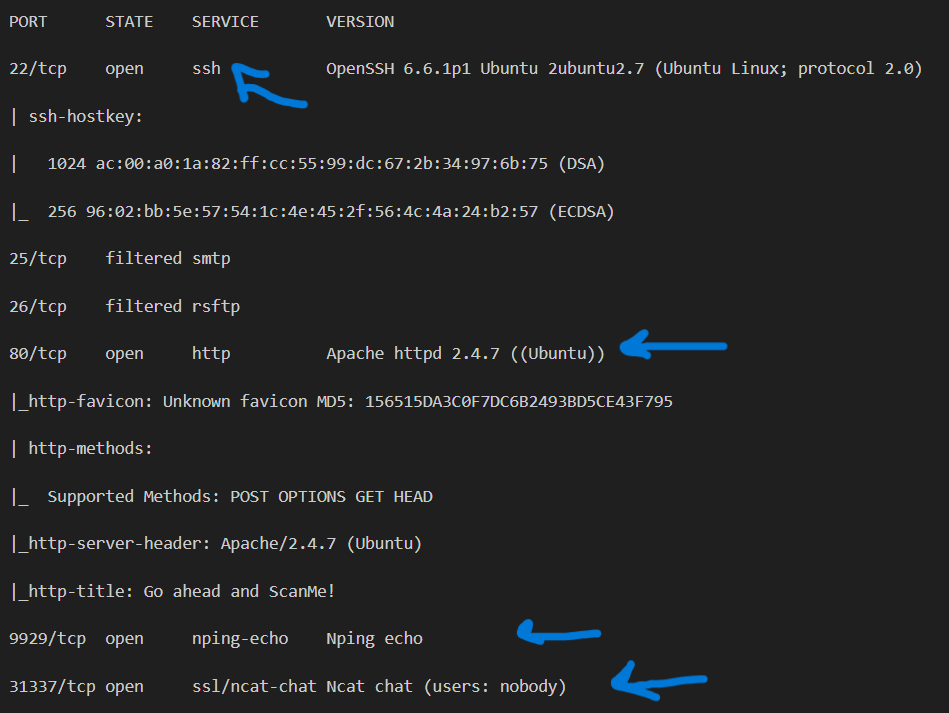 

Answer: `22,80,9929,31337` 

#### Q13: What was the version of the network scanner running on this computer?

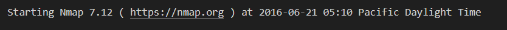 

Answer: `7.12`

#### Q14: The employee engaged in a Skype conversation with someone. What is the skype username of the other party? 

SKYPE data are in this path `C:\Users\<Username>\AppData\Roaming\Skype\` 
open this path and export the `main.db` file

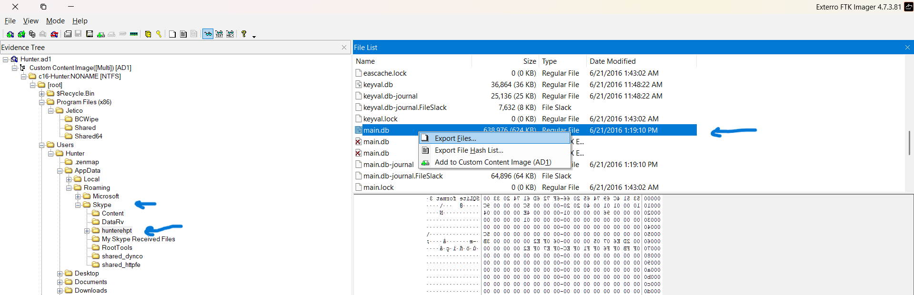 

then open the main.db using `skyperious`

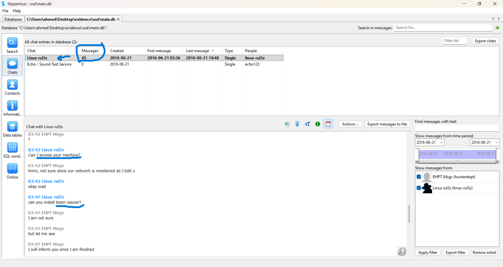 

Answer: `linux-rul3z`

#### Q15: What is the name of the application both parties agreed to use to exfiltrate data and provide remote access for the external attacker in their Skype conversation?

in the photo above you can find the answer 

Answer: `Teamviewer`

#### Q16: What is the Gmail email address of the suspect employee?

emails are sended by outlook and you can find outlook data in this path
`C:\Users\<Username>\AppData\Local\Microsoft\Outlook\`

I searched in this path and found nothing, so I tried to search in other palces and found this under the document folder 

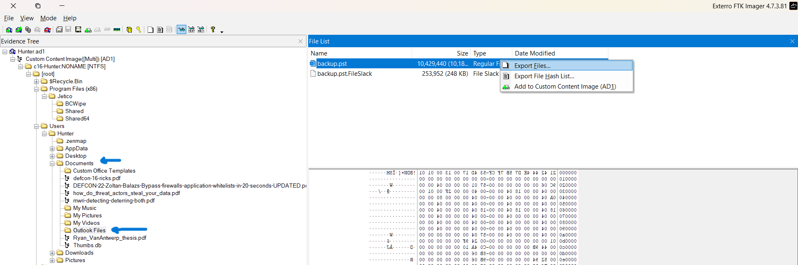 

go ahead and open this file using `SysTools Outlook PST Viewer`

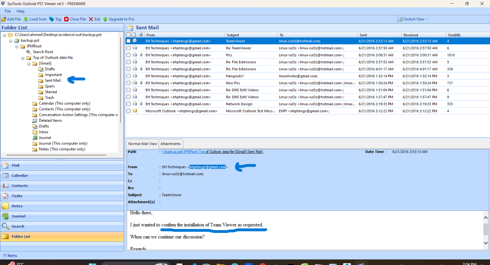  

Answer: `ehptmsgs@gmail.com`

#### Q17: It looks like the suspect user deleted an important diagram after his conversation with the external attacker. What is the file name of the deleted diagram?

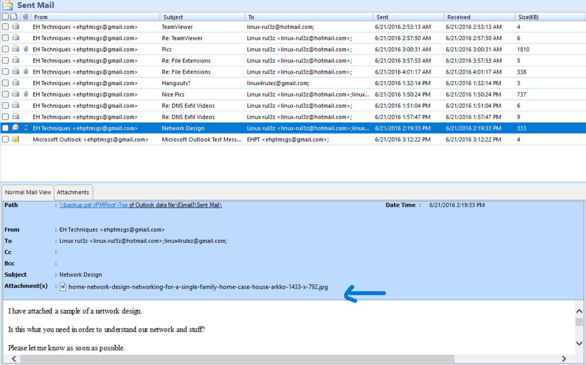  

Answer: `home-network-design-networking-for-a-single-family-home-case-house-arkko-1433-x-792.jpg`

#### Q18: The user Documents' directory contained a PDF file discussing data exfiltration techniques. What is the name of the file?

in the documnet folder you will see more than .pdf file, so you need to export all of them and see the content 

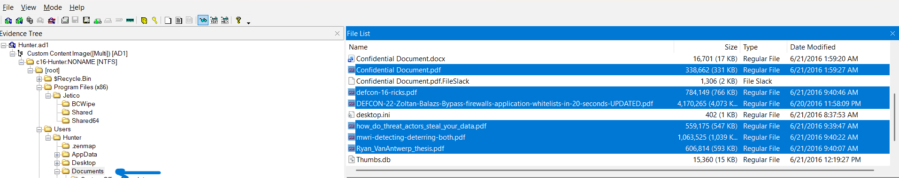  

If you open `Ryan_VanAntwerp_thesis.pdf`, you will find that 

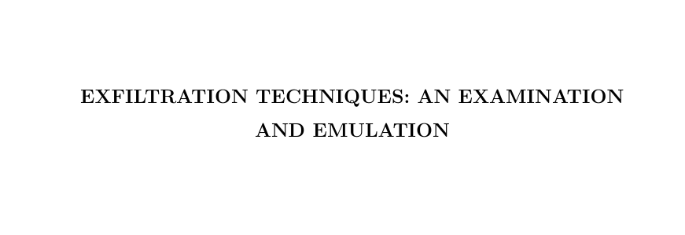  

Answer: `Ryan_VanAntwerp_thesis.pdf`

#### Q19: What was the name of the Disk Encryption application Installed on the victim system? (two words space separated)

 

