# MrRobot lab wrtieup 
## Lab link [MrRobot](https://cyberdefenders.org/blueteam-ctf-challenges/mrrobot/)

## Category : Endpoint Forensics
## Tools : 
Volatility 


## scenario 
```
An employee reported that his machine started to act strangely after receiving a suspicious email for a security update.
The incident response team captured a couple of memory dumps from the suspected machines for further inspection.
Analyze the dumps and help the SOC analysts team figure out what happened!
```

### Q1: Machine:Target1 What email address tricked the front desk employee into installing a security update?

First of all, you need to know the profile of memory dump 
`volatility_2.exe -f Target1-1dd8701f.vmss imageinfo`


then list all processes to know which one related to emails

`volatility_2.exe -f Target1-1dd8701f.vmss --profile=Win7SP1x86_23418 pslist`


Next, execute the YaraScan plugin against the target process and search for the keyword "gmail".

`volatility_2.exe -f Target1-1dd8701f.vmss --profile=Win7SP1x86_23418 yarascan  -Y "gmail" -p 3196`


Answer: `th3wh1t3r0s3@gmail.com`

### Q2: Machine:Target1 What is the filename that was delivered in the email?

using the same plugin, but now search for .exe
`volatility_2.exe -f Target1-1dd8701f.vmss --profile=Win7SP1x86_23418 yarascan  -Y ".exe" -p 3196`


Answer: `AnyConnectInstaller.exe`


### Q3: Machine:Target1 What is the name of the rat's family used by the attacker?

First, I used filescan plugin to know the path of the file
`volatility_2.exe -f Target1-1dd8701f.vmss --profile=Win7SP1x86_23418 | findstr "AnyConnectInstaller.exe"`

choose the offset who has write permision 


now, you need to dump the file 

`volatility_2.exe -f Target1-1dd8701f.vmss --profile=Win7SP1x86_23418 dumpfiles -Q 0x000000003e2ae8e0 -D  C:\Users\ahmed\Desktop`


then go to the file location and calc file hash
`certutil -hashfile file.None.0x85d12b18.dat sha1`

94a4ef65f99c594a8bfbfbc57f369ec2b6a5cf789f91be89976086aaa507cd47

search using hash value in any threathunting paltform like [Virus total](https://www.virustotal.com/)


by google it
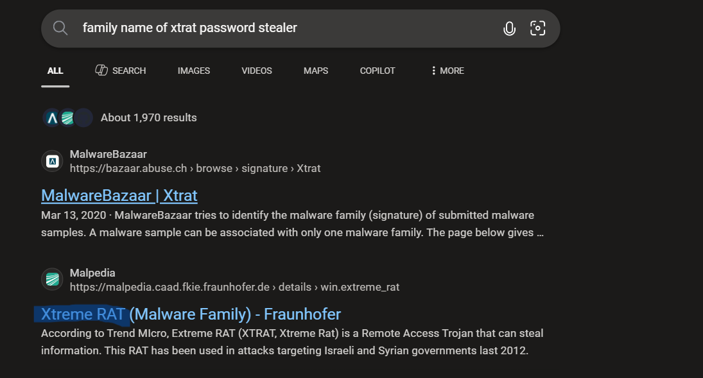


Answer: `XTREMERAT`


### Q4: Machine:Target1 The malware appears to be leveraging process injection. What is the PID of the process that is injected?

from the virus total report, navigate to BEHAVIOR tab 

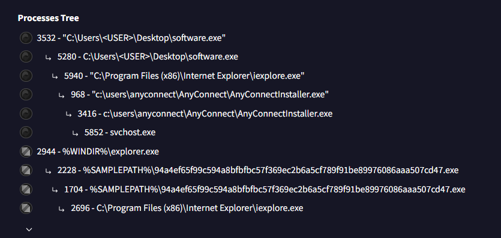

then use pslist plugin to show the PID 

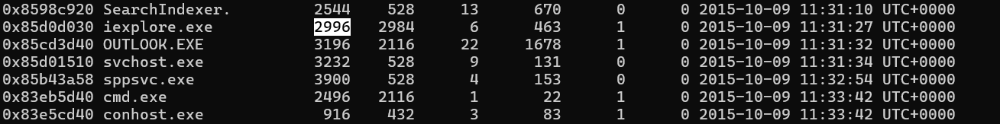

Answer: `2996`


### Q5: Machine:Target1 What is the unique value the malware is using to maintain persistence after reboot?

Persistence is commonly achieved via registry Run keys, scheduled tasks, or other autostart mechanisms. 
Therefore, I will begin by examining the registry Run keys.

I used this to check which plugin will be useful in this 
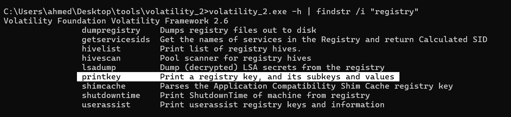

the run key is in this path `MICROSOFT\WINDOWS\CURRENTVERSION\RUN` so, you need to search using it 

`volatility_2.exe -f Target1-1dd8701f.vmss --profile=Win7SP1x86_23418 printkey -K "MICROSOFT\WINDOWS\CURRENTVERSION\RUN"`

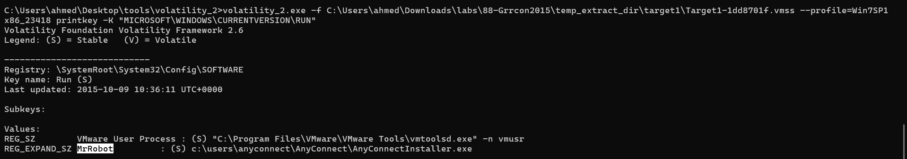

Answer: `MrRobot `


### Q6: Machine:Target1 Malware often uses a unique value or name to ensure that only one copy runs on the system. What is the unique name the malware is using?
The handles plugin was used to enumerate open handles for each process, including files, 
registry keys, and mutex objects, which helped identify suspicious activity.

To reduce noise, the analysis focused on mutex objects associated with a specific process using the handles plugin.

`volatility_2.exe -f Target1-1dd8701f.vmss --profile=Win7SP1x86_23418 handles -p 2996 | findstr /i "mutant"`

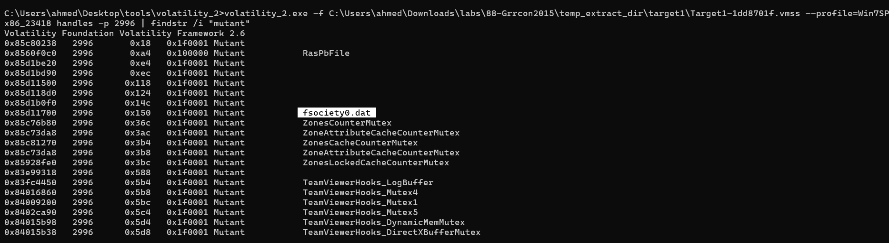

Answer: ` fsociety0.dat`


### Q7: Machine:Target1 It appears that a notorious hacker compromised this box before our current attackers. Name the movie he or she is from.

The filescan plugin will be used to identify file objects present in memory, including those that may not be visible in the file system.
`volatility_2.exe -f Target1-1dd8701f.vmss --profile=Win7SP1x86_23418 filescan | findstr /i "users"`

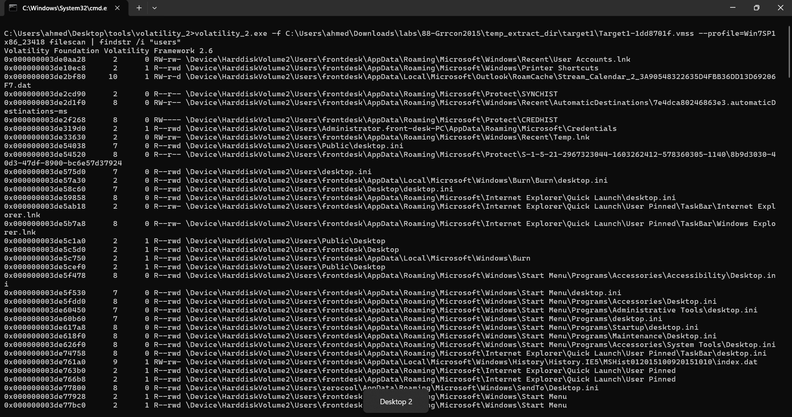

The output is very large, so I will use the findstr /v command to exclude default user entries and frontdesk user.

`volatility_2.exe -f Target1-1dd8701f.vmss --profile=Win7SP1x86_23418 filescan | findstr /i "users" | findstr /i /v "Administrator public frontdesk front-desk FRONTD~1"`

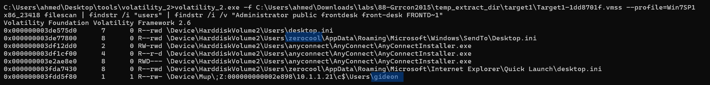


anyconnect is related to current attacker but it seemed zerocool and gideon are ralated to previous attacker

searching on google by its names to know the movie name 


Answer: `hackers`


### Q8: Machine:Target1 What is the NTLM password hash for the administrator account?

using hashdump plugin to dump LM/NTLM hashes
`volatility_2.exe -f Target1-1dd8701f.vmss --profile=Win7SP1x86_23418 hashdump`
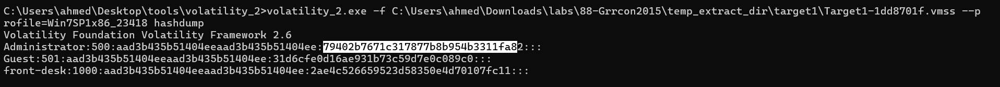

Answer: `79402b7671c317877b8b954b3311fa82`


### Q9: Machine:Target1 The attackers appear to have moved over some tools to the compromised front desk host. How many tools did the attacker move?

Attackers often place their tools in the Temp directory to minimize the risk of detection.

search for .exe files in temp directory on front machine
`volatility_2.exe -f Target1-1dd8701f.vmss --profile=Win7SP1x86_23418 filescan | findstr /i "temp" |findstr /i "front`

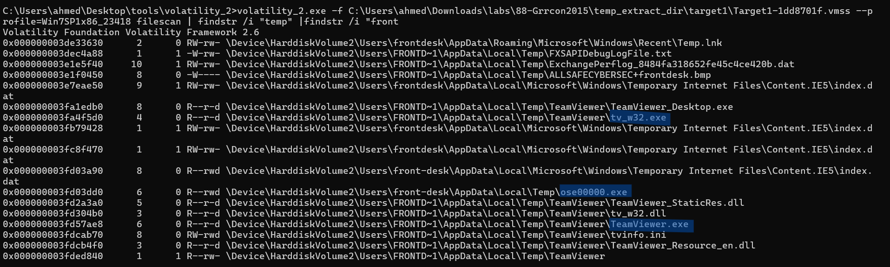
teamviewer is duplicated, so I counted it as one

Answer: `3`


### Q10: Machine:Target1 What is the password for the front desk local administrator account?

the consoles plugin was used to retrieve command history entered by the user.

`volatility_2>volatility_2.exe -f Target1-1dd8701f.vmss --profile=Win7SP1x86_23418 consoles`

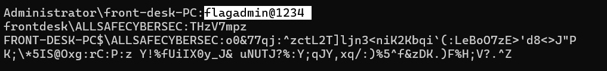


Answer: `flagadmin@1234`


### Q11: Machine:Target1 What is the std create data timestamp for the nbtscan.exe tool?

The mftparser plugin was used to analyze NTFS metadata and identify the Standard Information creation timestamp for the nbtscan.exe file.

`volatility_2.exe -f Target1-1dd8701f.vmss --profile=Win7SP1x86_23418 mftparser | findstr /i "nbtscan.exe"`

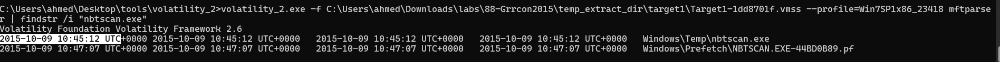

Answer: `2015-10-09 10:45:12 UTC`


### Q12: Machine:Target1 The attackers appear to have stored the output from the nbtscan.exe tool in a text file on a disk called nbs.txt. What is the IP address of the first machine in that file?

first, know the file offset to dump it 
`volatility_2.exe -f Target1-1dd8701f.vmss --profile=Win7SP1x86_23418 filescan | findstr /i "nbs.txt"`

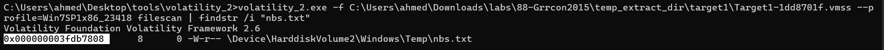

then dump the file 
`volatility_2.exe -f Target1-1dd8701f.vmss --profile=Win7SP1x86_23418 dumpfiles -Q 0x000000003fdb7808 -D <dir to extract in>`
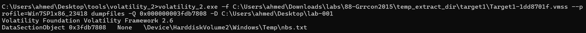

The extracted file was saved with a .dat extension, so it was manually renamed based on its original file type to properly view its contents.

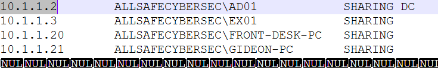


Answer: `10.1.1.2`


### Q13: Machine:Target1 What is the full IP address and the port was the attacker's malware using?

for this, I used netscan plugin to show all network connections 

`volatility_2.exe -f Target1-1dd8701f.vmss --profile=Win7SP1x86_23418 netscan`

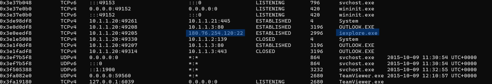

Answer: `180.76.254.120:22`


### Q14: Machine:Target1 It appears the attacker also installed legit remote administration software. What is the name of the running process?

By analyzing the running processes using the pslist plugin, it was identified that TeamViewer is actively running on the system.

`volatility_2.exe -f Target1-1dd8701f.vmss --profile=Win7SP1x86_23418 pslist`

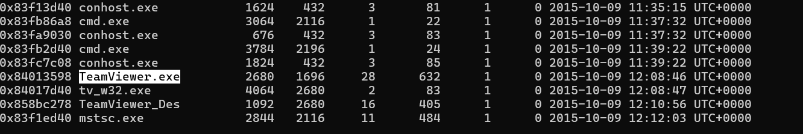

from WIKI
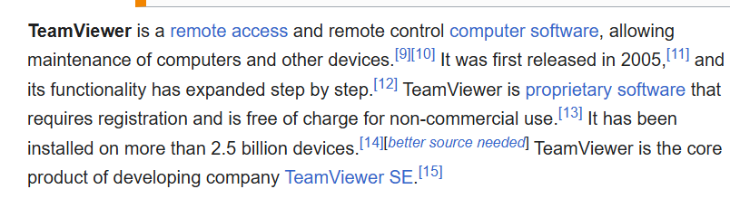

Answer: `TeamViewer.exe`


### Q15: Machine:Target1 It appears the attackers also used a built-in remote access method. What IP address did they connect to?

turn back to the netscan plugin

The mstsc.exe process corresponds to the Remote Desktop Connection tool, which allows users to remotely access other systems. 
Its presence may indicate remote access activity.

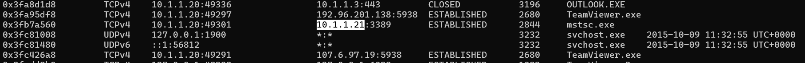

the 3389 port is for RDP 

Answer: `10.1.1.21`


### Q16: Machine:Target2 It appears the attacker moved latterly from the front desk machine to the security admins (Gideon) machine and dumped the passwords. What is Gideon's password?

The consoles plugin was used to retrieve command history and identify commands executed on the machine.

`volatility_2.exe -f target2-6186fe9f.vmss --profile=Win7SP1x86_23418 consoles`

I observed this 

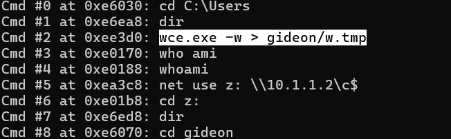

*wce.exe*  windows credential editor is used to dump credential 

so, now we need to dump w.tmp to see all dumped credentials  as we did in the `Q12`

start with *filescan* to know file offset 

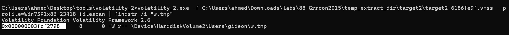

then dump file using *dumpfiles* plugin 

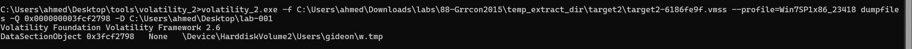

then open the file and you will find the answer

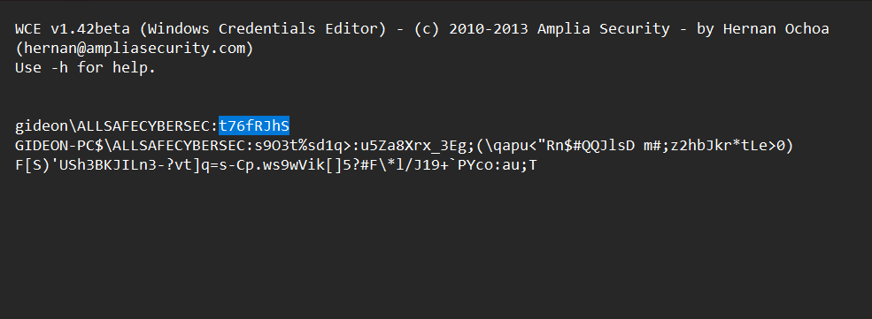

Answer: `t76fRJhS`


### Q17: Machine:Target2 Once the attacker gained access to "Gideon," they pivoted to the AllSafeCyberSec domain controller to steal files. It appears they were successful. What password did they use?

using the same plugin in previous question *consoles*

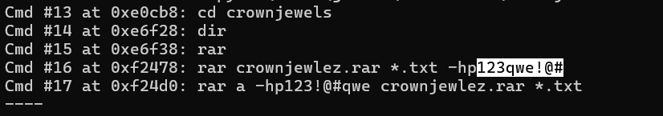


Answer: `123qwe!@#`


### Q18: Machine:Target2 What was the name of the RAR file created by the attackers?

you can find the answer from the screenshot above 

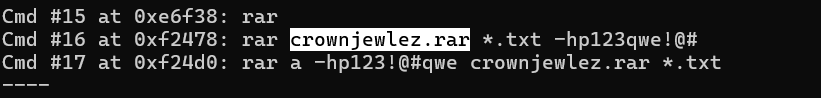

Answer: `crownjewlez.rar`


### Q19: Machine:Target2 How many files did the attacker add to the RAR archive?

I started with filescan to find file offset to dump it and see how many files in but found nothing

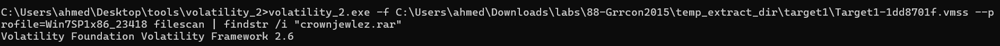

so, I used cmdscan to know the PID of the process that run the commands to dump it 
`olatility_2.exe -f target2-6186fe9f.vmss cmdscasn`

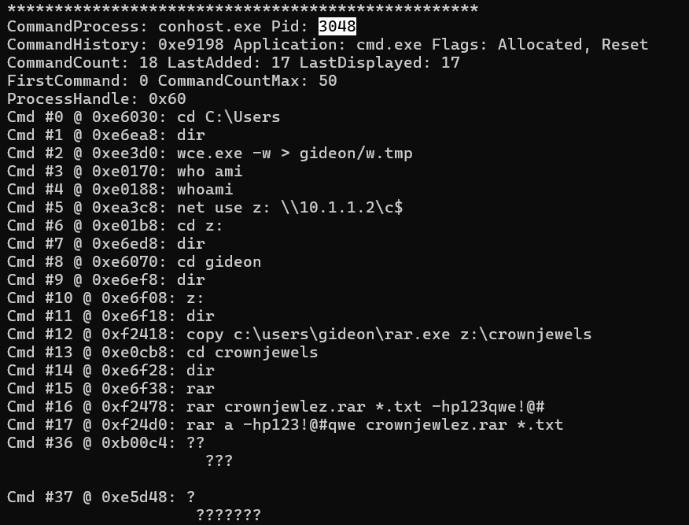

then dump the process using *memdump*

`volatility_2.exe -f target2-6186fe9f.vmss --profile=Win7SP1x86_23418 memdump -p 3048 -D <dir to dump in>`

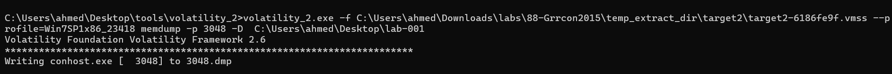

The memory dump was analyzed using the strings utility to extract readable content and identify the executed RAR command.

The strings utility with Unicode support (-el) was used to extract readable text from the memory dump,
and the output was saved to a text file for easier inspection of the RAR command.

`strings -el 3048.dmp > dd.txt`
then open .txt file using notepad  and search for  `crownjewlez.rar`

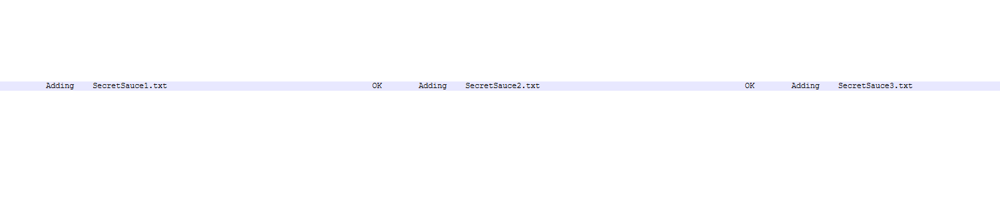

Answer: `3`


