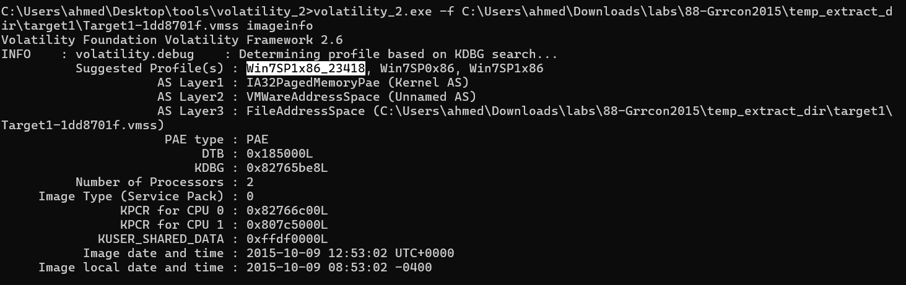
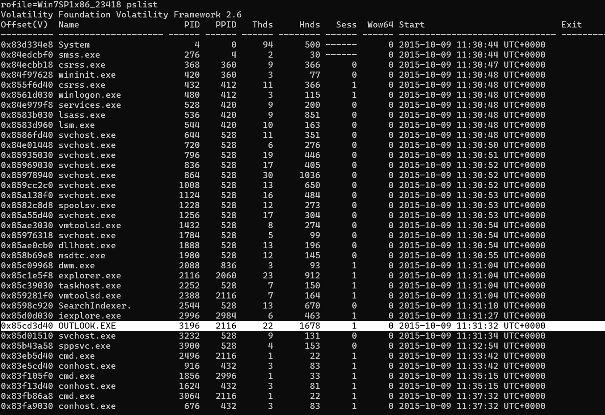
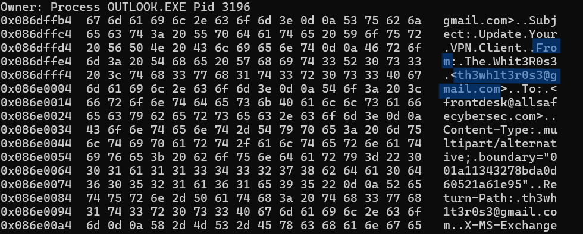
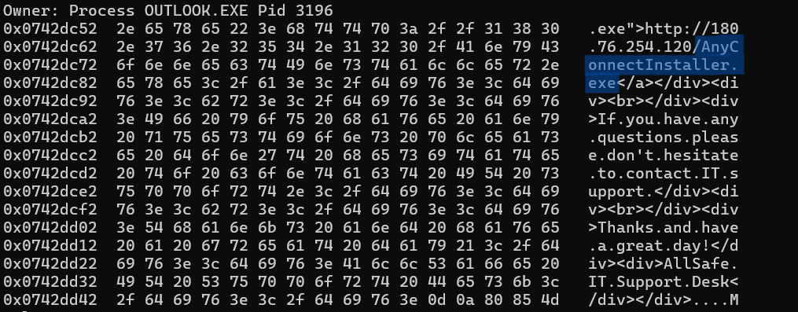
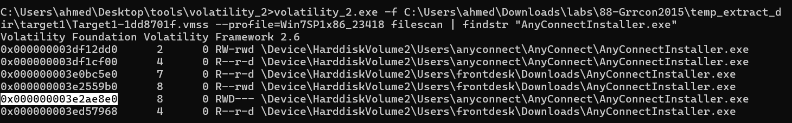
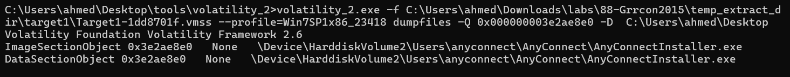

# MrRobot lab wrtieup 
## Lab link [MrRobot](https://cyberdefenders.org/blueteam-ctf-challenges/mrrobot/)

## Category : Endpoint Forensics
## Tools : 
Volatility 


## scenario 
```
An employee reported that his machine started to act strangely after receiving a suspicious email for a security update.
The incident response team captured a couple of memory dumps from the suspected machines for further inspection.
Analyze the dumps and help the SOC analysts team figure out what happened!
```

### Q1: Machine:Target1 What email address tricked the front desk employee into installing a security update?

First of all, you need to know the profile of memory dump 
`volatility_2.exe -f Target1-1dd8701f.vmss imageinfo`



then list all processes to know which one related to emails

`volatility_2.exe -f Target1-1dd8701f.vmss --profile=Win7SP1x86_23418 pslist`



Next, execute the YaraScan plugin against the target process and search for the keyword "gmail".

`volatility_2.exe -f Target1-1dd8701f.vmss --profile=Win7SP1x86_23418 yarascan  -Y "gmail" -p 3196`



Answer: `th3wh1t3r0s3@gmail.com`

### Q2: Machine:Target1 What is the filename that was delivered in the email?

using the same plugin, but now search for .exe
`volatility_2.exe -f Target1-1dd8701f.vmss --profile=Win7SP1x86_23418 yarascan  -Y ".exe" -p 3196`




Answer: `AnyConnectInstaller.exe`


### Q3: Machine:Target1 What is the name of the rat's family used by the attacker?

First, I used filescan plugin to know the path of the file
`volatility_2.exe -f Target1-1dd8701f.vmss --profile=Win7SP1x86_23418 | findstr "AnyConnectInstaller.exe"`

choose the offset who has write permision 


now, you need to dump the file 

`volatility_2.exe -f Target1-1dd8701f.vmss --profile=Win7SP1x86_23418 dumpfiles -Q 0x000000003e2ae8e0 -D  C:\Users\ahmed\Desktop`




then go to the file location and calc file hash
`certutil -hashfile file.None.0x85d12b18.dat sha1`

94a4ef65f99c594a8bfbfbc57f369ec2b6a5cf789f91be89976086aaa507cd47

search using hash value in any threathunting paltform like [Virus total](https://www.virustotal.com/)


Answer: `XTREMERAT`


### Q4: Machine:Target1 The malware appears to be leveraging process injection. What is the PID of the process that is injected?


