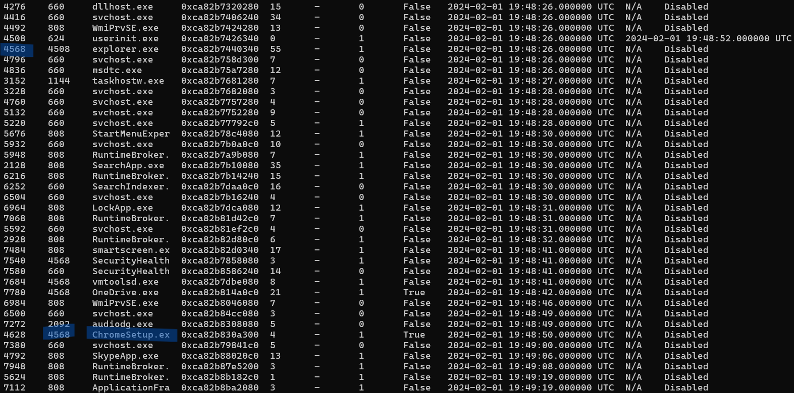
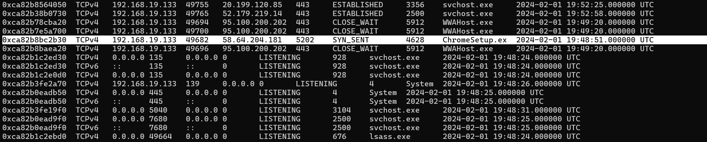
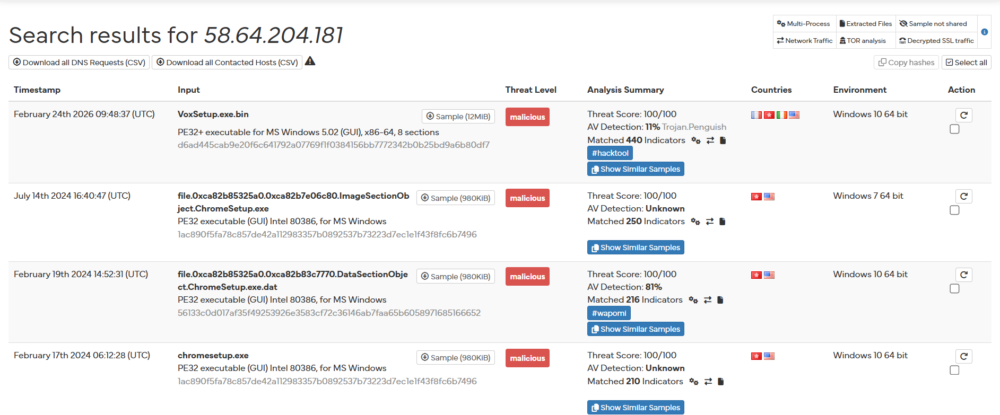
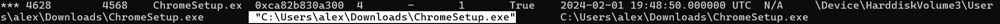
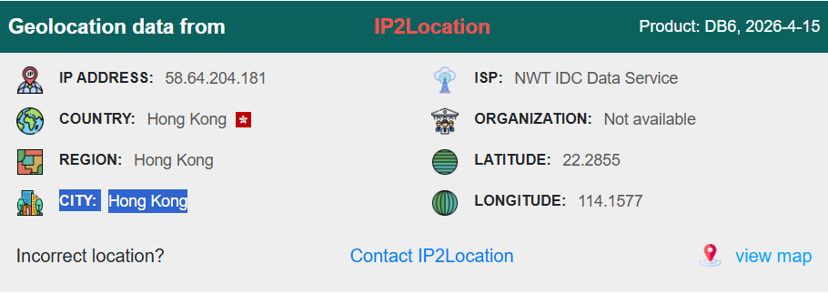
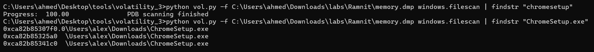
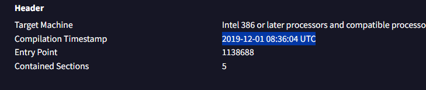
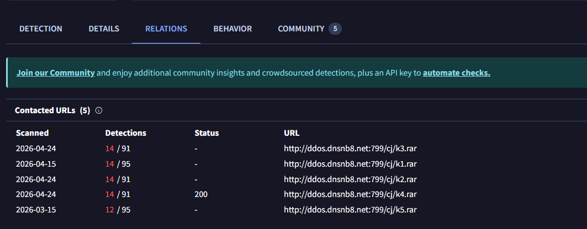

# Ramnit lab wrtieup 
Lab link [Ramnit](https://cyberdefenders.org/blueteam-ctf-challenges/ramnit/)
## Category : Endpoint Forensics
## Tools : 
Volatility


## scenario 
```
Our intrusion detection system has alerted us to suspicious behavior on a workstation, pointing to a likely malware intrusion. A memory dump of this system has been taken for analysis. Your task is to analyze this dump, trace the malware’s actions, and report key findings.
```

### Q1: What is the name of the process responsible for the suspicious activity?
Started with pslist plugin to list all processes and investigate them 
`vol.py -f memory.dmp windows.pslist`



that one looked suspicious, so I decided to investigate more

by using netstat I found this process established connection with malicious IP



Using [hybrid analysis](https://hybrid-analysis.com/) to checkh IP reputation 




Answer:  `ChromeSetup.exe`


### Q2: What is the exact path of the executable for the malicious process?

by using pstree plugin you can find the answer 

`python vol.py -f memory.dmp windows.pstree`



Answer: `C:\Users\alex\Downloads\ChromeSetup.exe`


### Q3: Identifying network connections is crucial for understanding the malware's communication strategy. What IP address did the malware attempt to connect to?

using netstat as in Q1 

`python vol.py -f memory.dmp windows.netstat`


Answer: `58.64.204.181`


### Q4: To determine the specific geographical origin of the attack, Which city is associated with the IP address the malware communicated with?

searching by ip in any iplookup paltform like [IPlookup](https://www.iplocation.net/)



Answer: `Hong Kong`


### Q5: Hashes serve as unique identifiers for files, assisting in the detection of similar threats across different machines. What is the SHA1 hash of the malware executable?

now, we need to extract file to know its hash 

start with filescan to know the offset of file to extract 

`python vol.py -f memory.dmp windows.filescan | findstr "chromesetup"`



then dump the .exe file using this dumpfiles plugin
`python vol.py -f memory.dmp -o  Desktop/ windows.dumpfiles --virtaddr 0xca82b85341c0`

then use this command on linux 
`sha1sum tmp_v_93635v.vol3` 
using cmd 
`certutil -hashfile tmp_v_93635v sha1`

Answer: `280c9d36039f9432433893dee6126d72b9112ad2`


### Q6: Examining the malware's development timeline can provide insights into its deployment. What is the compilation timestamp for the malware?

searh using hash in [Virus Total](https://www.virustotal.com/)

navigate to Details tab 



Answer: `2019-12-01 08:36`

### Q7: Identifying the domains associated with this malware is crucial for blocking future malicious communications and detecting any ongoing interactions with those domains within our network. Can you provide the domain connected to the malware?

In the same report From virus total 
navigate to RELATIONS tab 




Answer: `dnsnb8.net`


# The end. I hope this has been helpful to you.

