# RedLine Writeup
Lab Link [](https://cyberdefenders.org/blueteam-ctf-challenges/redline/)
## Category : Endpoint Forensics
## Tools
  - Volatility
  - Strings
  - bstrings.exe
## Scenario
```
As a member of the Security Blue team, your assignment is to analyze a memory dump using Redline and Volatility tools.
Your goal is to trace the steps taken by the attacker on the compromised machine and determine how they managed to bypass the Network Intrusion Detection System (NIDS). Your investigation will identify the specific malware family employed in the attack and its characteristics.
Additionally, your task is to identify and mitigate any traces or footprints left by the attacker.
```


### Firstly, you need to unzip the downloaded file using this password `cyberdefenders.org`

the volatility commad is `pyhton3 vol.py -f <file.mem> plugin`


### Q1: What is the name of the suspicious process?
first, I use this command to search for malware
`python3 vol.py -f 106-RedLine/temp_extract_dir/MemoryDump.mem windows.malfind`

then I found the next 

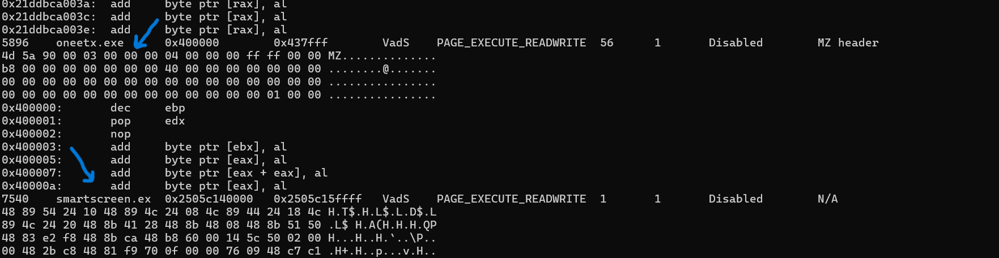

since there's 2 .exe, we need to investigate more 

use this to list process and parent process

`python3 vol.py -f 106-RedLine/temp_extract_dir/MemoryDump.mem windows.pslist`

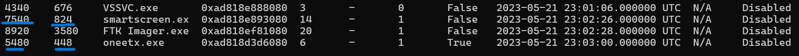

then I selected PID,PPID for both to know the parent process

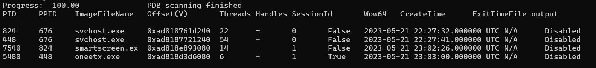

but both are under the `svchost.exe`

By using the psscan plugin to identify processes that are running but not registered, I executed the following command:
`python3 vol.py -f 106-RedLine/temp_extract_dir/MemoryDump.mem windows.psscan`
I found that oneetx.exe has 2 different PID

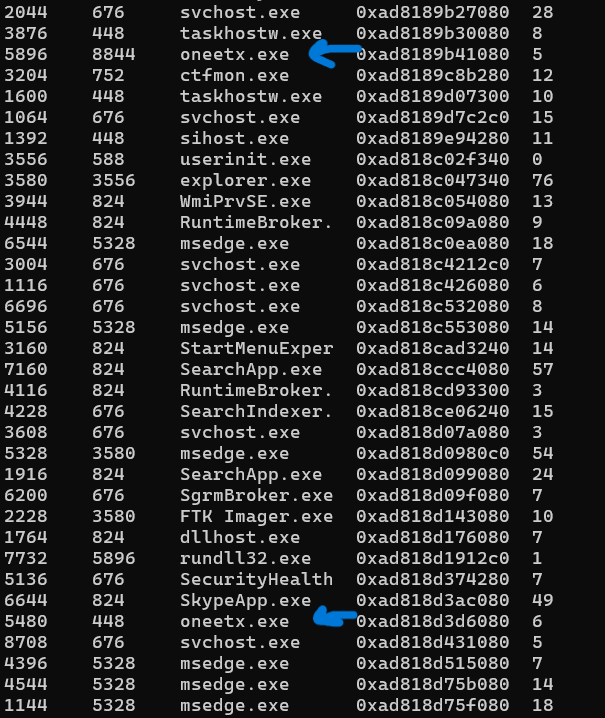 


after that I googled for smartscreen.ex and found that it's a windows core process related to windows defender 


and by searching for oneetx.exe it turned out that it's a malware

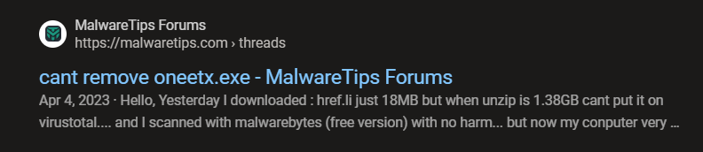

Answer: `oneetx.exe`


### Q2: What is the child process name of the suspicious process?
by using pstree plugin 

`python3 vol.py -f 106-RedLine/temp_extract_dir/MemoryDump.mem windows.pstree`

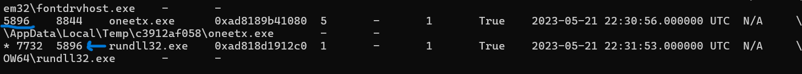


### Q3: What is the memory protection applied to the suspicious process memory region?

as the first questoin, we need to use `malfind` to see the permission

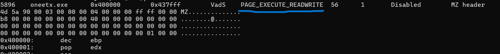


### Q4: What is the name of the process responsible for the VPN connection?

you need to use `windows.netscan` to see all network connections

`python3 vol.py -f 106-RedLine/temp_extract_dir/MemoryDump.mem windows.netscan`

focuse on services that make a connection to public IP (external)

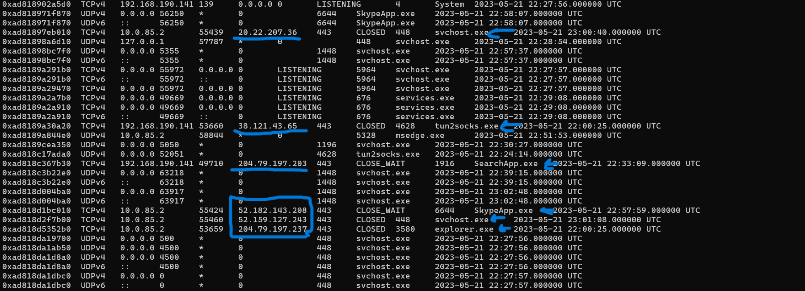

by searching for `tun2socks.exe` it turned out that it's related to VPN service

well, now we need to know the parent process
by using `pslist` you can find the next: 

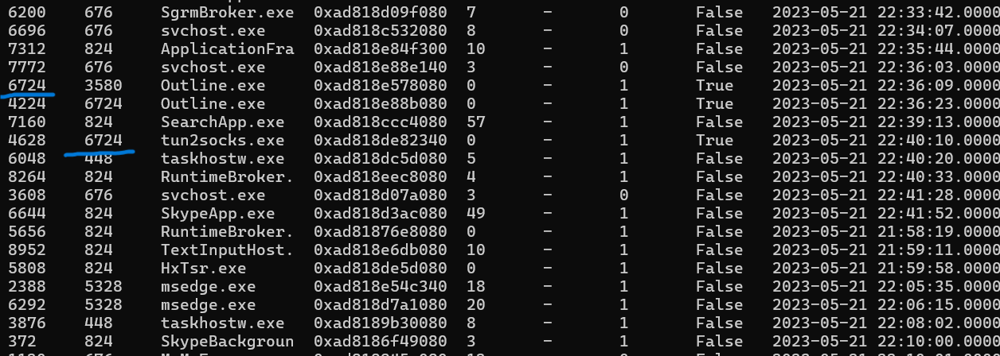

Answer: `outline.exe`


### Q5: What is the attacker's IP address?

Like previouse question, you can use `netscan`

you can see the suspicious process oneetx.exe use the next IP to connect outside
it might be C2 server 

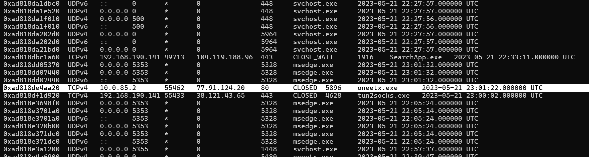

Answer: `77.91.124.20 `


### Q6: What is the full URL of the PHP file that the attacker visited?

As we already know from the previous question the attacker IP was `77.91.124.20` 

so you can run `Strings` on the .mem file and grep for the suspiciouse IP 

`strings /mnt/c/Users/ahmed/Downloads/labs/106-RedLine/temp_extract_dir/MemoryDump.mem | grep -i "77.91.124.20"`

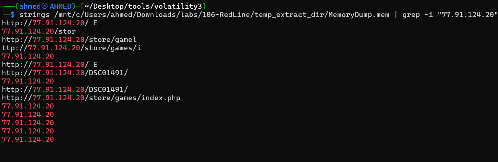


Answer: `http://77.91.124.20/store/games/index.php`
 


### Q7: What is the full path of the malicious executable?
you can find that using pstree and grep for `oneetx.exe`

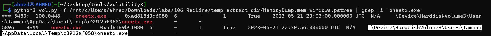


Answer: `C:\Users\Tammam\AppData\Local\Temp\c3912af058\oneetx.exe`


# The end. I hope this has been helpful to you.


