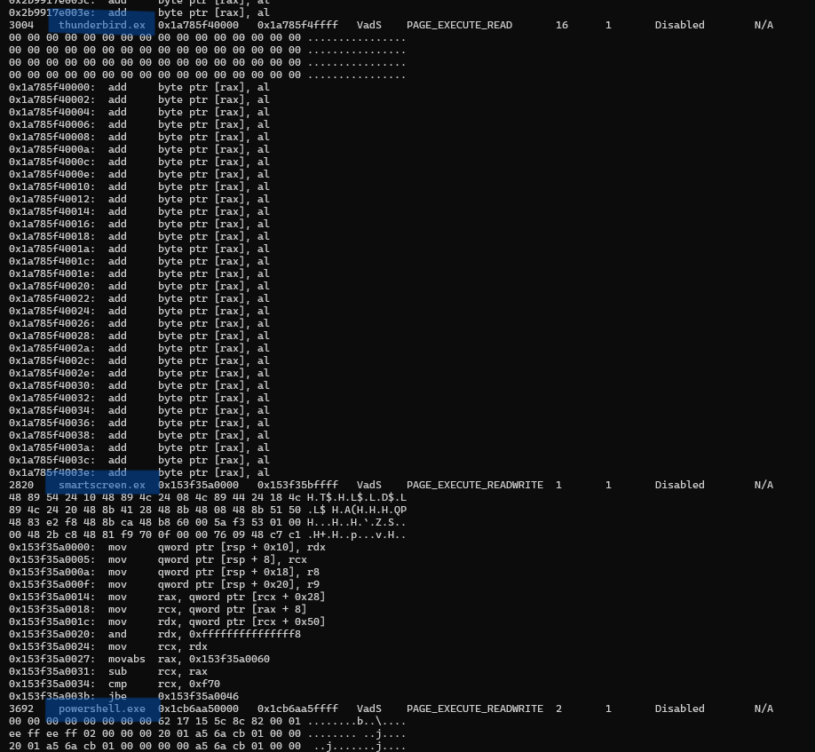
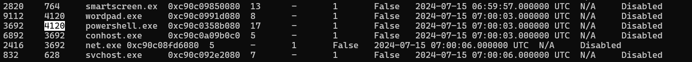
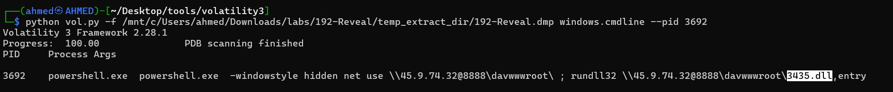
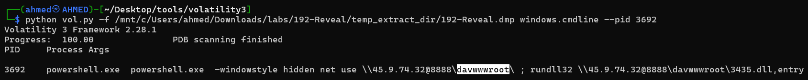
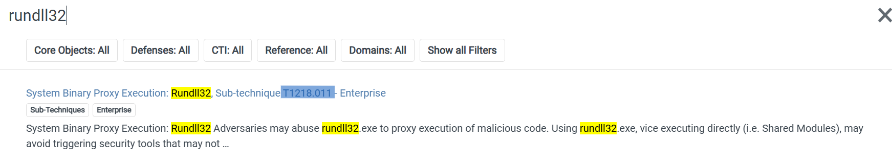
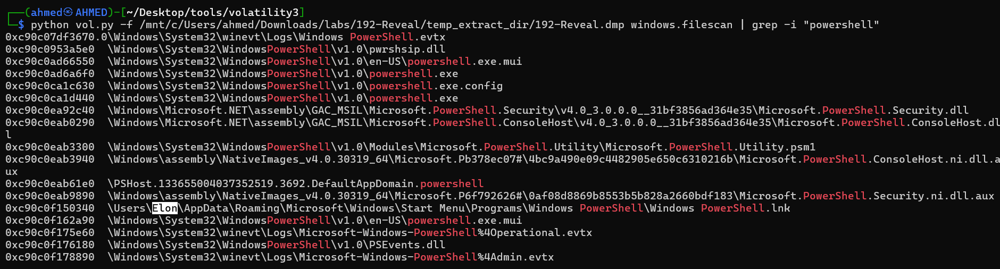
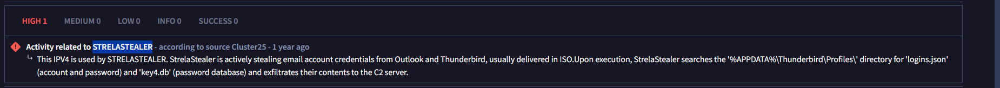

# Reavel Writeup
Lab Link [Reveal](https://cyberdefenders.org/blueteam-ctf-challenges/reveal/)
## Category : Endpoint Forensics
## Tools 
  - Volatility 3

## Scenario 
```
You are a forensic investigator at a financial institution, and your SIEM flagged unusual activity on a workstation with access to sensitive financial data. Suspecting a breach, you received a memory dump from the compromised machine. Your task is to analyze the memory for signs of compromise, trace the anomaly's origin, and assess its scope to contain the incident effectively.
```

#### Q1: Identifying the name of the malicious process helps in understanding the nature of the attack. What is the name of the malicious process?
To solve this question, I used the *malfind* plugin in Volatility to detect the malicious process by analyzing suspicious memory regions.
`python vol.py -f 192-Reveal.dmp windows.malfind`

After analyzing the output of the malfind plugin, I identified three processes: *smartscreen.exe*, *thunderbird.exe*, and *powershell.exe*.
Among them, *powershell.exe* appeared to be the most suspicious process becuase *thunderbird.exe* is a legitimate email client process used for managing and accessing email accounts, while *smartscreen.exe* is a legitimate Windows security process responsible for protecting the system from suspicious files and applications.




Answer: `powershell.exe`


#### Q2: Knowing the parent process ID (PPID) of the malicious process aids in tracing the process hierarchy and understanding the attack flow. What is the parent PID of the malicious process?

you can use *pslist* to find PPID 

`python vol.py -f 192-Reveal.dmp windows.pslist`



Answer: `4120`


#### Q3: Determining the file name used by the malware for executing the second-stage payload is crucial for identifying subsequent malicious activities. What is the file name that the malware uses to execute the second-stage payload?

In this task, I used the cmdline plugin to view the command-line arguments of the powershell.exe process by filtering the output using its PID.

`python vol.py 192-Reveal.dmp windows.cmdline --pid 3692`



Answer: `3435.dll`


#### Q4: Identifying the shared directory on the remote server helps trace the resources targeted by the attacker. What is the name of the shared directory being accessed on the remote server?

you can find the answer using the plugin above 




Answer: `davwwwroot`


#### Q5: What is the MITRE ATT&CK sub-technique ID that describes the execution of a second-stage payload using a Windows utility to run the malicious file?
as you observe from the previous question, the attacker used rundll32 to load a DLL file. 

so I searcehed in [Mitre](https://attack.mitre.org/) using rundll




Answer: `T1218.011`


#### Q6: Identifying the username under which the malicious process runs helps in assessing the compromised account and its potential impact. What is the username that the malicious process runs under?

I used the filescan plugin to identify the path associated with the suspicious powershell.exe process and determine the related user profile.

`python vol.py -f 192-Reveal.dmp windows.filescan | grep -i "powershell"`



Answer: `Elon`


#### Q7: Knowing the name of the malware family is essential for correlating the attack with known threats and developing appropriate defenses. What is the name of the malware family?

searching by ip address in the Q4 in [Virus Total](https://www.virustotal.com/)




Answer: `StrelaStealer`


# The end. I hope this has been helpful to you.


