# Silent Breach Lab 

lab link [Silent Breach](https://cyberdefenders.org/blueteam-ctf-challenges/silent-breach/)

## Scenario
    The IMF is hit by a cyber attack compromising sensitive data. Luther sends Ethan to retrieve crucial information from a compromised server.
    Despite warnings, Ethan downloads the intel, which later becomes unreadable.
    To recover it, he creates a forensic image and asks Benji for help in decoding the files.

## Tools
 - FTK Imager 
 - text editor
 - DB browser (SQLite)
 - HxD
 - cyberchef


first you need to extract lab file using any uncompression tool like winrar using password `cyberdefenders.org`

after that, open the image file using FTK_image 

 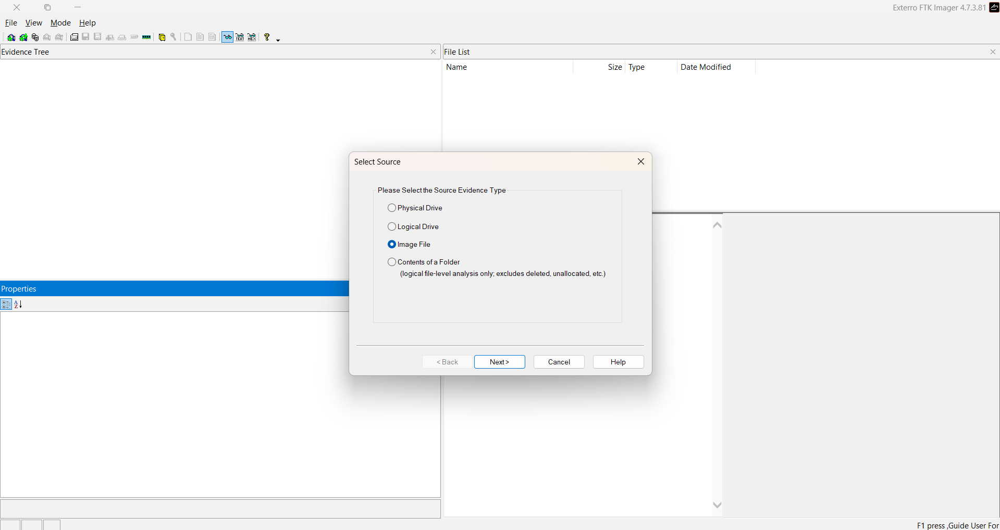
 
#### Q1: What is the MD5 hash of the potentially malicious EXE file the user downloaded? 
  open the image on FTK_Imager and go to the Download folder, you will find only one .exe file
  export hash list 

 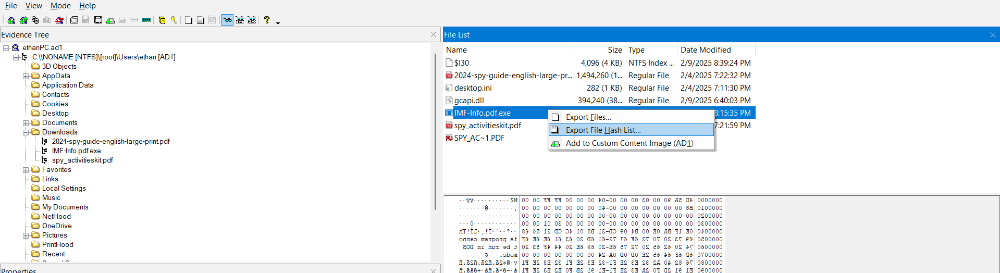

 open the hash list file using any text editor 

 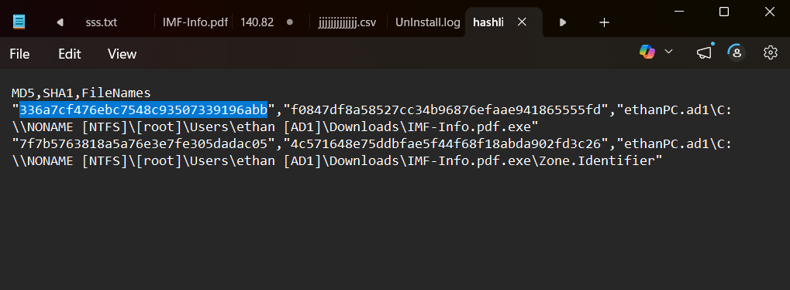

 Answer: `336A7CF476EBC7548C93507339196ABB`
  


#### Q2: What is the URL from which the file was downloaded?
 
 open the file .exe itself, you will find Zone.Identifier file export it and see its content 

 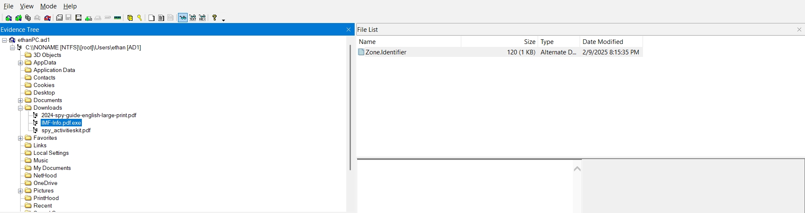

 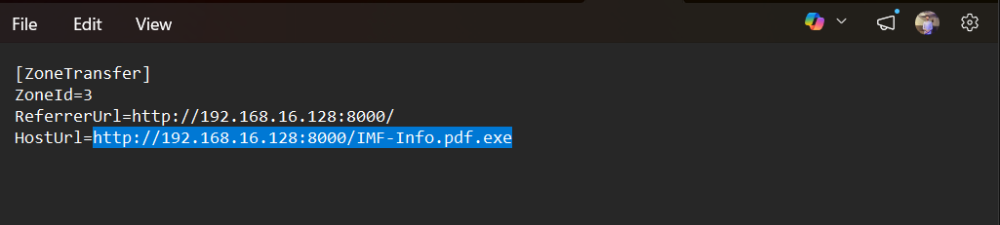
 
 Answer: `http://192.168.16.128:8000/IMF-Info.pdf.exe`


#### Q3: What application did the user use to download this file?

 you need to search in all browsers history to see which one used to download these files 

 edge history:    `C:\Users\<username>\Appdata\Local\Microsoft\Edge\User Data\Default\history`
 Chrome history:  `C:\Users\<username>\Appdata\Local\googel\chrome\User Data\Default\history`
 FireFox history: `C:\Users\<Username>\AppData\Roaming\Mozilla\Firefox\Profiles\<ProfileFolder>\places.sqlite`

 go ahead and export all of them, but we won't find firefox history 

 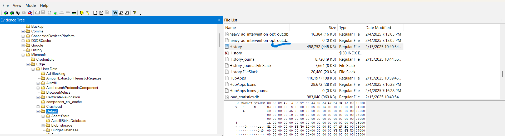

 then open file with `DB browser (SQLite)`
 
 at Browse data choose urls 
 
 I found the url related to app downloded in edge history

  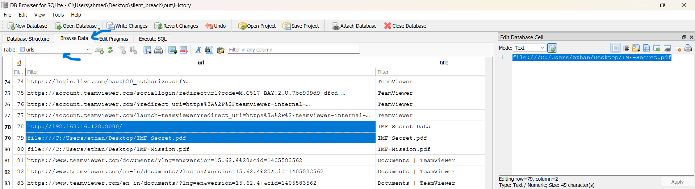

  Answer: `Microsoft Edge`


#### Q4: By examining Windows Mail artifacts, we found an email address mentioning three IP addresses of servers that are at risk or compromised. What are the IP addresses?

open link in the lab 
    
  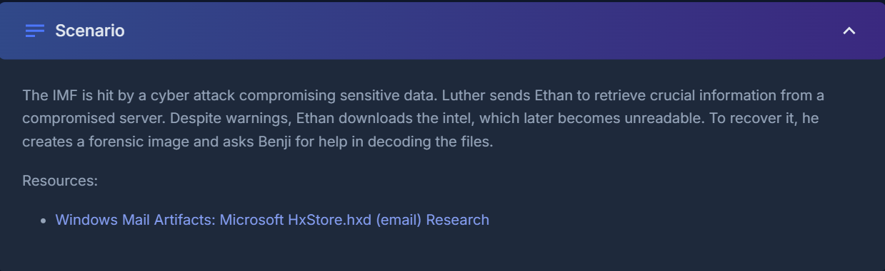

  [](https://boncaldoforensics.wordpress.com/2018/12/09/microsoft-hxstore-hxd-email-research/)

we will find this 

  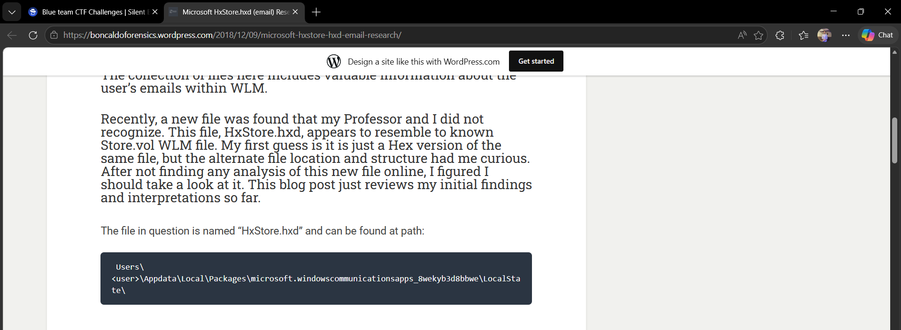
   `Users\<user>\Appdata\Local\Packages\microsoft.windowscommunicationsapps_8wekyb3d8bbwe\LocalState\`
   
go ahead and export this file from its location 

  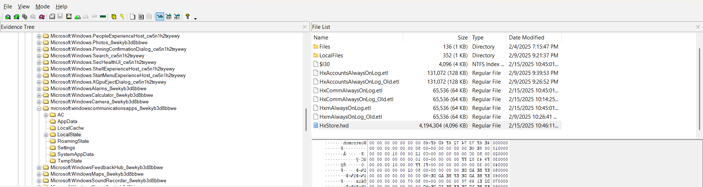
   
open this file unsing `HxD` and press CTRL+F to search for `ip`

  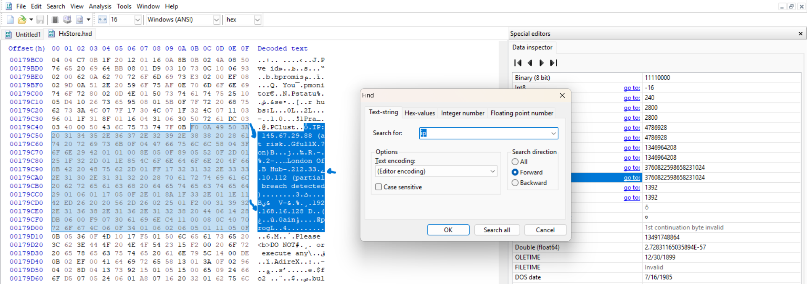


  Answer: `145.67.29.88, 212.33.10.112, 192.168.16.128`

   


   

#### Q5: By examining the malicious executable, we found that it uses an obfuscated PowerShell script to decrypt specific files. What predefined password does the script use for encryption?
 
extract the .exe file from Q1 then user a strings tool to extract all strings in it. 

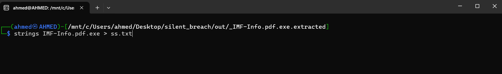          

I save the out in .txt file to be easier to search in 

since the question tell that `it uses an obfuscated PowerShell script`
I searched for .ps1 because it's a powershell script extension 

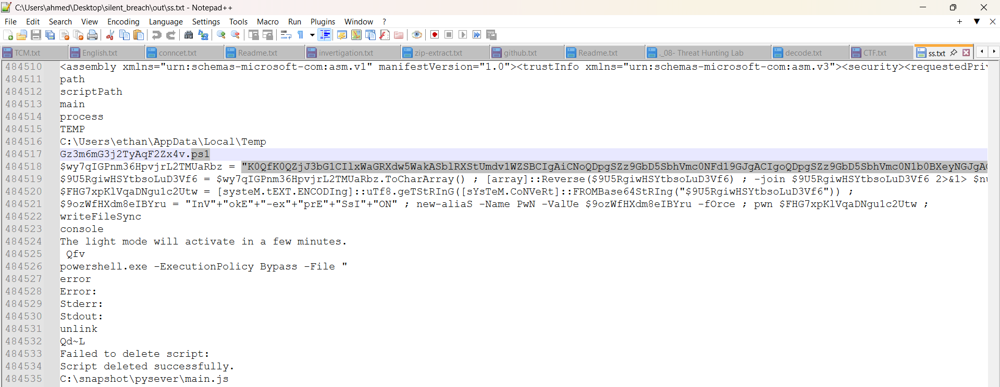 

use `cyberchef` to see the origin content of this script 

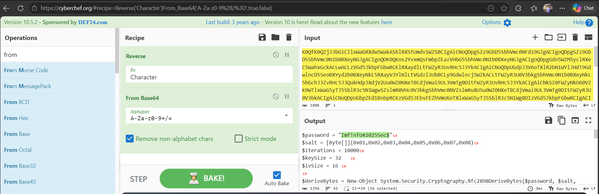 

Answer: `Imf!nfo#2025Sec$`


#### Q6: After identifying how the script works, decrypt the files and submit the secret string.

from the same script above you can find that the secret files is located in `"C:\\Users\\ethan\\Desktop\\IMF-Secret.pdf"`

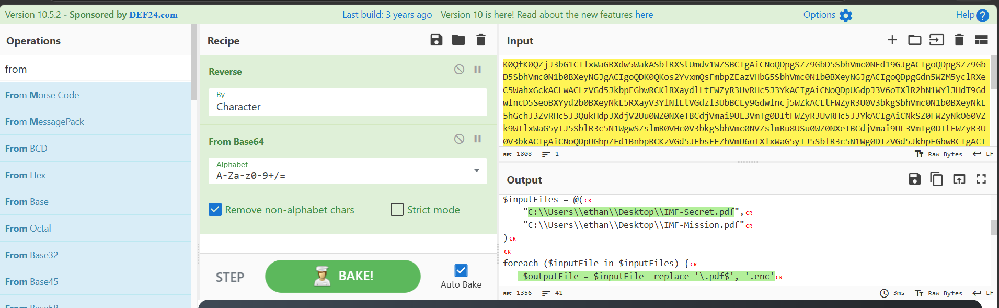 

go ahead and export this file from its location in FTK

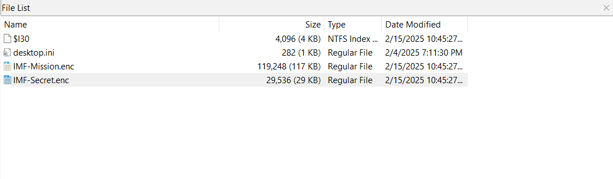 

as you can see in the photo above the files are encrypted with the .ps1 script
so, I asked chatgpt to give me a script to decrypt with the same algorthim 

``` $password = "Imf!nfo#2025Sec$"
$salt = [Byte[]](0x01,0x02,0x03,0x04,0x05,0x06,0x07,0x08)
$iterations = 10000
$keySize = 32
$ivSize = 16

# Derive Key and IV
$deriveBytes = New-Object System.Security.Cryptography.Rfc2898DeriveBytes($password, $salt, $iterations)
$key = $deriveBytes.GetBytes($keySize)
$iv = $deriveBytes.GetBytes($ivSize)

# --- Input Files (Update these paths) ---
$inputFiles = @(
    "Silent_Breach\IMF-Secret.enc",
    "Silent_Breach\IMF-Mission.enc"
)

foreach ($encFile in $inputFiles) {
    if (-not (Test-Path $encFile)) {
        Write-Warning "File not found: $encFile"
        continue
    }
    # Generate output path: replace .enc with .decrypted.pdf
    $outputFile = $encFile -replace '\.enc$', '.decrypted.pdf'
    try {
        # Set up AES decryption
        $aes = [System.Security.Cryptography.Aes]::Create()
        $aes.Key = $key
        $aes.IV = $iv
        $aes.Mode = [System.Security.Cryptography.CipherMode]::CBC
        $aes.Padding = [System.Security.Cryptography.PaddingMode]::PKCS7

        $decryptor = $aes.CreateDecryptor()

        # Read encrypted data
        $cipherBytes = [System.IO.File]::ReadAllBytes($encFile)

        # Create streams for decryption
        $inStream = [System.IO.MemoryStream]::new([byte[]] $cipherBytes)
        $cryptoStream = New-Object System.Security.Cryptography.CryptoStream($inStream, $decryptor, [System.Security.Cryptography.CryptoStreamMode]::Read)

        $buffer = New-Object byte[] $cipherBytes.Length
        $read = $cryptoStream.Read($buffer, 0, $buffer.Length)

        [System.IO.File]::WriteAllBytes($outputFile, $buffer[0..($read - 1)])

        $cryptoStream.Close()
        $inStream.Close()
        Write-Host "Decrypted: $outputFile" -ForegroundColor Green
    }
    catch {
        Write-Error "Failed to decrypt $encFile. Error: $_"
    }
} ```

remeber to change this 
`$inputFiles = @(
    "Silent_Breach\IMF-Secret.enc",
    "Silent_Breach\IMF-Mission.enc")` 
    
to decrypted file path in your machine 

save it in a file .ps1 

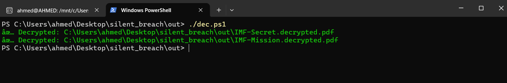

open the .pdf files

I found the flag in IMF-Mission.decrypted.pdf

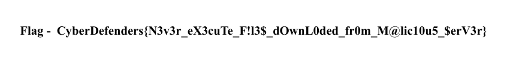


Answer: `CyberDefenders{N3v3r_eX3cuTe_F!l3$_dOwnL0ded_fr0m_M@lic10u5_$erV3r}`


# The end, I hope you found this useful. 


   
