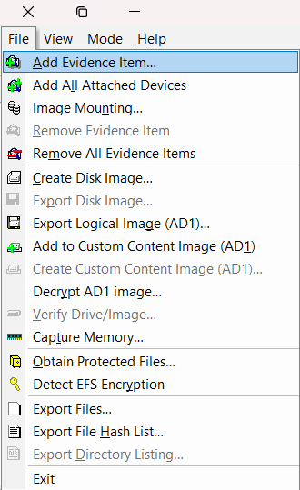
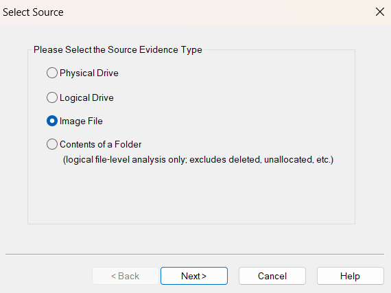
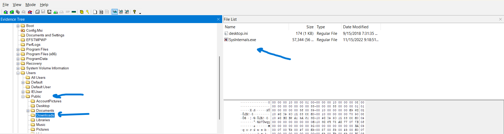
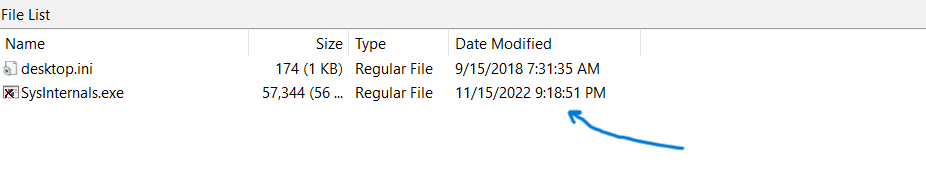
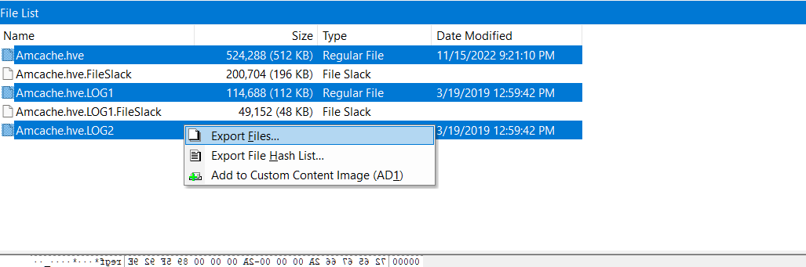
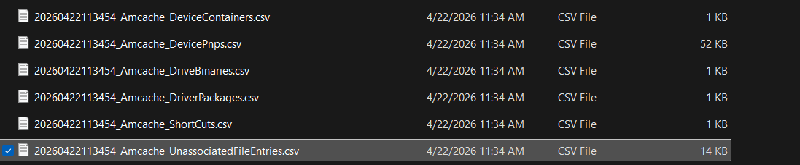
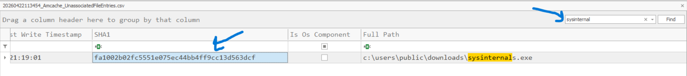

# Sysinternals lab writeup 
lab link [Sysinternals](https://cyberdefenders.org/blueteam-ctf-challenges/sysinternals/)
## Category : Endpoint Forensics
## Scenario
```
A user thought they were downloading the SysInternals tool suite and attempted to open it,
but the tools did not launch and became inaccessible. Since then,
the user has observed that their system has gradually slowed down and become less responsive.
```
## Tools 
  - Autopsy
  - FTK imager
  - registry explorer
  - timeline explorer
  - amchaceparser.exe
  - virus total
  - 

first you need to extract lab file using any uncompression tool like winrar using password `cyberdefenders.org`
then open the image file in FTK_Imager 

file >>>> Add evidence item


then select image file 



### Q1: What was the malicious executable file name that the user downloaded?

go ahead and search for user download
I found it in user public 



Answer: `SysInternals.exe`


### Q2: When was the last time the malicious executable file was modified?

form the same page you can find that 



convert 9 PM. to 21 to match answer format

Answer: `2022-11-15 21:18`


### Q3: What is the SHA1 hash value of the malware?

you can find sha1 value in Amchace.hve 
Amchace : `C:\Windows\AppCompat\Programs\Amcache.hve`

go ahead and export it 

export it and its .log files



parse this file using `AmcacheParser.exe` from eric tools

use this command 
`AmcacheParser.exe -f Amcache.hve --csv  <directory to save out>`

the out as you can see



open files with `timeline explorer` form eric tool
and search for sysinternal

I found the answer in the file named `20260422113454_Amcache_UnassociatedFileEntries.csv`




Answer: `fa1002b02fc5551e075ec44bb4ff9cc13d563dcf`


### Q4: Based on the Alibaba vendor, what is the malware's family?

search in  [Virus total](https://www.virustotal.com/) using hash value from previuos question

as the report below
[Virustotal](https://www.virustotal.com/gui/file/72e6d1728a546c2f3ee32c063ed09fa6ba8c46ac33b0dd2e354087c1ad26ef48)

you can find that 


Answer: `rozena`


