# Benign writeup
### Lab Link [Benign](https://tryhackme.com/room/benign)


## Scenario
```
One of the client’s IDS indicated a potentially suspicious process execution indicating one of the hosts from the HR department was compromised.
Some tools related to network information gathering / scheduled tasks were executed which confirmed the suspicion.
Due to limited resources, we could only pull the process execution logs with Event ID: 4688 and ingested them into Splunk with the index win_eventlogs for further investigation.

About the Network Information

The network is divided into three logical segments. It will help in the investigation.

IT Department

James
Moin
Katrina
HR department

Haroon
Chris
Diana
Marketing department

Bell
Amelia
Deepak
```


### Q1: How many logs are ingested from the month of March, 2022?
Firstly, I set the index = win_eventlogs
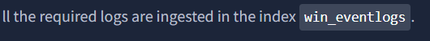

then, change the time range to start with March 2022
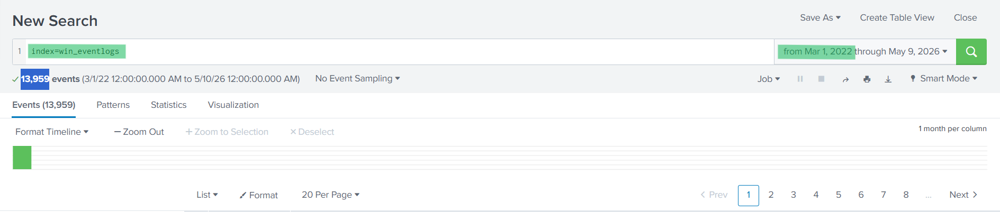

Answer: `13959`


### Q2: Imposter Alert: There seems to be an imposter account observed in the logs, what is the name of that user?

I listed all users to check tried to impersonate another user 

- index=win_eventlogs | stats count by UserName

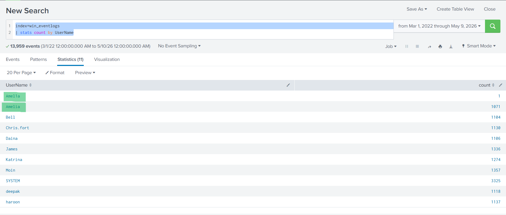

I found that there was a user named `Amel1a` tried to impersonate `Amelia` by replacing `i` with `1` 

Answer: `Amel1a`


### Q3: Which user from the HR department was observed to be running scheduled tasks?
As shown, the HR machine hostnames start with `HR_`, 

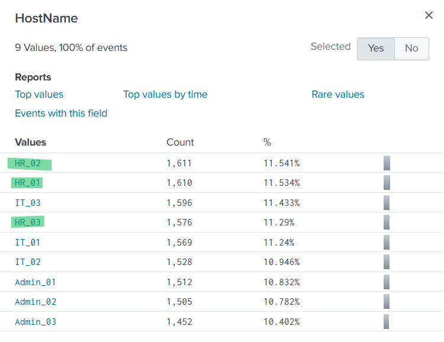

so I added this pattern to the query and filtered for `schtasks` activity

`index=win_eventlogs HostName=HR_* schtasks`

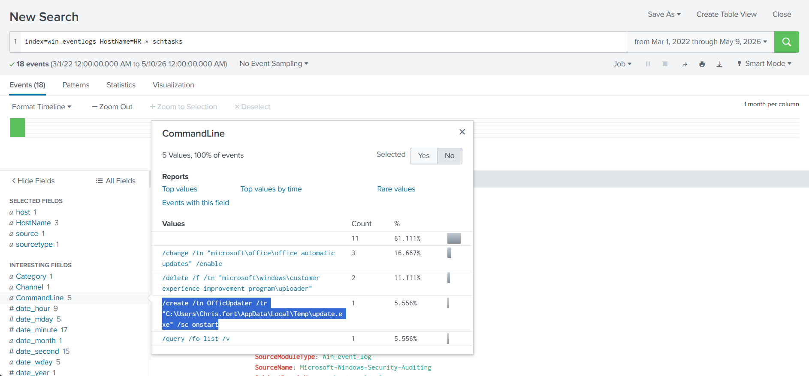

as shown, there is a scheduled task created, view event for further investigation 

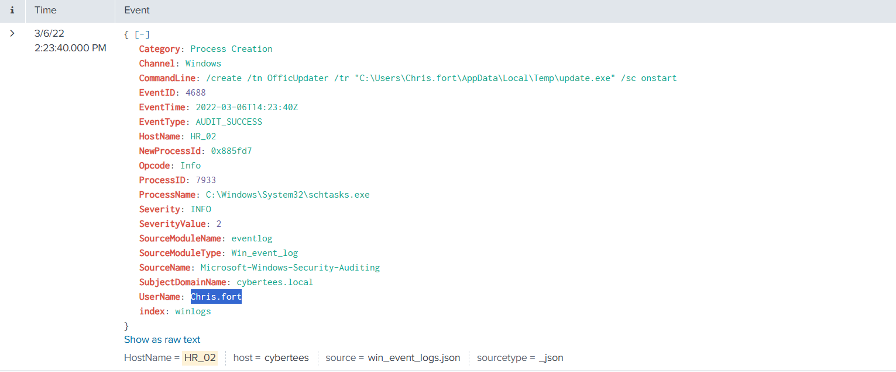

A suspicious scheduled task was identified that launches an executable from the Temp directory upon system startup, 
indicating possible persistence activity by the attacker.

Answer: `Chris.fort`


### Q4: Which user from the HR department executed a system process (LOLBIN) to download a payload from a file-sharing host.

A LOLBIN is a trusted system binary abused by attackers to evade detection and execute malicious actions.

so, I used this query 
- index=win_eventlogs HostName=HR_* UserName=haroon OR UserName=Chris.fort OR UserName=Diana | dedup CommandLine | table CommandLine UserName

Filter events for HR-related hostnames and HR users only, then display the executed command and username in a table and remove duplicates using dedup.

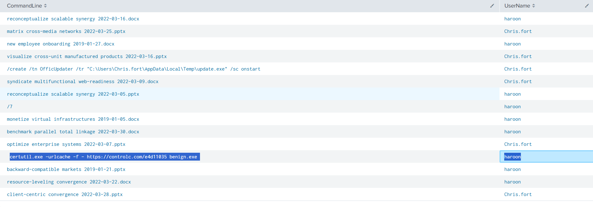

It was observed that the user `haroon` used the `LOLBIN` certutil to download a malicious executable, indicating an attempt to avoid detection mechanisms.
Answer: `haroon`


### Q5: To bypass the security controls, which system process (lolbin) was used to download a payload from the internet?

As identified in the previous analysis, the suspicious process involved was certutil.exe.

Answer: `certutil.exe`


### Q6: What was the date that this binary was executed by the infected host? format (YYYY-MM-DD)

just view event from prevoius qustion and you will see the time 

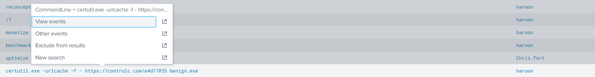

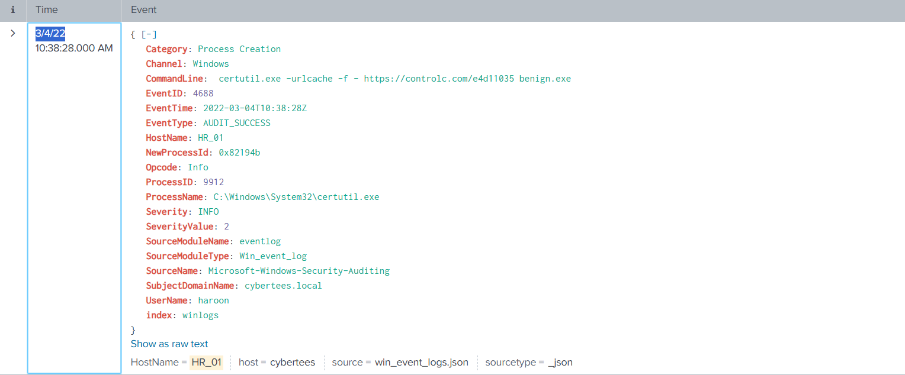

Answer: `2022-03-04`


### Q7: Which third-party site was accessed to download the malicious payload?

also you can find the answer from the same event 

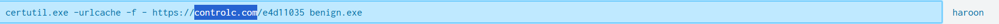


Answer: `controlc.com`


### Q8: What is the name of the file that was saved on the host machine from the C2 server during the post-exploitation phase?
This command provides extensive information and contains multiple useful results.
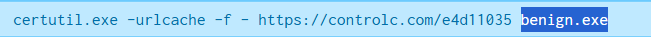

Answer: `benign.exe`


The suspicious file downloaded from the C2 server contained malicious content with the pattern THM{..........}; what is that pattern?
The malicious URL was analyzed using [VirusTotal](https://www.virustotal.com/), and further details were reviewed in the Details section.
then navigate to details tab 

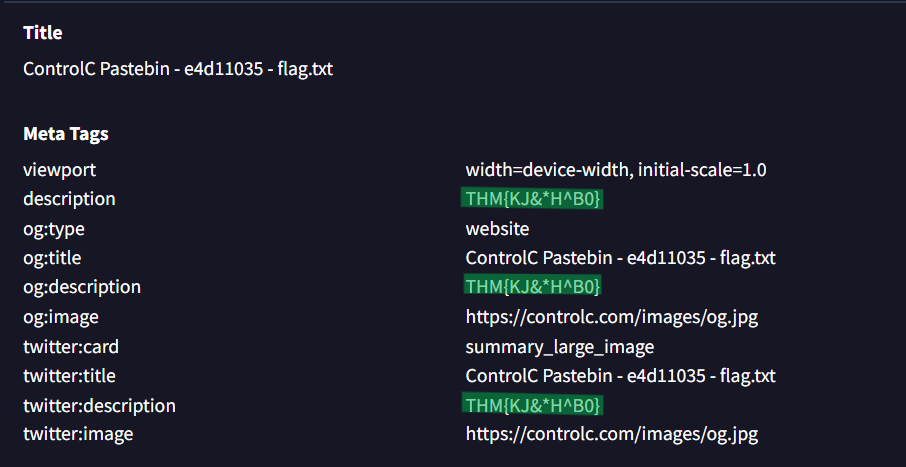

Answer: `THM{KJ&*H^B0}`


What is the URL that the infected host connected to?
Revisit the previous command output to display the complete URL.


Answer: `https://controlc.com/e4d11035`


## The End 
# I hope you find it useful.


