#  Boogeyman2 Writeup
## Lab Link [Boogeyman2](https://tryhackme.com/room/boogeyman2)


```
After having a severe attack from the Boogeyman, Quick Logistics LLC improved its security defences. However, the Boogeyman returns with new and improved tactics, techniques and procedures. 

In this room, you will be tasked to analyse the new tactics, techniques, and procedures (TTPs) of the threat group named Boogeyman. 

```

### Q1: What email was used to send the phishing email?
open Atrefact folder then open .eml file from gui 

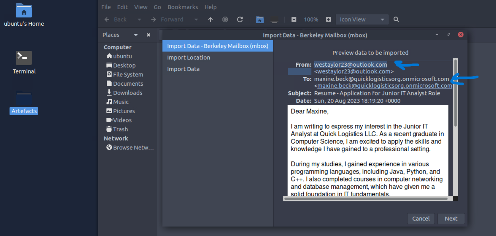

Answer: `westaylor23@outlook.com `


### Q2: What is the email of the victim employee?

from the same photo above you can find the answer

Answer: `maxine.beck@quicklogisticsorg.onmicrosoft.com `


### Q3: What is the name of the attached malicious document?
scroll down on the mail 

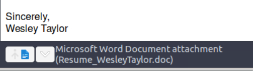

Answer: `Resume_WesleyTaylor.doc`


### Q4: What is the MD5 hash of the malicious attachment?
Firstly, download the malicious document 
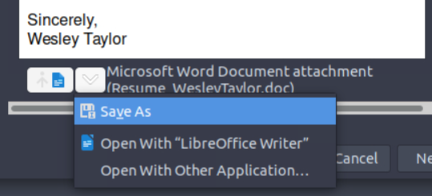
then, calc hash using `md5sum`
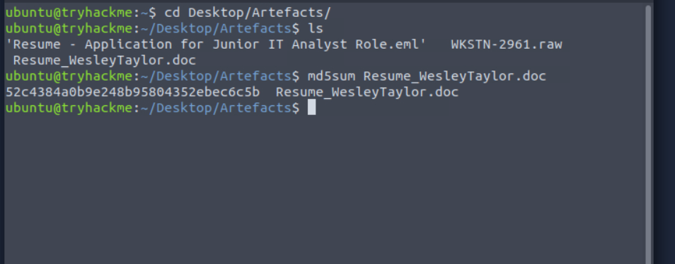


Answer: `52c4384a0b9e248b95804352ebec6c5b`

### Q5: What URL is used to download the stage 2 payload based on the document's macro?
use `olevba` to analyze malicious document `olevba Resume_WesleyTaylor.doc `

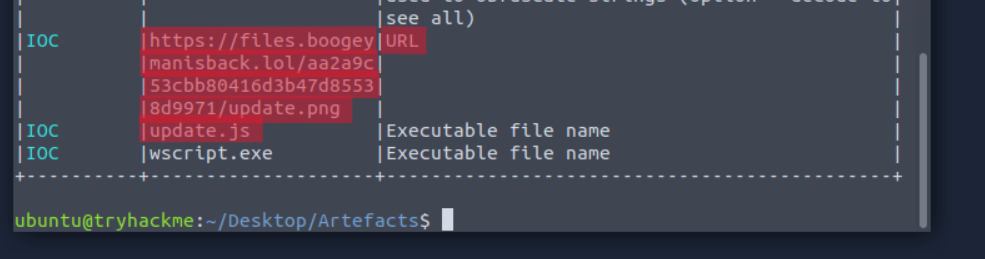


Answer: `https://files.boogeymanisback.lol/aa2a9c53cbb80416d3b47d85538d9971/update.png`


### Q6: What is the name of the process that executed the newly downloaded stage 2 payload?
For, this you need to use volatility to analyze memory dump file 
I used pslist plugin to list all processes

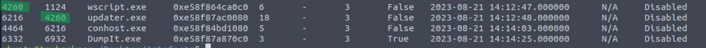

as you can see, the `wscript.exe` is parent process of `updater.exe`

Answer: `wscript.exe`


### Q7: What is the full file path of the malicious stage 2 payload?
In the first, I tried to find the answer using `filescan` plugin but in the end I found it when I investigate using `cmdline`
`vol -f WKSTN-2961.raw windows.cmdline `

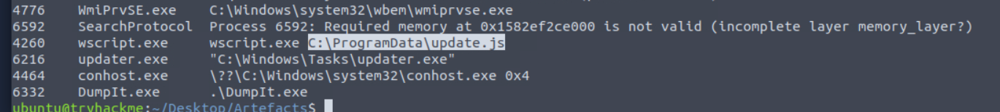

Answer: `C:\ProgramData\update.js`

### Q8: What is the PID of the process that executed the stage 2 payload?

use pslist also to see PID and PPID 

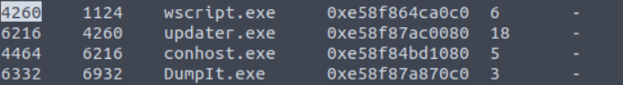


Answer: `4260`

### Q9: What is the parent PID of the process that executed the stage 2 payload?
you can find the answer from the screenshot above

Answer: `1124`

### Q10: What URL is used to download the malicious binary executed by the stage 2 payload?

It's the same answer in Q5

Answer: `https://files.boogeymanisback.lol/aa2a9c53cbb80416d3b47d85538d9971/update.exe`

### Q11: What is the PID of the malicious process used to establish the C2 connection?
by analyze pslist before it seemed that wscript.exe was used to execute update.exe
so, after that I used `netscan` plugin to see which one establish connection with C2

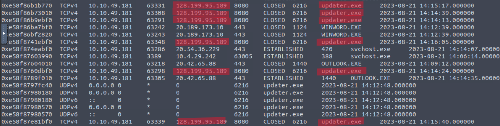

it seemed updater connected with malicious ip, you can analyze ip using [Virus total](https://www.virustotal.com/)

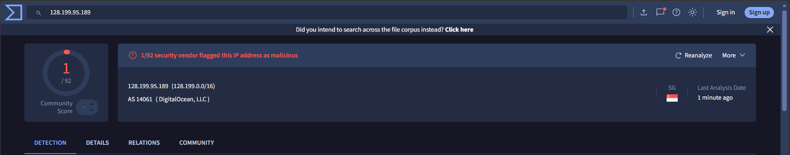

use pslist to know PID

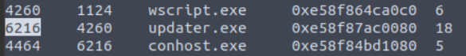


Answer: `6216`

### Q12: What is the full file path of the malicious process used to establish the C2 connection?
You can use the `filescan` plugin to retrieve file paths, then use `grep` to search for the target filename.
`vol -f WKSTN-2961.raw windows.filescan | grep -i "updater.exe"`

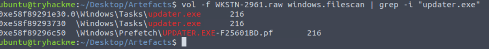

Answer: `C:\Windows\Tasks\updater.exe`

### Q13: What is the IP address and port of the C2 connection initiated by the malicious binary? (Format: IP address:port)
Like we did in the Q11, use netstat to find the answer

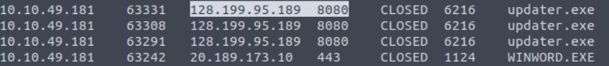

Answer: `128.199.95.189:8080`

### Q14: What is the full file path of the malicious email attachment based on the memory dump?
You can use the `filescan` plugin to retrieve file paths, then use `grep` to search for the target filename.
as we did in the Q12
`vol -f WKSTN-2961.raw windows.filescan | grep -i "Resume_WesleyTaylor"`
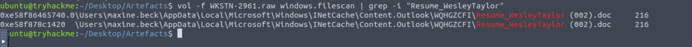


Answer: `C:\Users\maxine.beck\AppData\Local\Microsoft\Windows\INetCache\Content.Outlook\WQHGZCFI\Resume_WesleyTaylor (002).doc`

### Q15: The attacker implanted a scheduled task right after establishing the c2 callback. What is the full command used by the attacker to maintain persistent access?
I first tried by using `cmdline` and `registry.printkey` but couldn't find the answer 
then I used `strings` to print all data of the raw file and grep for schtask
`strings WKSTN-2961.raw | grep -i "schtasks" `
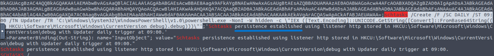

Answer: `schtasks /Create /F /SC DAILY /ST 09:00 /TN Updater /TR 'C:\Windows\System32\WindowsPowerShell\v1.0\powershell.exe -NonI -W hidden -c \"IEX ([Text.Encoding]::UNICODE.GetString([Convert]::FromBase64String((gp HKCU:\Software\Microsoft\Windows\CurrentVersion debug).debug)))\"'`


# The End I hope you find it useful.


