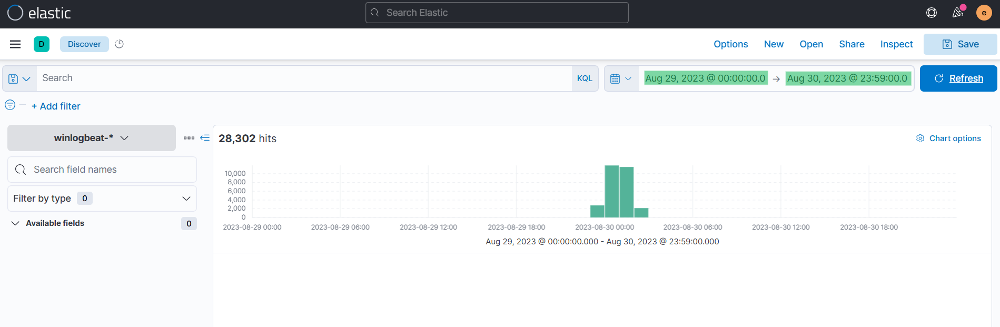
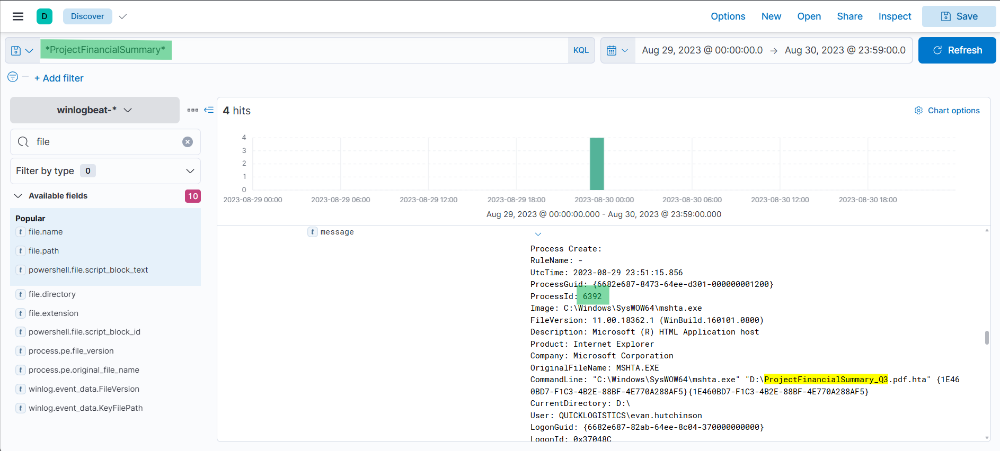
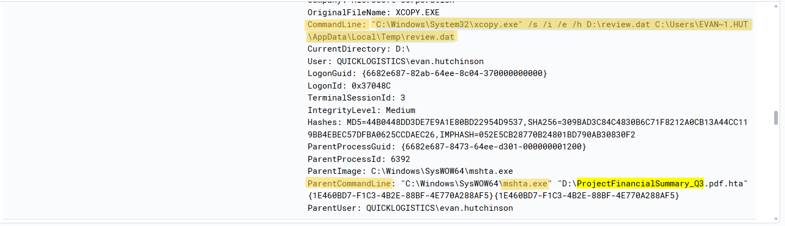
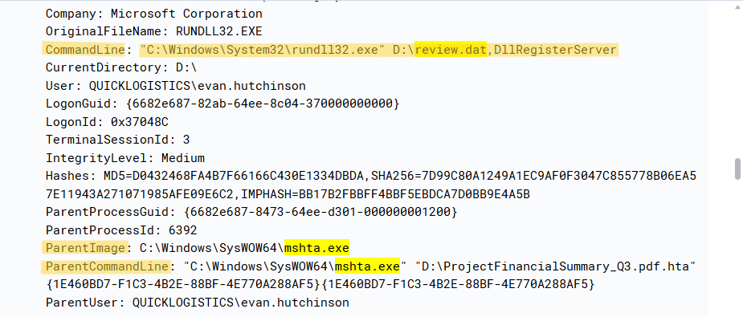

#  Boogeyman3 Writeup
## Lab Link [Boogeyman3](https://tryhackme.com/room/boogeyman3)


```
Due to the previous attacks of Boogeyman, Quick Logistics LLC hired a managed security service provider to handle its Security Operations Center.
Little did they know, the Boogeyman was still lurking and waiting for the right moment to return. 

In this room, you will be tasked to analyse the new tactics, techniques, and procedures (TTPs) of the threat group named Boogeyman. 
```

Lurking in the Dark

Without tripping any security defences of Quick Logistics LLC, the Boogeyman was able to compromise one of the employees and stayed in the dark, waiting for the right moment to continue the attack. Using this initial email access, the threat actors attempted to expand the impact by targeting the CEO, Evan Hutchinson. 


The email appeared questionable, but Evan still opened the attachment despite the scepticism. After opening the attached document and seeing that nothing happened, Evan reported the phishing email to the security team.

Initial Investigation

Upon receiving the phishing email report, the security team investigated the workstation of the CEO. During this activity, the team discovered the email attachment in the downloads folder of the victim.


In addition, the security team also observed a file inside the ISO payload, as shown in the image below.


Lastly, it was presumed by the security team that the incident occurred between August 29 and August 30, 2023.

Given the initial findings, you are tasked to analyse and assess the impact of the compromise.


### Q1: What is the PID of the process that executed the initial stage 1 payload?
Firstly, access the machine using the given IP address, navigate to the Discover tab, and then change the time range.




After searching for the malicious PDF name, it appeared that mshta.exe was used as part of the attack chain to execute a malicious document.



Answer: `6392`


### Q2: The stage 1 payload attempted to implant a file to another location. What is the full command-line value of this execution?

using the same query filter, you will see this event 



Answer: `"C:\Windows\System32\xcopy.exe" /s /i /e /h D:\review.dat C:\Users\EVAN~1.HUT\AppData\Local\Temp\review.dat`

### Q3: The implanted file was eventually used and executed by the stage 1 payload. What is the full command-line value of this execution?
I searched using implanted file and stage 1 payload 
`*mshta.exe* AND *review.dat*`



Answer: `"C:\Windows\System32\rundll32.exe" D:\review.dat,DllRegisterServer`


### Q4: The stage 1 payload established a persistence mechanism. What is the name of the scheduled task created by the malicious script?


Answer: ``

### Q5: The execution of the implanted file inside the machine has initiated a potential C2 connection. What is the IP and port used by this connection? (format: IP:port)


Answer: ``


# The End I hope you find it useful.
