#  Boogeyman3 Writeup
## Lab Link [Boogeyman3](https://tryhackme.com/room/boogeyman3)


```
Due to the previous attacks of Boogeyman, Quick Logistics LLC hired a managed security service provider to handle its Security Operations Center.
Little did they know, the Boogeyman was still lurking and waiting for the right moment to return. 

In this room, you will be tasked to analyse the new tactics, techniques, and procedures (TTPs) of the threat group named Boogeyman. 
```

Lurking in the Dark

Without tripping any security defences of Quick Logistics LLC, the Boogeyman was able to compromise one of the employees and stayed in the dark, waiting for the right moment to continue the attack. Using this initial email access, the threat actors attempted to expand the impact by targeting the CEO, Evan Hutchinson. 


The email appeared questionable, but Evan still opened the attachment despite the scepticism. After opening the attached document and seeing that nothing happened, Evan reported the phishing email to the security team.

Initial Investigation

Upon receiving the phishing email report, the security team investigated the workstation of the CEO. During this activity, the team discovered the email attachment in the downloads folder of the victim.


In addition, the security team also observed a file inside the ISO payload, as shown in the image below.


Lastly, it was presumed by the security team that the incident occurred between August 29 and August 30, 2023.

Given the initial findings, you are tasked to analyse and assess the impact of the compromise.


### Q1: What is the PID of the process that executed the initial stage 1 payload?
Firstly, access the machine using the given IP address, navigate to the Discover tab, and then change the time range.


After searching for the malicious PDF name, it appeared that mshta.exe was used as part of the attack chain to execute a malicious document.


Answer: `6392`


### Q2: The stage 1 payload attempted to implant a file to another location. What is the full command-line value of this execution?

using the same query filter, you will see this event 


Answer: `"C:\Windows\System32\xcopy.exe" /s /i /e /h D:\review.dat C:\Users\EVAN~1.HUT\AppData\Local\Temp\review.dat`

### Q3: The implanted file was eventually used and executed by the stage 1 payload. What is the full command-line value of this execution?
I searched using implanted file and stage 1 payload 
`*mshta.exe* AND *review.dat*`


Answer: `"C:\Windows\System32\rundll32.exe" D:\review.dat,DllRegisterServer`


### Q4: The stage 1 payload established a persistence mechanism. What is the name of the scheduled task created by the malicious script?

search using `scheduled task`

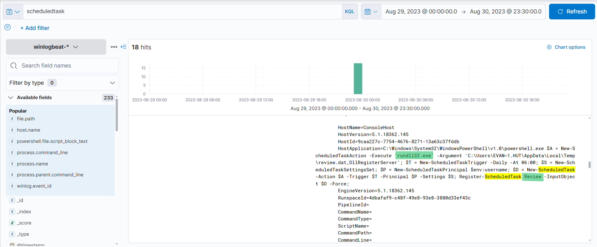


Answer: `Review`

### Q5: The execution of the implanted file inside the machine has initiated a potential C2 connection. What is the IP and port used by this connection? (format: IP:port)

Filter the logs with `event.code:3`, which indicates a network connection event, and you will observe powershell.exe establishing a connection to the malicious C2 server over port 80.

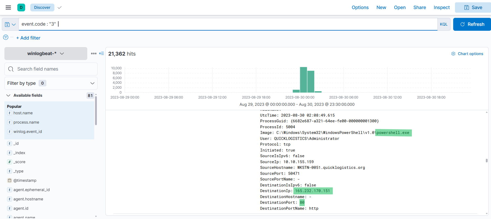

I analyzed the IP address using [Virus Total](https://www.virustotal.com/)to verify whether it was malicious or not.

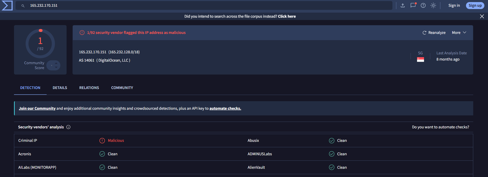

Answer: `165.232.170.151:80`


### Q6: The attacker has discovered that the current access is a local administrator. What is the name of the process used by the attacker to execute a UAC bypass?

I searched for most common bypass techniques and Found that 
```
Common processes used to UAC bypass
fodhelper.exe
eventvwr.exe
computerdefaults.exe
sdclt.exe
slui.exe
cmstp.exe
```

So, you need to filter using these processes one by one 

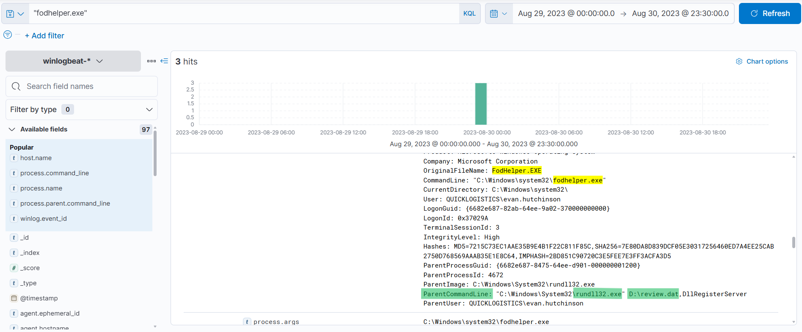


ANswer: `fodhelper.exe`


### Q7: Having a high privilege machine access, the attacker attempted to dump the credentials inside the machine. What is the GitHub link used by the attacker to download a tool for credential dumping?

I filtered using this word *github* 

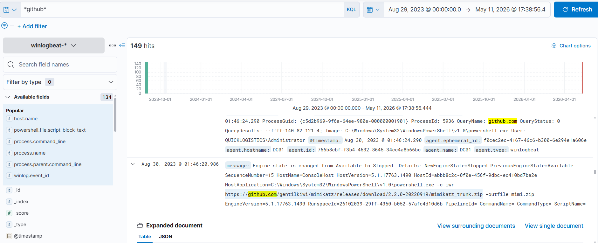

Answer: `https://github.com/gentilkiwi/mimikatz/releases/download/2.2.0-20220919/mimikatz_trunk.zip`


### Q8: After successfully dumping the credentials inside the machine, the attacker used the credentials to gain access to another machine. What is the username and hash of the new credential pair? (format: username:hash)

I filtered the logs using `sekurlsa`, which is a module used by Mimikatz to dump credentials from `lsass.exe`.

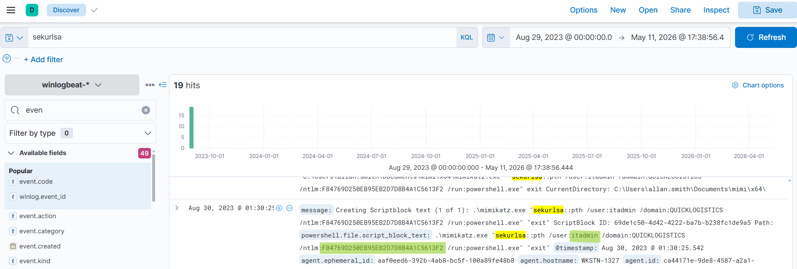

Answer: `itadmin:F84769D250EB95EB2D7D8B4A1C5613F2`


### Q9: Using the new credentials, the attacker attempted to enumerate accessible file shares. What is the name of the file accessed by the attacker from a remote share?
Firstly, I filtered the logs using the username itadmin to identify the hostname. Then, I filtered by that hostname and reviewed all commands executed through PowerShell.

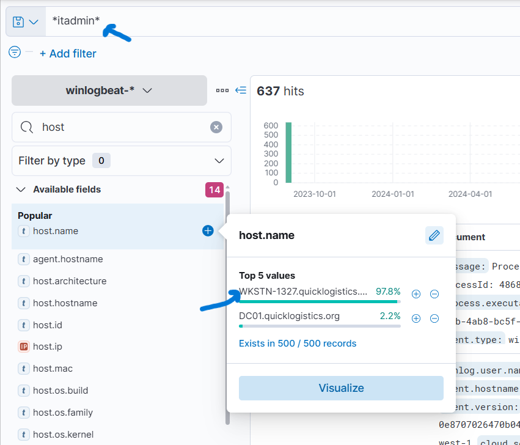

`host.name: "WKSTN-0051.quicklogistics.org" and powershell.exe`

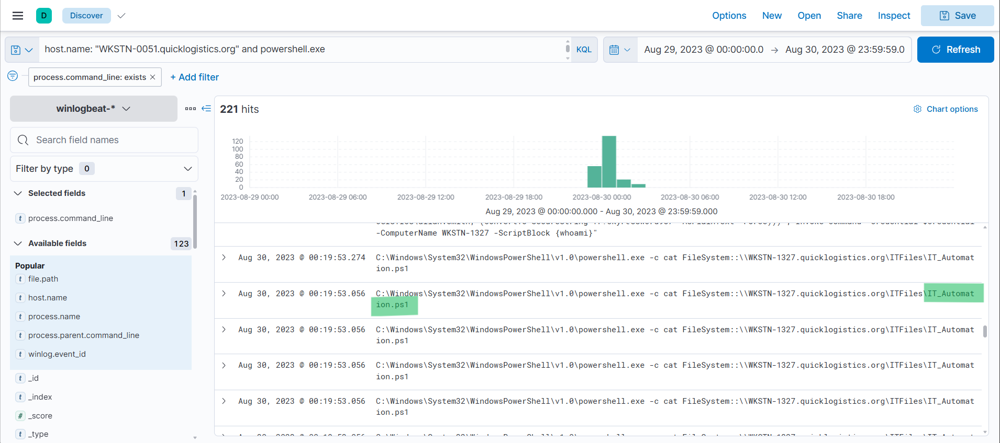


ANswer: `IT_Automation.ps1`


### Q10: After getting the contents of the remote file, the attacker used the new credentials to move laterally. What is the new set of credentials discovered by the attacker? (format: username:password)

Within the same filter, the command after the one from the previous question contained the required credentials.

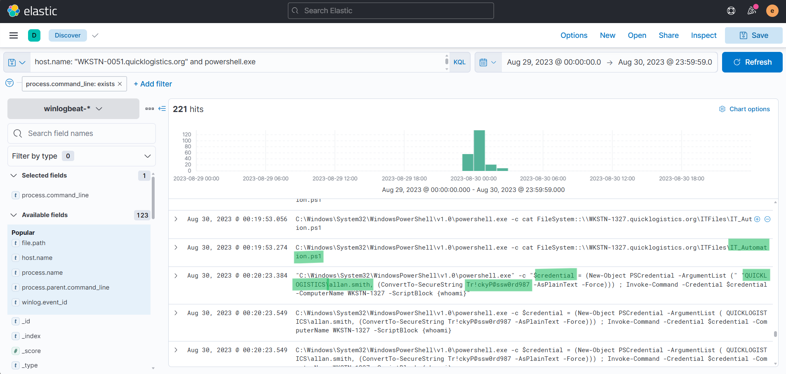

Answer: `QUICKLOGISTICS\allan.smith:Tr!ckyP@ssw0rd987`


### Q11: What is the hostname of the attacker's target machine for its lateral movement attempt?

within the same command in the previous question

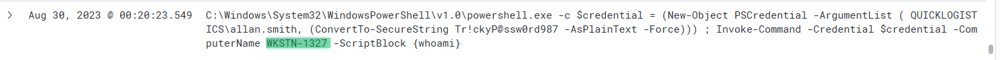

Answer: `WKSTN-1327`


### Q12: Using the malicious command executed by the attacker from the first machine to move laterally, what is the parent process name of the malicious command executed on the second compromised machine?
I filtered the logs using the second machine’s hostname and the first machine’s username.

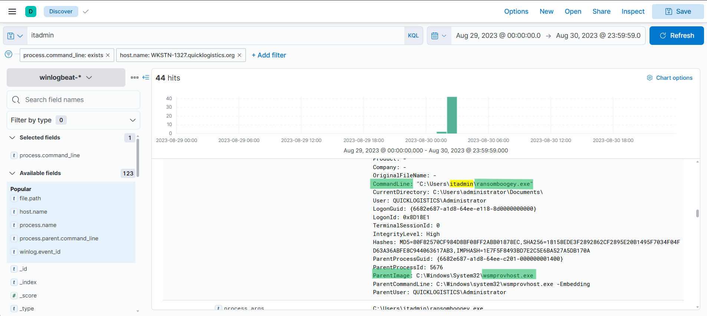

The attacker executed `ransomboogey.exe` through `wsmprovhost.exe`.

Answer: `wsmprovhost.exe`


### Q13: The attacker then dumped the hashes in this second machine. What is the username and hash of the newly dumped credentials? (format: username:hash)
I used the same filter as in Q8, you can also filter using `*mimikatz.exe*`
becuase it's the tool used in credential dump

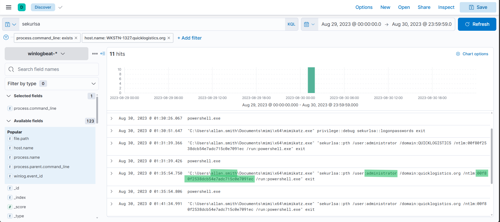


Answer: `administrator:00f80f2538dcb54e7adc715c0e7091ec `

### Q14: After gaining access to the domain controller, the attacker attempted to dump the hashes via a DCSync attack. Aside from the administrator account, what account did the attacker dump?

The attacker abuses Active Directory replication permissions to make their machine request password data from the Domain Controller
as if it were another Domain Controller.

the module used in mimikatz to perform `dcsync` is  `lsadump::dcsync`
so, I filtered using `dcsync`

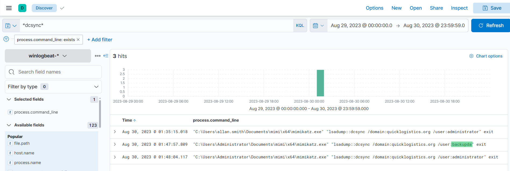

Answer: `backupda`


### Q15: After dumping the hashes, the attacker attempted to download another remote file to execute ransomware. What is the link used by the attacker to download the ransomware binary?

As observed from Q12, the file downloaded to execute the ransomware was `ransomboogey.exe`. 
Therefore, I filtered logs using `ransomboogey.exe` to identify the URL it was downloaded from.

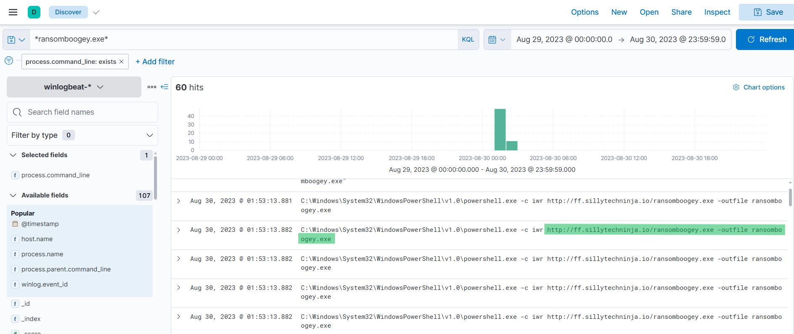

Answer: `http://ff.sillytechninja.io/ransomboogey.exe`


# The End I hope you find it useful.
