# Brains Writeup

## Lab Link [Brains](https://tryhackme.com/room/brains)


## Task 1 | Red: Exploit the Server!

### Q1: What is the content of flag.txt in the user's home folder?
First, I scanned the target machine using Nmap to identify open ports that could potentially be exploited.
`nmap -p- <target-ip>`

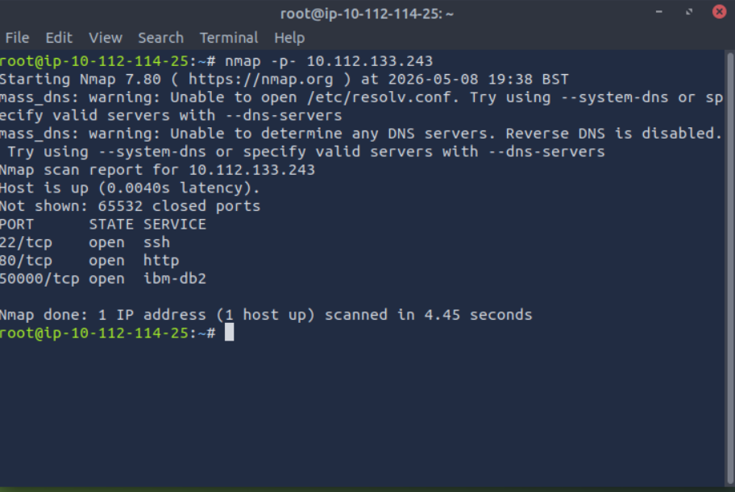

As you can see, the IBM Db2 database service is running on port 50000.
so, I tried to open data base server using url with mentioned port

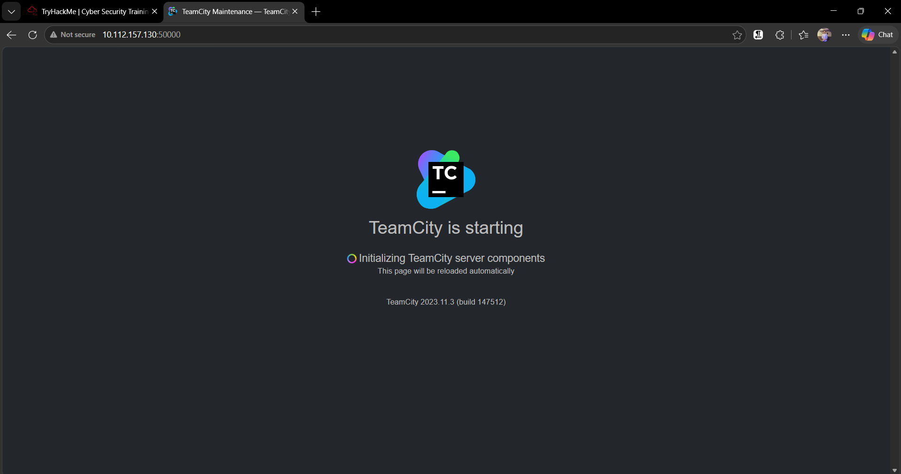

as you can see, the service is related to teamcity with pecific version 
so, I searched for CVE to exploit this service 

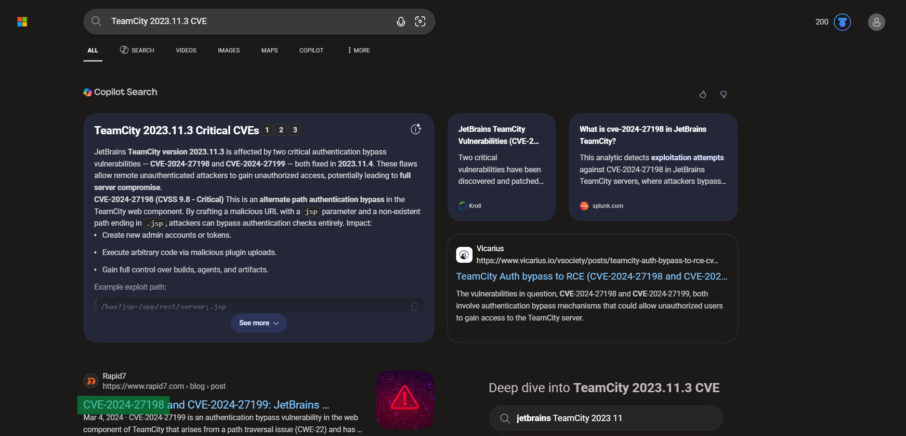

now, you need to search for exploitation for this vulnerability on metasploite

use `msfconsole` to run metasploite
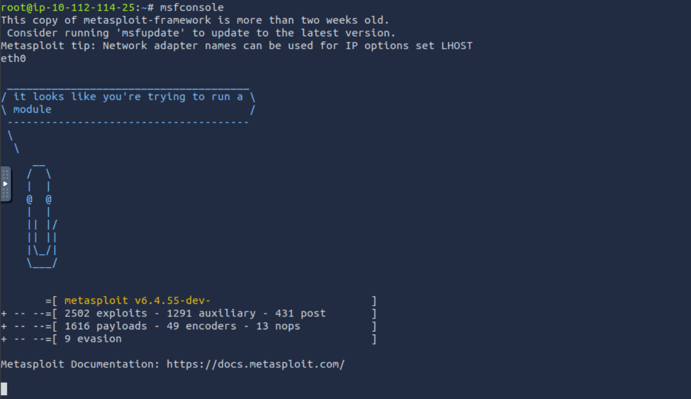

search for teamcity and choose cve_2024_27198 
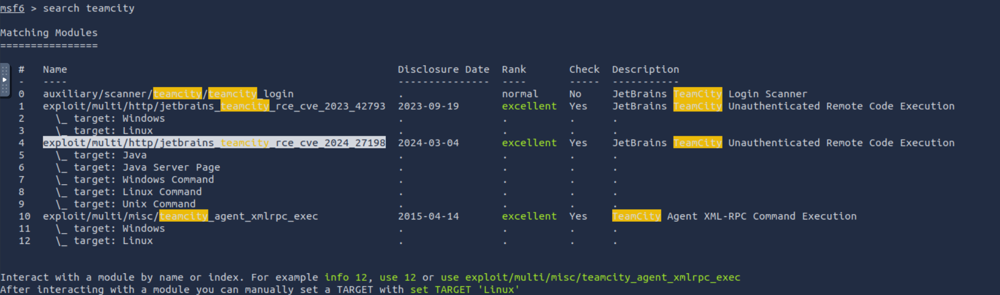

then run use command on selected module
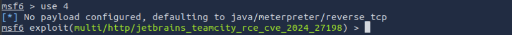

then show options to show required option 

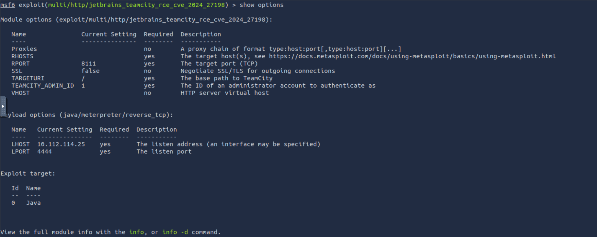

Set the required options, then run the exploit command, and you will see that the Meterpreter session has been opened.

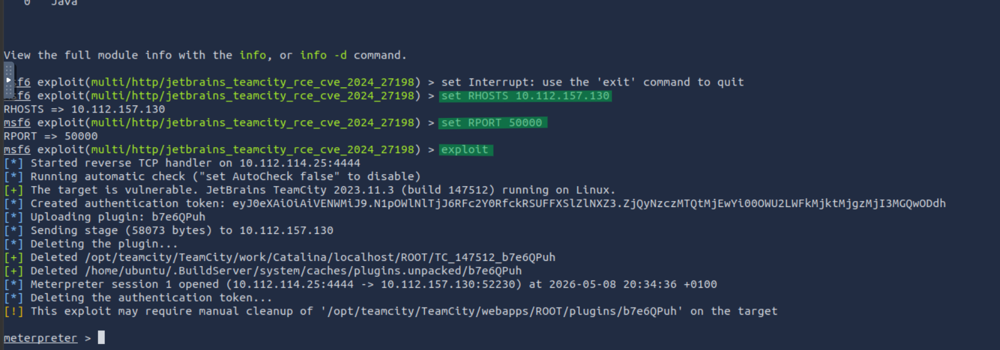

After gaining a Meterpreter session, I used the cd command to navigate to the home directory in order to locate the flag.txt file.

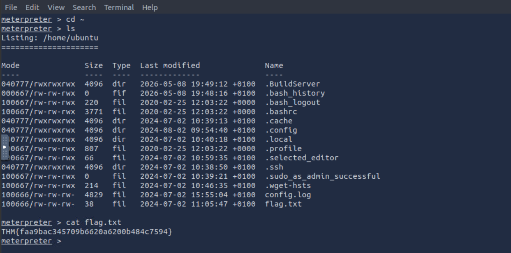


Answer: `THM{faa9bac345709b6620a6200b484c7594}`


## Task 2 | Blue: Let's Investigate

```
Now comes the detection part.

The IT department has provided us one of the servers which was compromised as a result of the attack.
Our task as a Forensics Analyst is to examine the host and identify the attacker's footprints in the post-exploitation stage.
```


### Q1: What is the name of the backdoor user which was created on the server after exploitation?

Terminate the machine from the first task and start the machine in the second task.

First of all, expand the time range to all time to show all events 

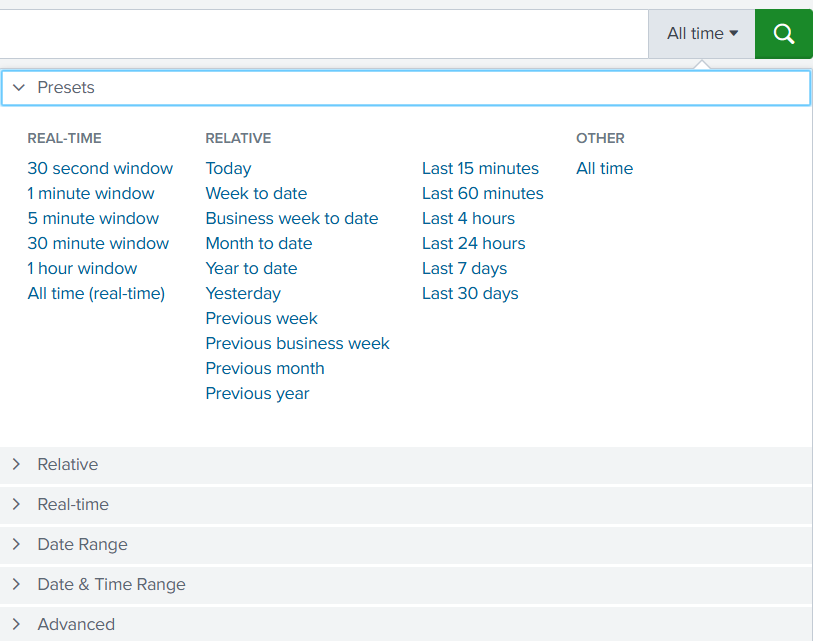

from the logs it seemed that the target machine operating system is linux 

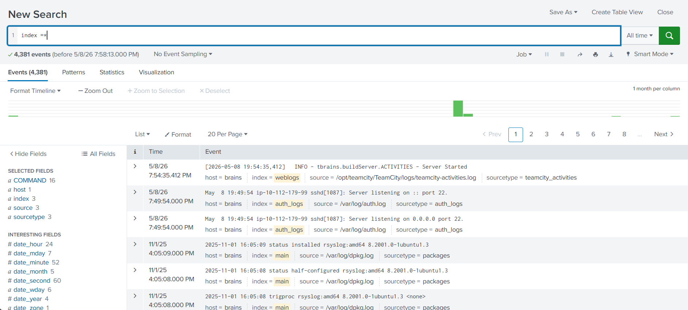

so, I searched for how to add user to linux system to filter by it 

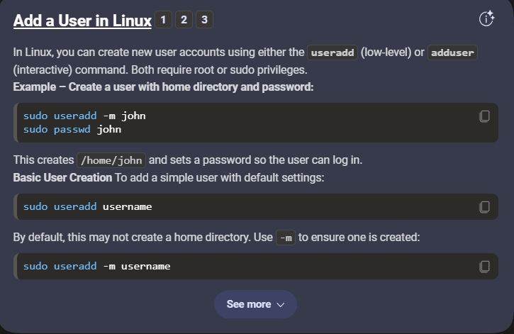

- index =* useradd

The id command showed that the current user had a UID lower than 1000, indicating that it was a system or service account rather than a regular user account on the Linux machine.

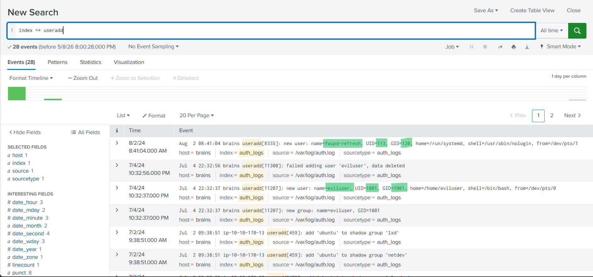


Answer: `eviluser`


### Q2: What is the name of the malicious-looking package installed on the server?
filter by "install" and focus on time after create backdoor user
- index =* "install"

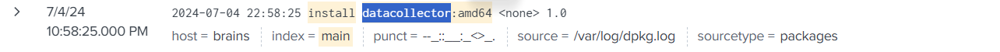


Answer: `datacollector`


### Q3: What is the name of the plugin installed on the server after successful exploitation?
filter by plugins
- index =* plugins

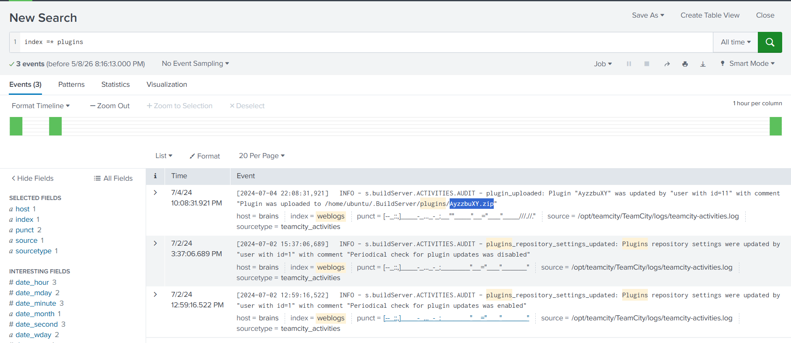

Answer: `AyzzbuXY.zip`


# The End I hope you find it useful.


