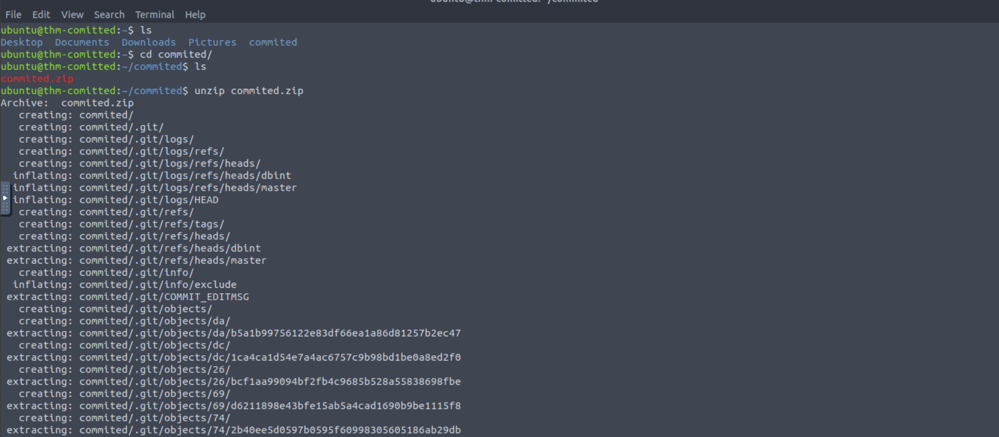
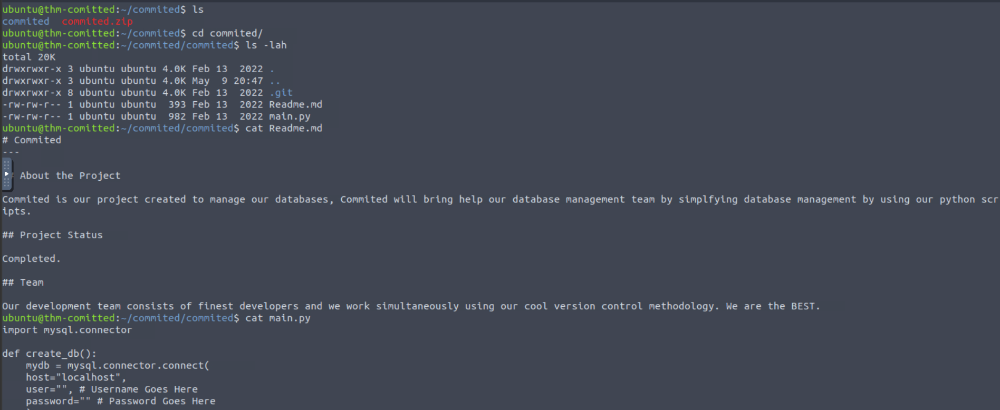
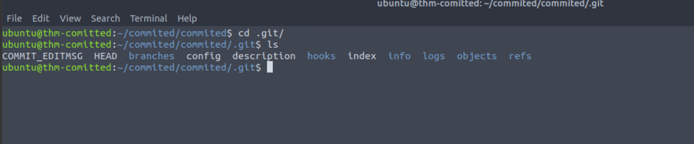
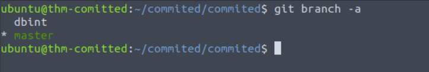
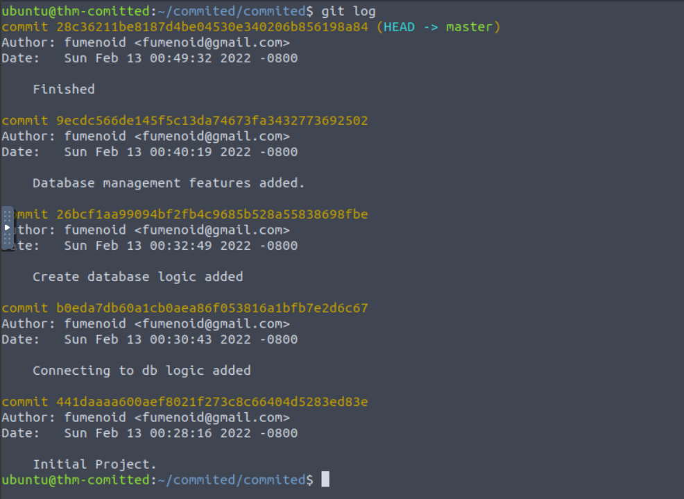
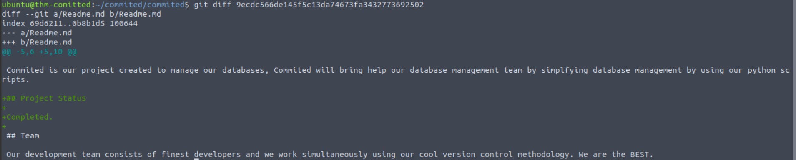
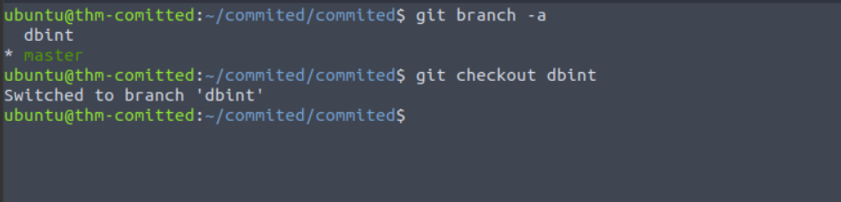
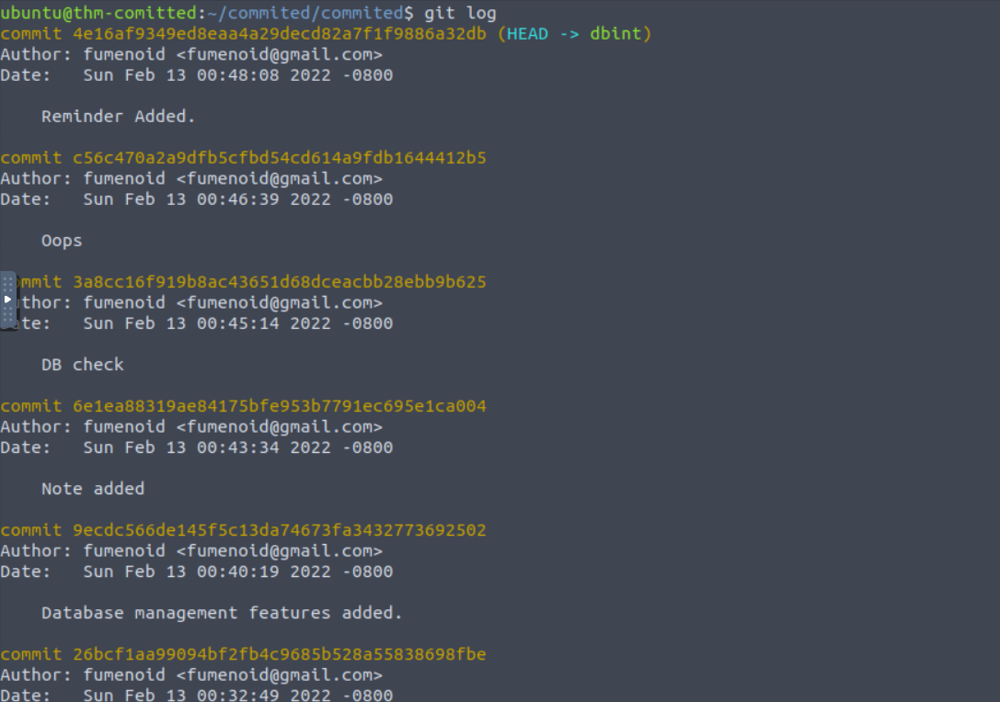
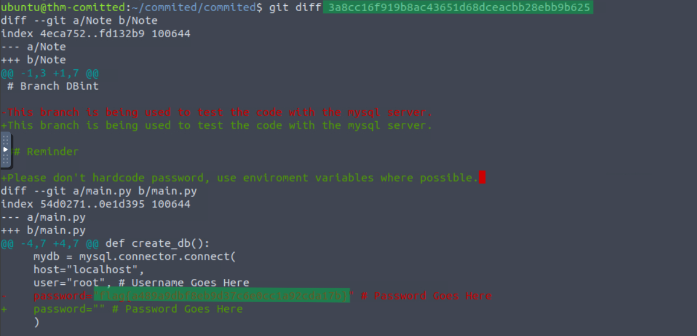

#  Committed Writeup
### Lab Link [Committed](https://tryhackme.com/room/committed)


## Scenario
```
Oh no, not again! One of our developers accidentally committed some sensitive code to our GitHub repository.
Well, at least, that is what they told us... the problem is, we don't remember what or where! Can you track down what we accidentally committed?

The files you need are located in /home/ubuntu/commited on the VM attached to this task.
```

## Q: Discover the flag in the repository!

First, discover the machine, you will find the commited folder and inside you will find .zip file
so, unzip it 



you will find new directory named commited and inside you will see 2 files and one hidden folder
I displayed the content of two files but found nothing related to flag



then, I displayed all content in these files and folders in .git folder but found nothing



First, I checked the available branches in the repository. 
`git branch -a`



`git log` displays the history of commits, including commit IDs, authors, dates, and commit messages.



you can see there was 4 different commits
then, `git diff <hash>` displays the changes made to files by comparing different versions or commits.



I went through them one by one but I couldn't find the flag

then I chaged the branch to `dbint` using `git checkout `


then `git log` to show old commits



after that `git diff` to see change made to files

I found the flag on this one 




Answer: `flag{a489a9dbf8eb9d37c6e0cc1a92cda17b}`


## The End 
# I hope you find it useful.
