# Conti Writeup
### Lab Link [Conti](https://tryhackme.com/room/contiransomwarehgh)
## Scenario

Some employees from your company reported that they can’t log into Outlook. The Exchange system admin
also reported that he can’t log in to the Exchange Admin Center.
After initial triage, they discovered some weird readme files settled on the Exchange server.

Below is a copy of the ransomware note.

Below are the error messages that the Exchange admin and employees see when they try to access anything related to Exchange or Outlook.

Outlook Web Access:

Task: You are assigned to investigate this situation. Use Splunk to answer the questions below regarding the Conti ransomware. 

### Q1: Can you identify the location of the ransomware?

Firstly, use this query to know which index contains data
- | eventcount summarize=false index=*

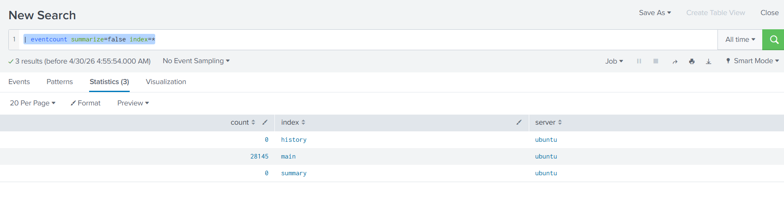

I filtered using EventCode = 11 : file create  

this is a useful website to know more about windows logs and Sysmon EventIDs [EventIDs](https://www.ultimatewindowssecurity.com/securitylog/encyclopedia)

- index = main EventCode = 11

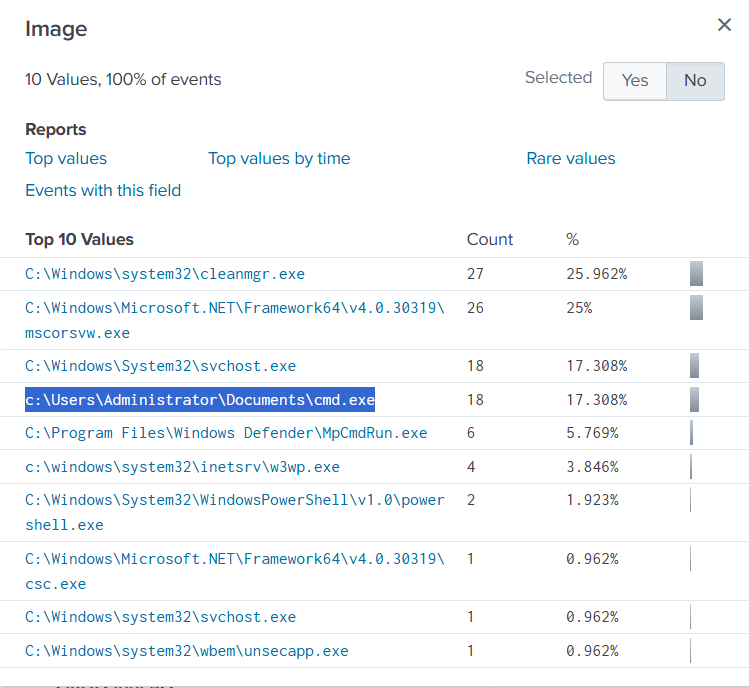

The presence of cmd.exe in C:\Users\Administrator\Documents\ is suspicious, as the legitimate binary should reside in the System32 directory, 
indicating possible malicious activity or defense evasion.

Answer: `c:\Users\Administrator\Documents\cmd.exe`

### Q2: What is the Sysmon event ID for the related file creation event?

using the same link above and choose Sysmon [EventIDs](https://www.ultimatewindowssecurity.com/securitylog/encyclopedia) 

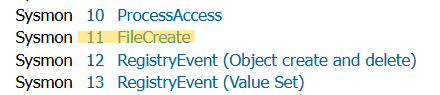

Answer: `11`

### Q3: Can you find the MD5 hash of the ransomware?

you can filterd using bianry name and search for field called hashed 

- index = main  Image="c:\\Users\\Administrator\\Documents\\cmd.exe"

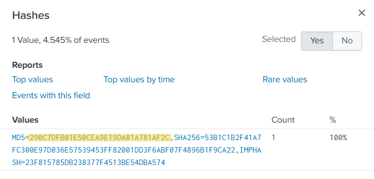

### Q4: What file was saved to multiple folder locations?
 Like question 2, you can filter using *EventCode = 11 to see file create*
 and I stats by TargetFilename to better visibility
 
 - index = main EventCode = 11 | stats count by TargetFilename

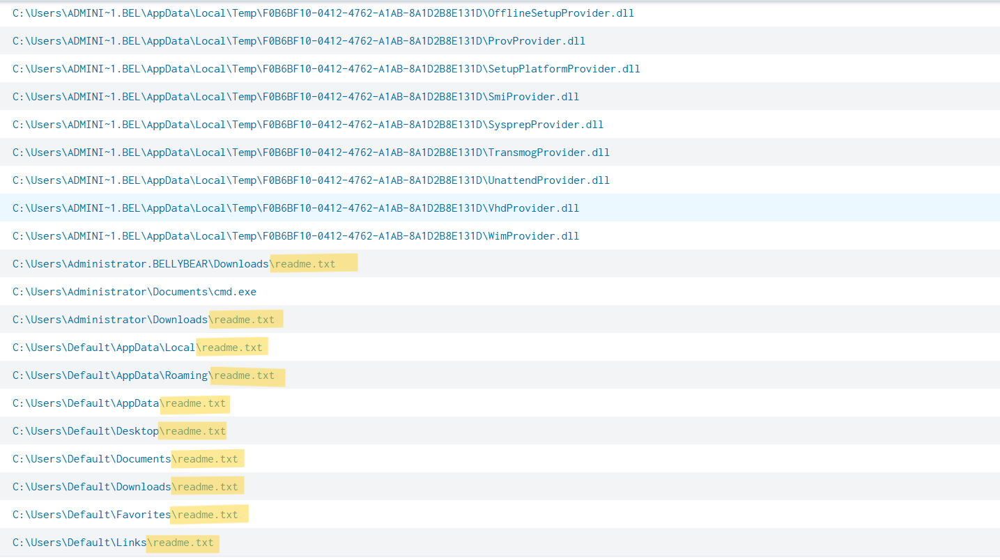

Answer: `readme.txt`

### Q5: What was the command the attacker used to add a new user to the compromised system?

I searched on google for the *add user command on windows*

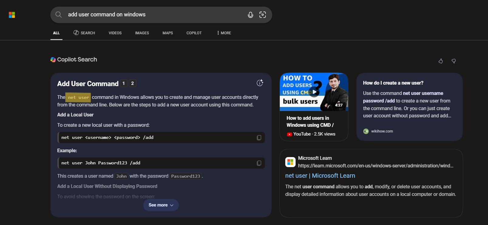

then, I filtered using this command and stats by command line

 - index = main net user | stats count by CommandLine

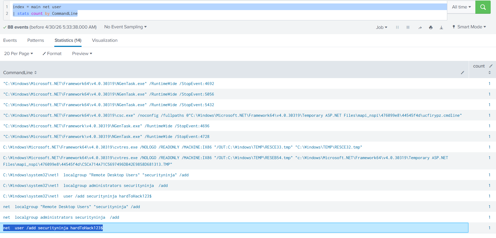

### Q6: The attacker migrated the process for better persistence. What is the migrated process image (executable), and what is the original process image (executable) when the attacker got on the system?

I filtered using *EventCode = 8 : create remote thread*

CreateRemoteThread can be used as part of process migration, 
where malicious code is injected and executed within another process to maintain persistence and evade detection.

- index = main EventCode = 8

We will see two events; choose the first one based on time.

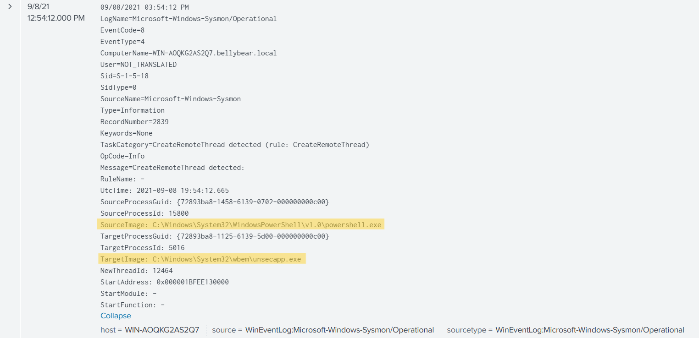

Answer: `C:\Windows\System32\WindowsPowerShell\v1.0\powershell.exe,C:\Windows\System32\wbem\unsecapp.exe`

### Q7: The attacker also retrieved the system hashes. What is the process image used for getting the system hashes?

Using the same filter as above, the second event shows that the process migrates again, this time into lsass.exe.

*lsass is a critical Windows process responsible for authentication and enforcing security policies, and it is commonly targeted by attackers to extract sensitive credentials from memory.*

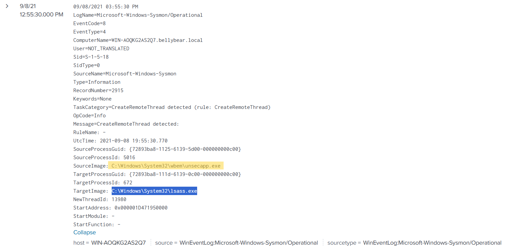

Answer: `C:\Windows\System32\lsass.exe`

### Q8: What is the web shell the exploit deployed to the system?

In this scenario, filtering for POST requests helps identify files that were deployed on the system. 
Additionally, The cs_uri_stem field represents the requested resource path without query parameters,

- index = main cs_method=POST | stats count by cs_uri_stem

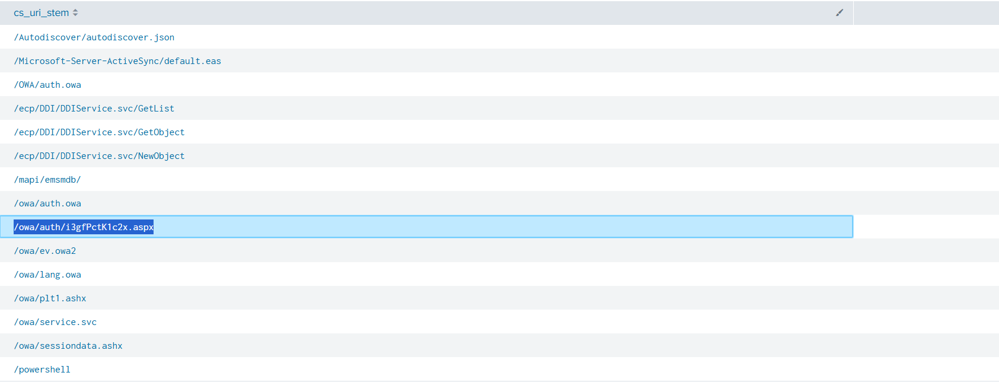

The request to /owa/auth/i3gfPctK1c2x.aspx is suspicious due to the random filename and unusual locationز

Answer: `/owa/auth/i3gfPctK1c2x.aspx`

### Q9: What is the command line that executed this web shell?

Search using the web shell name and check the command line. 

- index = main i3gfPctK1c2x.aspx

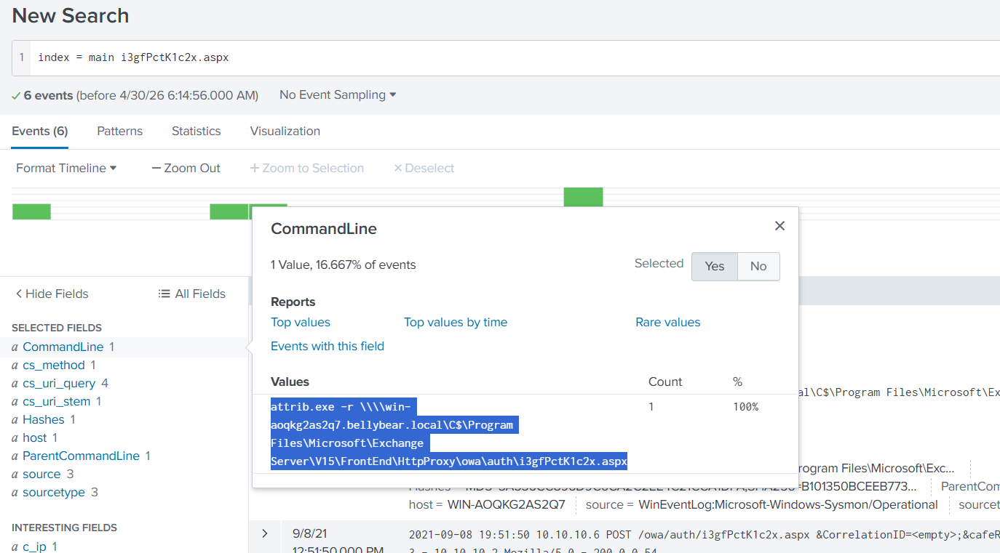

Answer: `attrib.exe  -r \\\\win-aoqkg2as2q7.bellybear.local\C$\Program Files\Microsoft\Exchange Server\V15\FrontEnd\HttpProxy\owa\auth\i3gfPctK1c2x.aspx`

### Q10: What three CVEs did this exploit leverage? Provide the answer in ascending order.

