# Investigating with Splunk
## Lab Link [Investigating with Splunk](https://tryhackme.com/room/investigatingwithsplunk)


## Scenario
```
SOC Analyst Johny has observed some anomalous behaviours in the logs of a few windows machines.
It looks like the adversary has access to some of these machines and successfully created some backdoor.
His manager has asked him to pull those logs from suspected hosts and ingest them into Splunk for quick investigation.
Our task as SOC Analyst is to examine the logs and identify the anomalies.
```

### Q1: How many events were collected and Ingested in the index main?
First, modify the time range of the search.

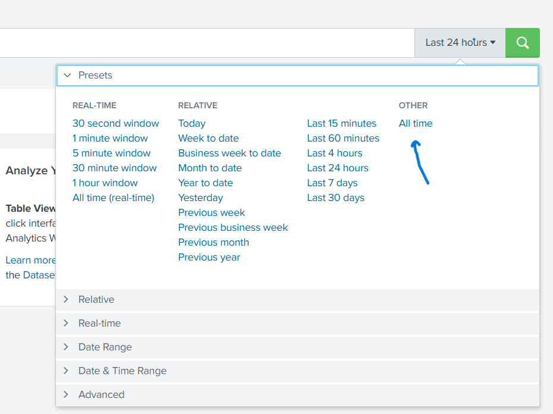

then, search using *index=main*
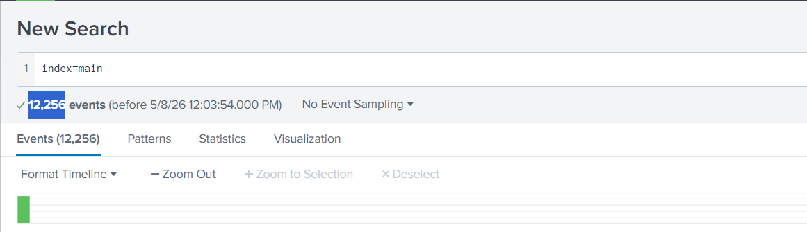

Answer: `12256`


### Q2: On one of the infected hosts, the adversary was successful in creating a backdoor user. What is the new username?
Because the machine is running Microsoft Windows, you can filter the logs using EventID=4720, which indicates that a new user account was created.
useful source to check EventIDs [Ultimate windows security](https://www.ultimatewindowssecurity.com/securitylog/encyclopedia/default.aspx)

- index=main EventID=4720

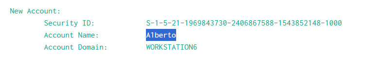

Answer: `A1berto`


### Q3: On the same host, a registry key was also updated regarding the new backdoor user. What is the full path of that registry key?

First, check the hostname from the log in the previous question.

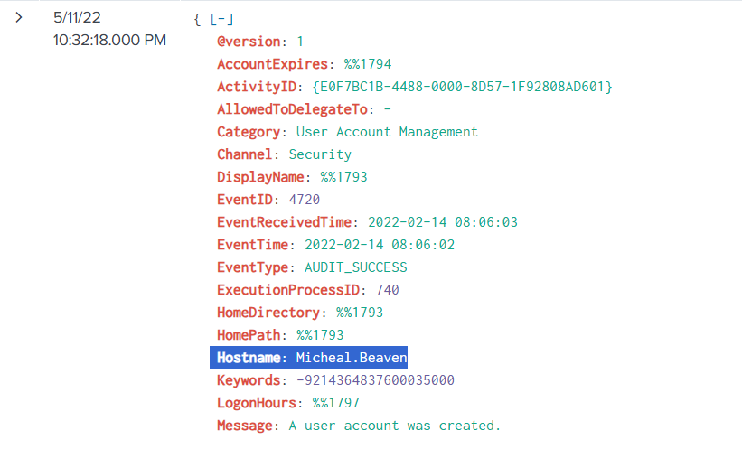

Then, you can search using Sysmon events related to registry value set EventID = 13 from the same resource above 

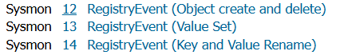

and also append A1berto in your query 

- index=main  Hostname="Micheal.Beaven" EventID=13 A1berto

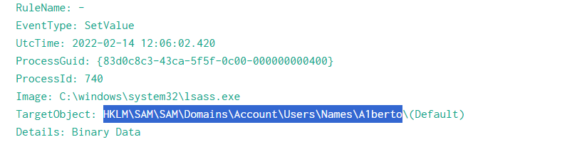

Answer: `HKLM\SAM\SAM\Domains\Account\Users\Names\A1berto`


### Q4: Examine the logs and identify the user that the adversary was trying to impersonate.
I listed all user to see which user that the adversary was trying to impersonate
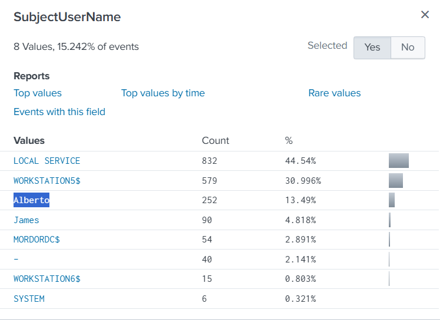

I found that there was a user named `Alberto` with `l` and the attacker create user named `A1berto` with `1` instead `l`

Answer: `Alberto`


### Q5: What is the command used to add a backdoor user from a remote computer?
as you know from previous questions tha backdoor user called *A1berto* so, I appedned in my query then list all commands

- index=main A1berto | stats count by CommandLine

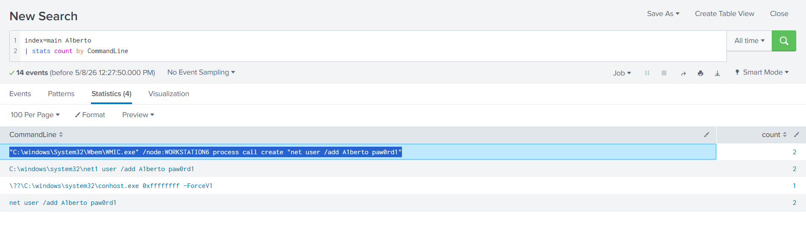


Answer: `"C:\windows\System32\Wbem\WMIC.exe" /node:WORKSTATION6 process call create "net user /add A1berto paw0rd1"`


### Q6: How many times was the login attempt from the backdoor user observed during the investigation?
For this task, I used EventID=4624, which indicates a successful user login, and EventID=4625, which indicates a failed user login attempt.
I also appended *A1berto* to the query to filter the results and search only for this user account.

- index=main A1berto EventID= 4624 OR EventID= 4625

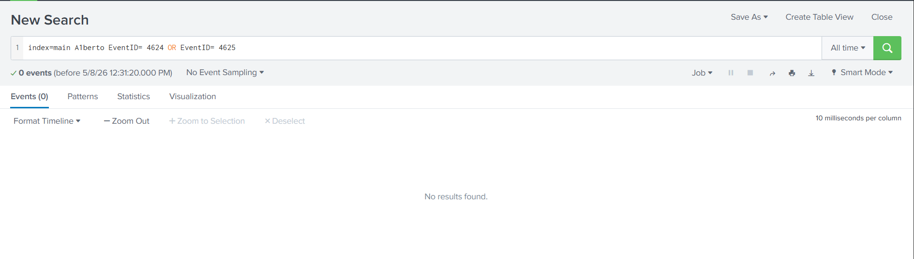

as you can see there isn't any logs 

Answer: `0`


### Q7: What is the name of the infected host on which suspicious Powershell commands were executed?

For this task, I listed all commands along with the hostname on which each command was executed.

- index=main | stats count by CommandLine Hostname
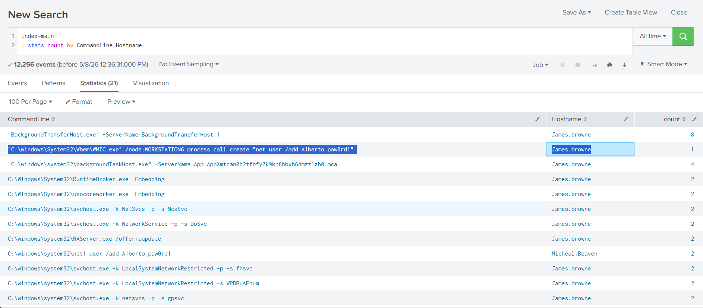

Answer: `James.browne`


### Q8: PowerShell logging is enabled on this device. How many events were logged for the malicious PowerShell execution?

for this question, I used those eventIDs 
4103 : PowerShell module logging
4104 : PowerShell script block logging

- index=main  EventID=4103 OR EventID=4104
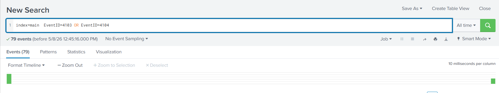


### Q9: An encoded Powershell script from the infected host initiated a web request. What is the full URL?
First, I listed all commands to investigate them manually. Then, I filtered the results using -enc to identify only the encoded commands.

then click view event 

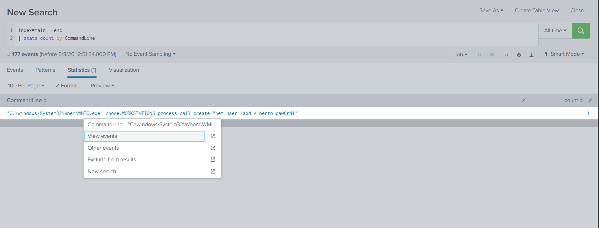

we will find this base64 enceoded command

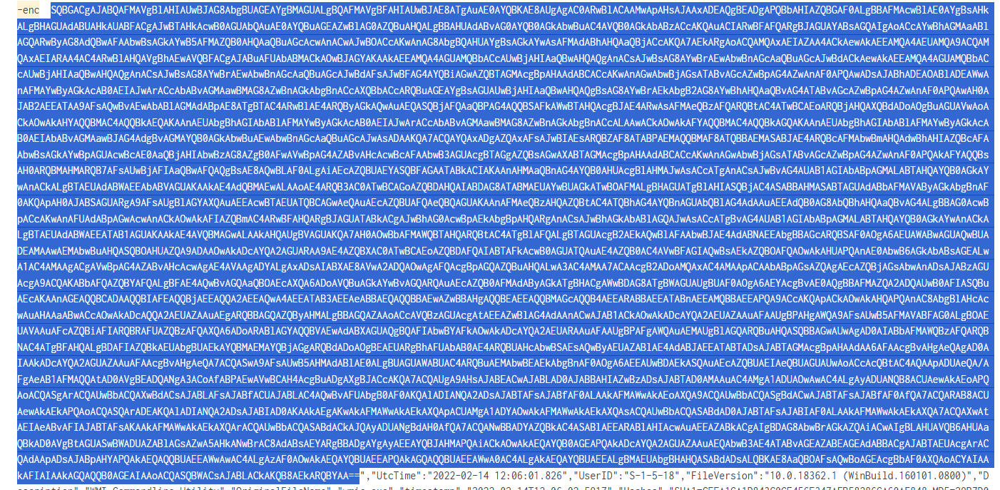

you can decode it using [cyber chef](https://cyberchef.org/)

You will also notice that the URL is encoded using Base64.

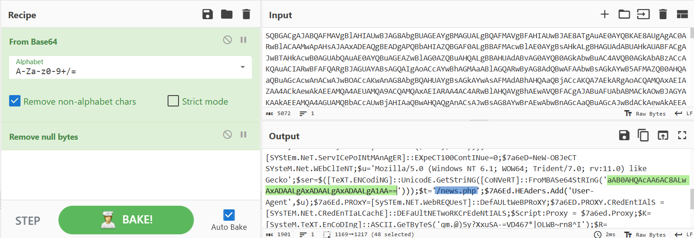

so, you need to decode it using the same Recipe

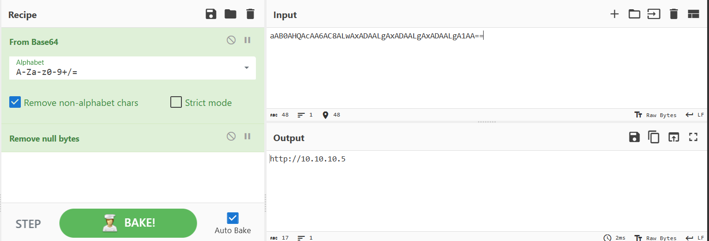

Then, defand the full URL to match the answer format

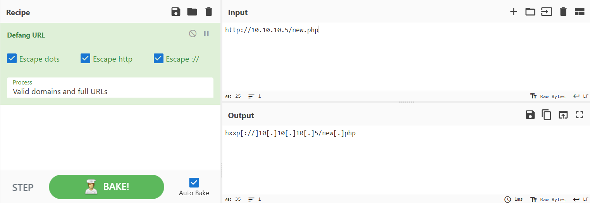

Answer: `hxxp[://]10[.]10[.]10[.]5/news[.]php`


# The End I hope you find it useful.


