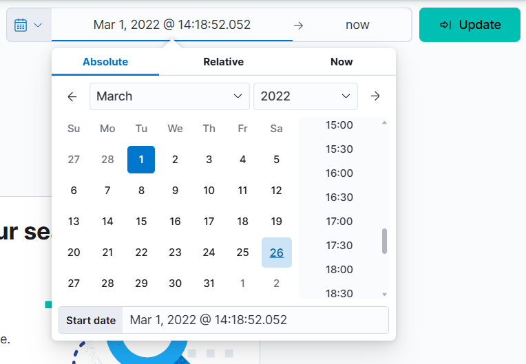
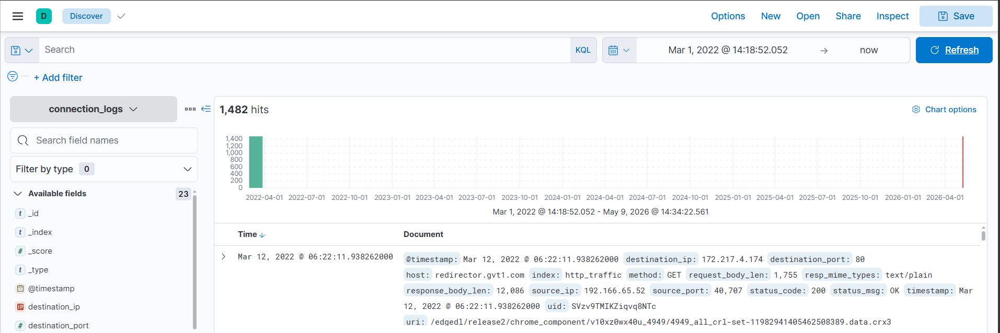
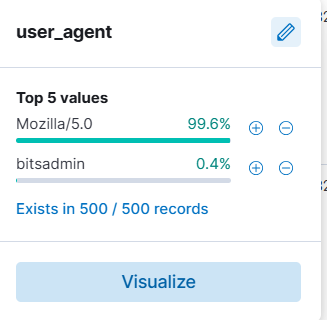
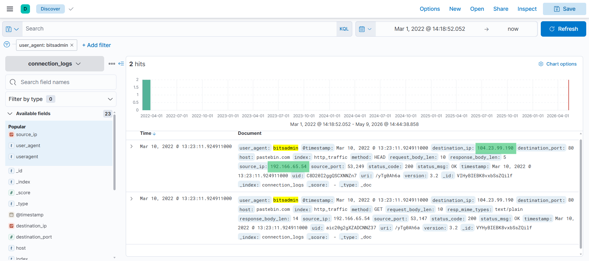
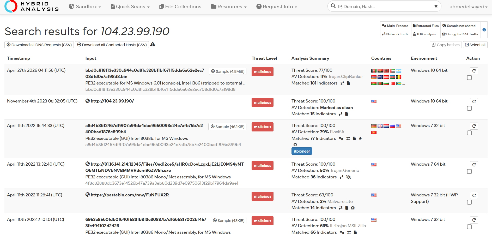
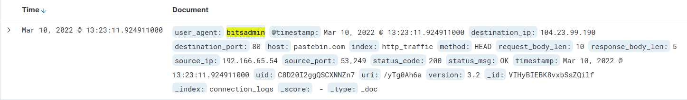
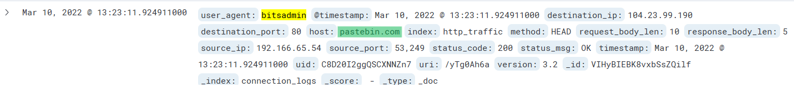
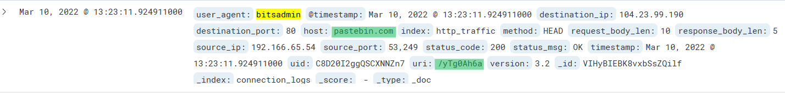
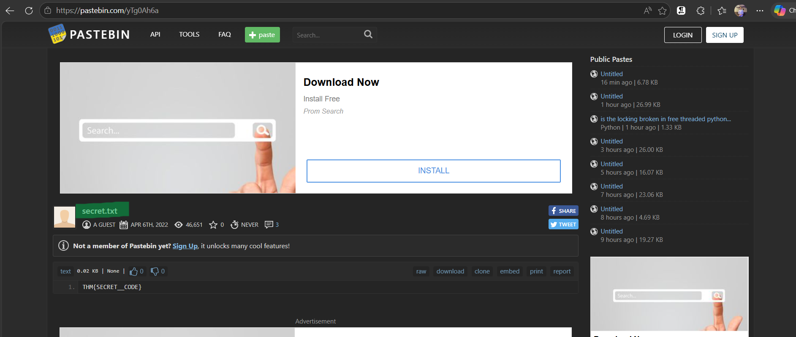
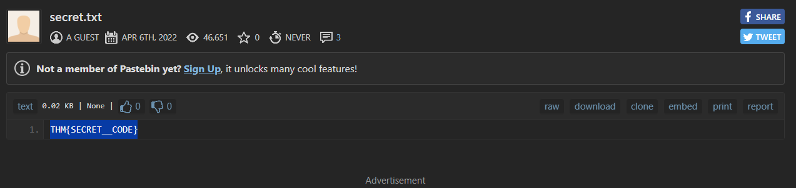

# ItsyBitsy writeup
### Lab Link [ItsyBitsy](https://tryhackme.com/room/itsybitsy)


## Scenario
```
During normal SOC monitoring, Analyst John observed an alert on an IDS solution indicating a potential C2 communication from a user Browne from the HR department. A suspicious file was accessed containing a malicious pattern THM:{ ________ }. A week-long HTTP connection logs have been pulled to investigate. Due to limited resources, only the connection logs could be pulled out and are ingested into the connection_logs index in Kibana.
```

### Q1: How many events were returned for the month of March 2022?
After accessing the ELK web interface, the following webpage will appear.


then navigate to discover  


then, change time range 






Answer: `1482`


### Q2: What is the IP associated with the suspected user in the logs?

During log analysis, a bitsadmin User-Agent was identified, indicating possible abuse of the Windows BITS service.
(BITS) is a Windows service used to transfer files from remote servers in the background.


After adding the user_agent field to the filter, the logs revealed a connection to a known malicious IP address.



you can analyze dest-ip using [hybrid analysis](https://hybrid-analysis.com/)



Answer: `192.166.65.54`


### Q3: The user’s machine used a legit windows binary to download a file from the C2 server. What is the name of the binary?
The answer to this question was identified before the previous one during the investigation.




Answer: `bitsadmin`


### Q4: The infected machine connected with a famous filesharing site in this period, which also acts as a C2 server used by the malware authors to communicate. What is the name of the filesharing site?
from the same event you can find the answer 




Answer: `pastebin.com`


### Q5: What is the full URL of the C2 to which the infected host is connected?

This event contains a large amount of information, and the answer can be found in the same event shown above.



Answer: `pastebin.com/yTg0Ah6a`


### Q6: A file was accessed on the filesharing site. What is the name of the file accessed?

The answer can be identified by reviewing the complete URL.



Answer: `secret.txt`

### Q7: The file contains a secret code with the format THM{_____}.
from the same site


Answer: `THM{SECRET__CODE}`


## The End 
# I hope you find it useful.
