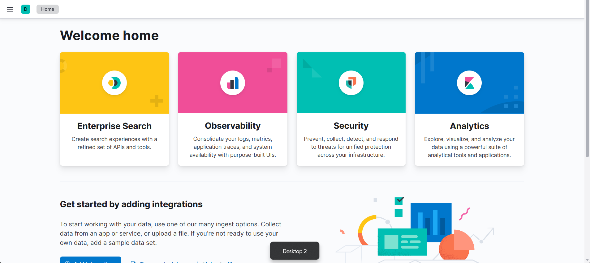
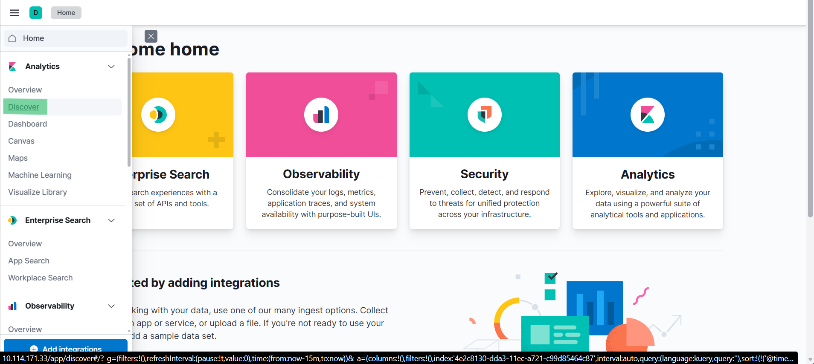

# ItsyBitsy writeup
### Lab Link [ItsyBitsy](https://tryhackme.com/room/itsybitsy)


## Scenario
```
During normal SOC monitoring, Analyst John observed an alert on an IDS solution indicating a potential C2 communication from a user Browne from the HR department. A suspicious file was accessed containing a malicious pattern THM:{ ________ }. A week-long HTTP connection logs have been pulled to investigate. Due to limited resources, only the connection logs could be pulled out and are ingested into the connection_logs index in Kibana.
```

### Q1: How many events were returned for the month of March 2022?
After accessing the ELK web interface, the following webpage will appear.



then navigate to discover tab 




Answer: `1482`

Answer: ``

Answer: ``

Answer: ``


Answer: ``

Answer: ``

Answer: ``

Answer: ``


## The End 
# I hope you find it useful.
