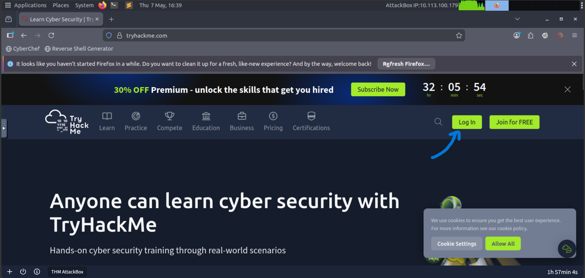
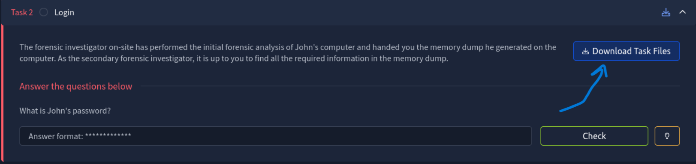
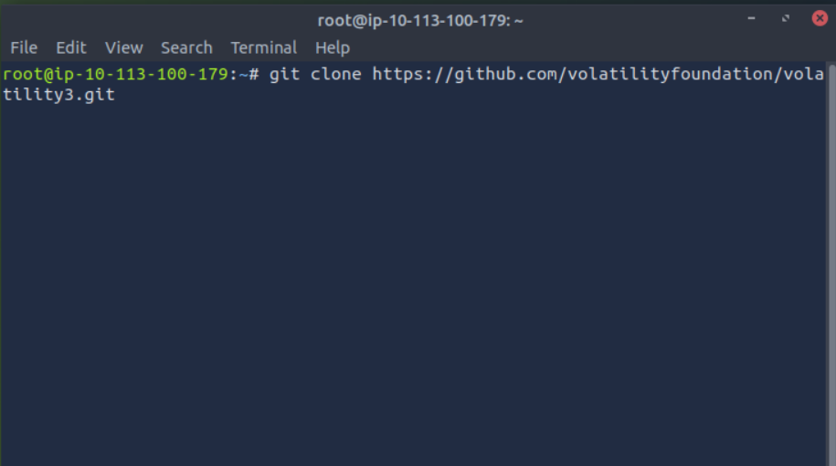
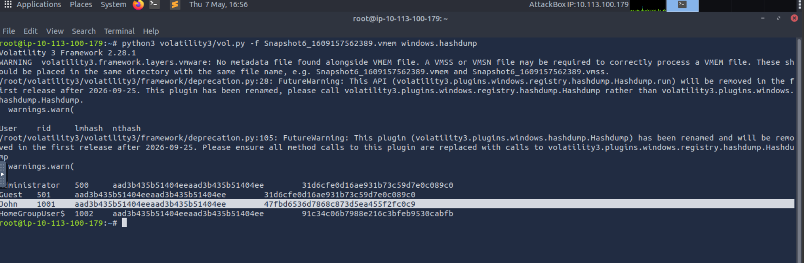
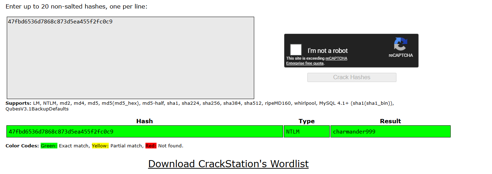
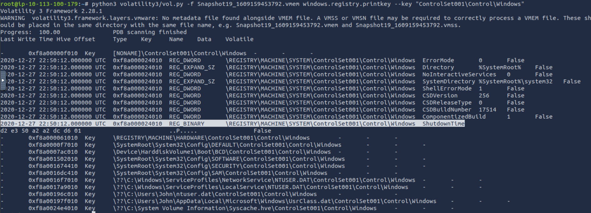
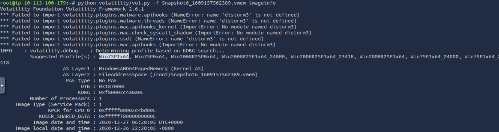

# Memory Forensics Writeup
### Lab Link [Memory Forensics](https://tryhackme.com/room/memoryforensics)


Fisrt of all, you can open the attack box and download files in it instead of download them in your own machine 
- open the attack box
- open firefox
- login using your THM account
- download lab files



download all 3 files.


- then open the shell and download volatility and other tools.
command to download volatility 
`git clone https://github.com/volatilityfoundation/volatility3.git`




## Task2: Login 
```
The forensic investigator on-site has performed the initial forensic analysis of John's computer and handed you the memory dump he generated on the computer.
As the secondary forensic investigator, it is up to you to find all the required information in the memory dump.
```

### Q1: What is John's password?
for this question you need to dump hashes then crack them 
to dump the hash you can use *hashdump* 

`python3 volatility3/vol.py -f Snapshot6_1609157562389.vmem windows.hashdump `

Windows systems store user password hashes using LM and NTLM hash formats for authentication purposes.


from the photo above the first one is LM & the second is NTLM

I used [crackstation](https://crackstation.net/) to crack the hash 



Answer: `charmander999`


## Task3: Analysis 
```
On arrival a picture was taken of the suspect's machine, on it, you could see that John had a command prompt window open. The picture wasn't very clear, sadly, and you could not see what John was doing in the command prompt window.

To complete your forensic timeline, you should also have a look at what other information you can find, when was the last time John turned off his computer?
```

### Q1: When was the machine last shutdown?

First I used Volatility 3 to print shutdowntime from registry but couldn't find the answer 



So, I turned back to volatility3 
download volatility 2 `git clone https://github.com/volatilityfoundation/volatility.git`

Firstly you need to identify image profile 
`python volatility/vol.py -f Snapshot6_1609157562389.vmem imageinfo`


Answer: ``


