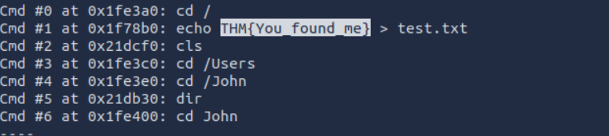
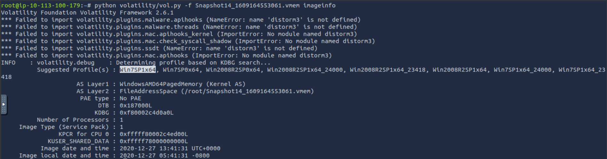
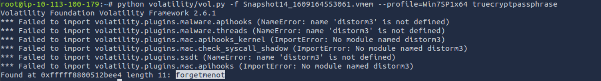

# Memory Forensics Writeup
### Lab Link [Memory Forensics](https://tryhackme.com/room/memoryforensics)


Fisrt of all, you can open the attack box and download files in it instead of download them in your own machine 
- open the attack box
- open firefox
- login using your THM account
- download lab files


download all 3 files.


- then open the shell and download volatility and other tools.
command to download volatility 
`git clone https://github.com/volatilityfoundation/volatility3.git`


## Task2: Login 
```
The forensic investigator on-site has performed the initial forensic analysis of John's computer and handed you the memory dump he generated on the computer.
As the secondary forensic investigator, it is up to you to find all the required information in the memory dump.
```

### Q1: What is John's password?
for this question you need to dump hashes then crack them 
to dump the hash you can use *hashdump* 

`python3 volatility3/vol.py -f Snapshot6_1609157562389.vmem windows.hashdump `

Windows systems store user password hashes using LM and NTLM hash formats for authentication purposes.


from the photo above the first one is LM & the second is NTLM

I used [crackstation](https://crackstation.net/) to crack the hash 


Answer: `charmander999`


## Task3: Analysis 
```
On arrival a picture was taken of the suspect's machine, on it, you could see that John had a command prompt window open. The picture wasn't very clear, sadly, and you could not see what John was doing in the command prompt window.

To complete your forensic timeline, you should also have a look at what other information you can find, when was the last time John turned off his computer?
```

### Q1: When was the machine last shutdown?
for this you need to show registry value that contains shutdowntime
so I used printkey to print registry key related to shutdown
`python3 volatility3/vol.py -f Snapshot19_1609159453792.vmem windows.registry.printkey --key "ControlSet001\Control\Windows"`


Answer: `2020-12-27 22:50:12`


### Q2: What did John write?
For this task, it was necessary to retrieve commands executed through the command prompt using the *consoles* plugin. 
Since this plugin is not available in Volatility 3, I used Volatility 2 to perform the analysis.

To download volatility2  use this command
`git clone https://github.com/volatilityfoundation/volatility.git`

First, you need to identify imageinfo 
`python volatility/vol.py -f Snapshot6_1609157562389.vmem imageinfo`


then use consoles plugin
`python volatility/vol.py -f Snapshot6_1609157562389.vmem --profile=Win7SP1x64 consoles`



Answer: `You_found_me`


## Task4: TrueCrypt
```
A common task of forensic investigators is looking for hidden partitions and encrypted files, as suspicion arose when TrueCrypt was found on the suspect's machine and an encrypted partition was found. The interrogation did not yield any success in getting the passphrase from the suspect, however, it may be present in the memory dump obtained from the suspect's computer.
```


### Q1: What is the TrueCrypt passphrase?

First, it is necessary to identify the memory profile of the dump file using the imageinfo plugin because each task uses a different memory dump image.



TrueCrypt is a disk encryption software used to protect files, partitions, and entire drives by encrypting data with a password or encryption key.

volatility has plugin called *truecryptpassphrase* which retrive passphrase of true crypt software
`python volatility/vol.py -f Snapshot14_1609164553061.vmem --profile=Win7SP1x64 truecryptpassphrase`



Answer: `forgetmenot`


# The End, I hope you find it useful.


