# New Hire Old Artifacts
### Lab Link [New Hire Old Artifacts](https://tryhackme.com/room/newhireoldartifacts)

## Scenario
```
You are a SOC Analyst for an MSSP (managed Security Service Provider) company called TryNotHackMe.


A newly acquired customer (Widget LLC) was recently onboarded with the managed Splunk service. The sensor is live, and all the endpoint events are now visible on TryNotHackMe's end. Widget LLC has some concerns with the endpoints in the Finance Dept, especially an endpoint for a recently hired Financial Analyst. The concern is that there was a period (December 2021) when the endpoint security product was turned off, but an official investigation was never conducted. 

Your manager has tasked you to sift through the events of Widget LLC's Splunk instance to see if there is anything that the customer needs to be alerted on. 

Happy Hunting!
```

Firstly, change the Date Range. Make it start from December 2021 

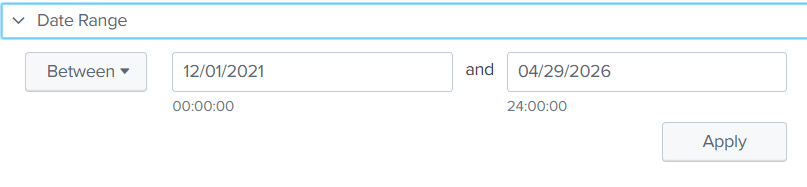

Then, use this command to know which index contains data
- | eventcount summarize=false index=*

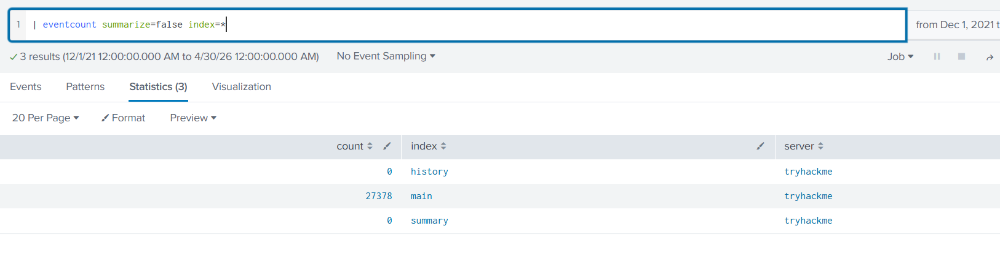


### Q1: A Web Browser Password Viewer executed on the infected machine. What is the name of the binary? Enter the full path.
Any program that is executed is considered a process. 
so, I searced using EventID = 1 : process creation 
 - index=main EventCode=1 

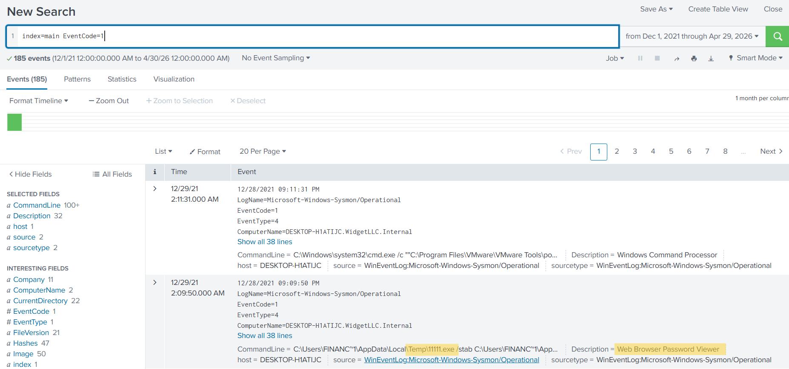


Answer: `C:\Users\FINANC~1\AppData\Local\Temp\11111.exe`


### Q2: What is listed as the company name?

from the same event above you can find the answer 

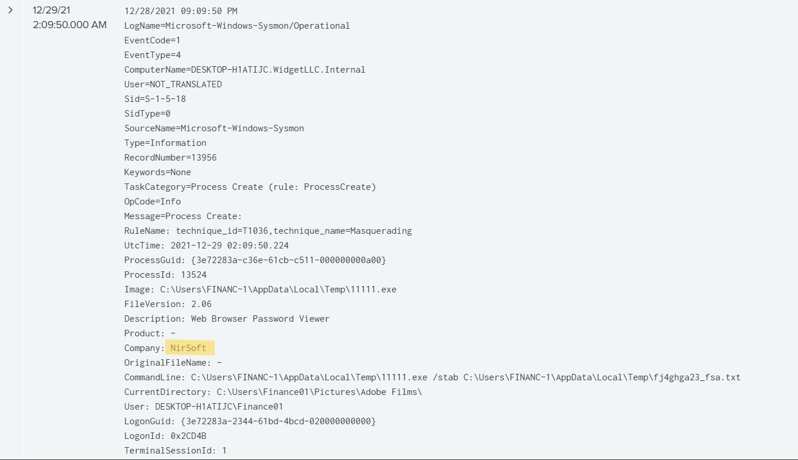

Answer: `NirSoft`


### Q3: Another suspicious binary running from the same folder was executed on the workstation. What was the name of the binary? What is listed as its original filename? (format: file.xyz,file.xyz)

search using the same dir 

 - index=main   TargetFilename = "C:\\Users\\FINANC~1\\AppData\\Local\\Temp\\*" | stats count by TargetFilename

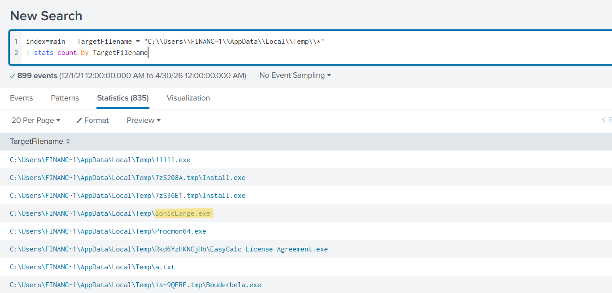

to find the original file name I searched using 

 - index=main IonicLarge.exe

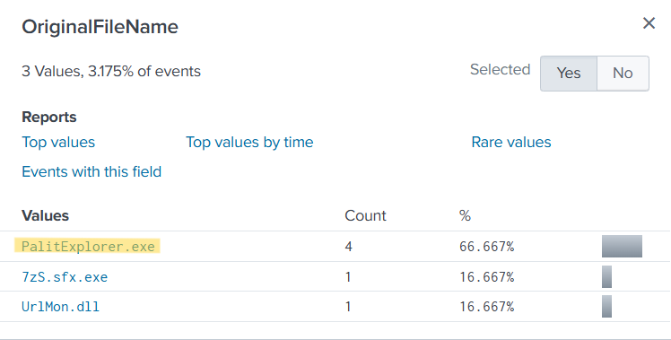


Answer: `IonicLarge.exe,PalitExplorer.exe`


### Q4: The binary from the previous question made two outbound connections to a malicious IP address. What was the IP address? Enter the answer in a defang format.

I filtered using this binary file and  EventID = 3 : network connection detected 

 - index=main   IonicLarge.exe  EventCode = 3

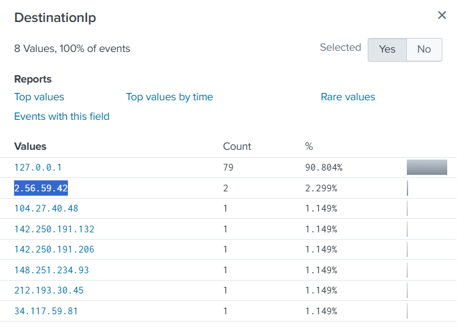

check these IPs on [virus total](https://www.virustotal.com) 
to find the suspicious one 

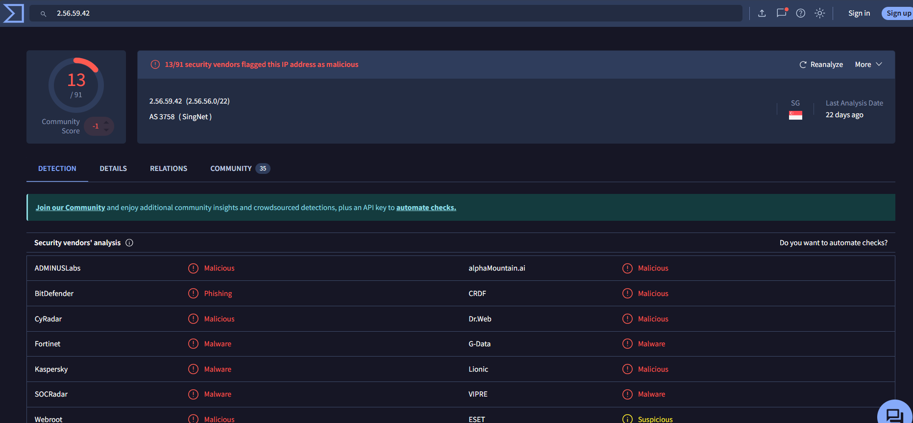

Answer: `2[.]56[.]59[.]42`


### Q5: The same binary made some change to a registry key. What was the key path?

search using binary name and EventID=13 : RegistryEvent (value set)
  - index=main   IonicLarge.exe  EventCode = 13

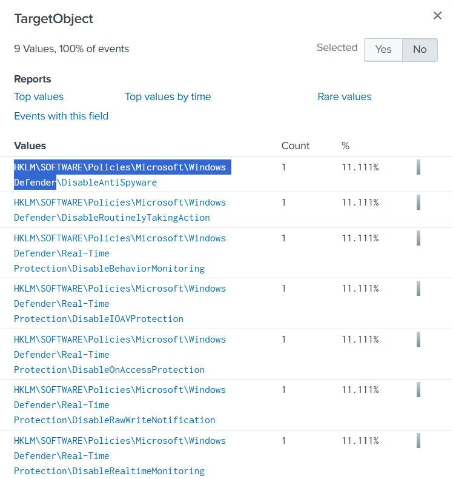

Answer: `HKLM\SOFTWARE\Policies\Microsoft\Windows Defender`


### Q6: Some processes were killed and the associated binaries were deleted. What were the names of the two binaries? (format: file.xyz,file.xyz)

 I searched for task kill command in windows 

 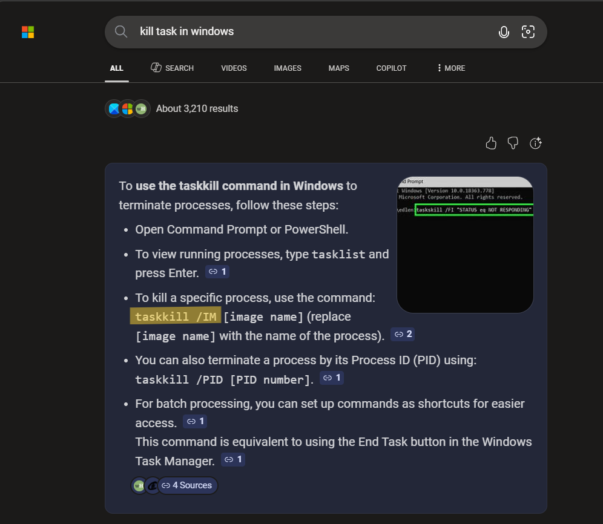

- index=main   taskkill /IM | stats count by CommandLine

 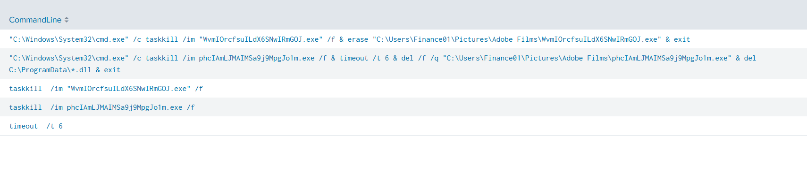

Answer: `WvmIOrcfsuILdX6SNwIRmGOJ.exe,phcIAmLJMAIMSa9j9MpgJo1m.exe`


### Q7: The attacker ran several commands within a PowerShell session to change the behaviour of Windows Defender. What was the last command executed in the series of similar commands?

I filtered using info in the question 

 - index=main  powershell.exe  Windows Defender | stats count by CommandLine

 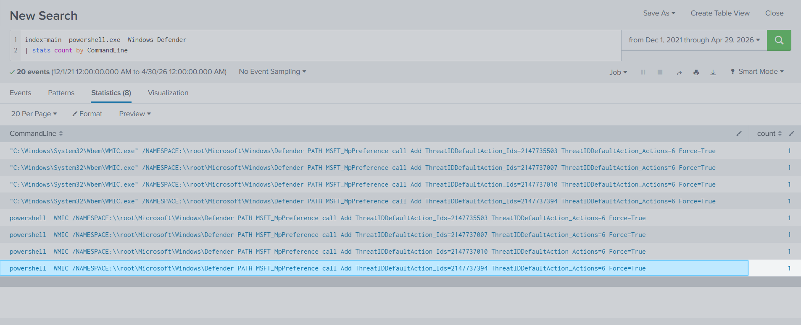

Answer: `powershell WMIC /NAMESPACE:\\root\Microsoft\Windows\Defender PATH MSFT_MpPreference call Add ThreatIDDefaultAction_Ids=2147737394 ThreatIDDefaultAction_Actions=6 Force=True`

### Q8: Based on the previous answer, what were the four IDs set by the attacker? Enter the answer in order of execution. (format: 1st,2nd,3rd,4th)

the answer is on the photo above 

 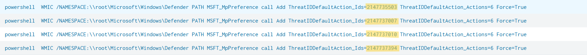

Answer: `2147735503,2147737010,2147737007,2147737394`


### Q9: Another malicious binary was executed on the infected workstation from another AppData location. What was the full path to the binary?

Filtered by 
- index=main  "C:\\Users\\Finance01\\AppData\\*" OR "C:\\Users\\FINANC~1\\AppData\\*" | stats count by Image

 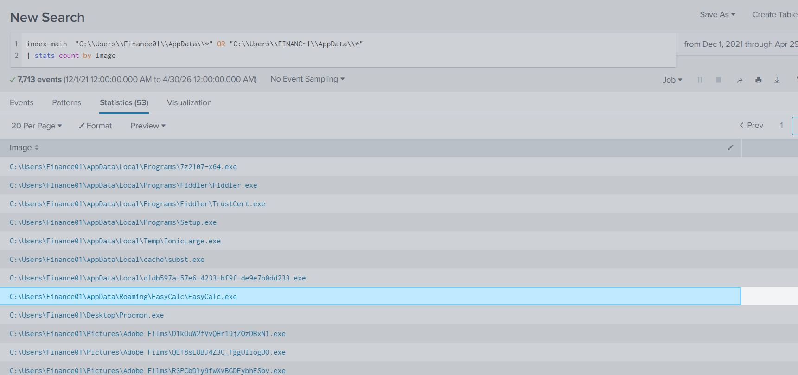

 The executable located in the AppData\Roaming directory with a benign-looking name is suspicious and may indicate malware presence.


Answer: `C:\Users\Finance01\AppData\Roaming\EasyCalc\EasyCalc.exe`


### Q10: What were the DLLs that were loaded from the binary from the previous question? Enter the answers in alphabetical order. (format: file1.dll,file2.dll,file3.dll)

I filtered using 
- index=main  EasyCalc.exe .dll

then searched in Fields for field related to dll loaded 

 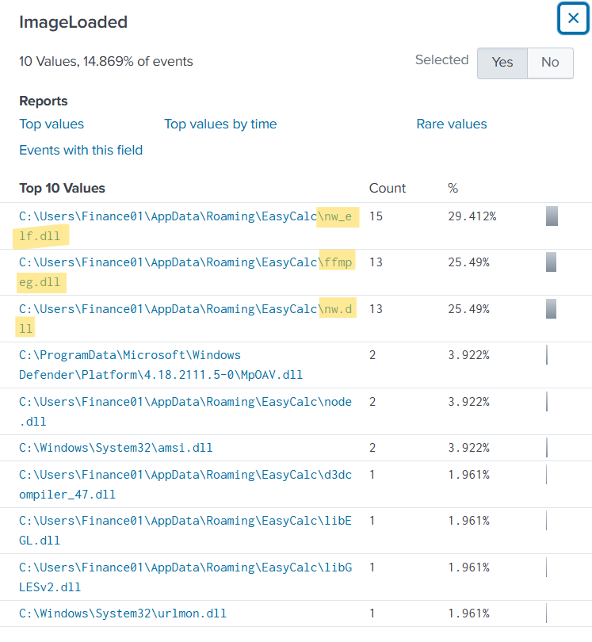


Answer: `nw_elf.dll,ffmpeg.dll,nw.dll`


## The End 
# I hope you find it useful.
